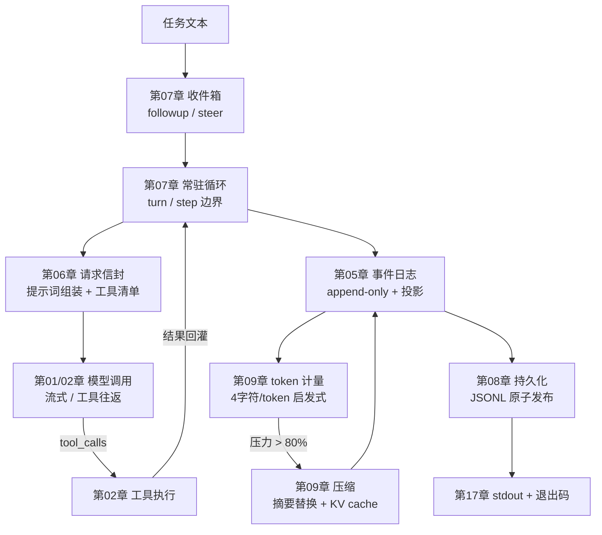

<p align="center">
  
</p>

<p align="center"><b>用 Python 看懂 DeepSeek Harness 怎样驱动一个 Agent</b></p>
<p align="center">
  <a href="README_EN.md">English</a>
</p>

<div align="center">

[](LICENSE)
[](pyproject.toml)

</div>

---

## 如果你熟悉 Python，却读不动 Harness

你可能已经会调用模型、写过简单 Agent，但打开 DeepSeek Harness（下文简称 DSH）的
TypeScript 源码仓库，还是会被插件、作用域、事件日志、工具管线和上下文工程淹没。
先补一门 TypeScript，再从生产仓库里找主线，学习成本很容易超过机制本身。

mini-harness 用 Python 3.11+ 把这套机制做成教学项目。课程聚焦 DSH 的**无界面
（Headless）运行路径**：直接把一个任务交给 Agent，等待它完成并取得结果，全程
不启动网页、TUI 或 HTTP 服务。

17 个章节带你逐步亲手实现：

- 能看见的模型流、消息协议和 Tool Calling 往返；
- 会等待依赖、卸载后能清理资源的 Python 插件系统；
- 可以追溯、压缩和恢复的对话记录；
- 默认只读的文件与命令工具，以及可控的外部能力；
- 一个能保存会话并返回最终文本的完整 Agent。

其中 9 章调用真实 DeepSeek 模型（01、02、05、06、07、09、14、15、17），
第 15 章还调用真实 Web Search 与网页抓取；其余 8 章是纯本地机制，不需要
API Key。**每章代码自包含**——不依赖任何黑盒包，教程正文把核心代码一字
不差贴出、逐段讲解。

## 5 分钟跑起来

项目使用 [uv](https://docs.astral.sh/uv/) 管理依赖。安装 Python 3.11+ 后：

```bash
cp .env.example .env
# 编辑 .env，填入自己的 DEEPSEEK_API_KEY
uv sync
uv run python chapters/01-streaming-agent/src/demo.py
```

`.env` 已被 Git 忽略，不会被提交。运行全部章节：

```bash
uv run python scripts/run_all.py              # 全部 17 章（9 章联网产生用量）
uv run python scripts/run_all.py --local-only # 只跑 8 个本地章节
```

> 环境说明：17 个章节只读取 `DEEPSEEK_API_KEY` 这一个变量。不要把
> `DEEPSEEK_BASE_URL`、`DSH_MODEL` 等启动级变量写进 `.env`——官方 DSH
> 启动器会拒绝从 `.env` 读取它们。

## 学习路径与章节

每章都遵循同一个节奏：**原理（为什么需要它）→ 完整代码 → 逐段讲解 → 真实运行
输出 → 官方源码对照 → 练习**。建议按顺序学习；只想快速预览，先跑 01、02、09
和 17。章节内会随用随讲 async、dataclass 等 Python 概念，无需前置学习。

| 阶段 | 章节 | 完成后能解释什么 |
|---|---|---|
| 最小闭环 | [01 流式 Agent](chapters/01-streaming-agent/README.md)（调模型）· [02 工具调用](chapters/02-tool-calling/README.md)（调模型） | 模型增量如何变成稳定消息；工具调用如何完成一次往返 |
| 插件底座 | [03 迷你插件系统](chapters/03-python-cordis/README.md)（本地）· [04 服务与依赖](chapters/04-services-scopes/README.md)（本地） | 插件怎样等待依赖自动启动、卸载时怎样级联清理；读服务为什么必须先声明 |
| 状态与执行 | [05 会话日志](chapters/05-session-log/README.md)（调模型）· [06 请求信封](chapters/06-prompt-tools/README.md)（调模型）· [07 常驻 Agent](chapters/07-agent-inbox/README.md)（调模型）· [08 持久化](chapters/08-persistence/README.md)（本地） | 事件溯源、提示词组装、轮次边界、原子落盘与崩溃恢复怎样配合 |
| 上下文工程 | [09 计量与压缩](chapters/09-context-engineering/README.md)（调模型） | 4 字符/token 启发式、80% 阈值、KV-cache 友好的摘要替换各解决什么问题 |
| 本地能力 | [10 文件系统](chapters/10-filesystem/README.md)（本地）· [11 Shell 与审批](chapters/11-shell-sandbox/README.md)（本地）· [12 Skills](chapters/12-instructions-skills/README.md)（本地） | 路径围栏、读后写 CAS、命令审批链、按需加载指令怎样工作 |
| 编排与扩展 | [13 Goal 与 Todo](chapters/13-goal-plan-todo/README.md)（本地）· [14 Subagent](chapters/14-subagents-workflow/README.md)（调模型）· [15 外部能力](chapters/15-external-capabilities/README.md)（调模型） | 长任务状态机、子 Agent 隔离与并行、真实 Web Search 怎样组织 |
| 装配 | [16 配置与 RPC](chapters/16-settings-jsonrpc/README.md)（本地）· [17 收口组装](chapters/17-headless-capstone/README.md)（调模型） | 配置分层、JSON-RPC 线格式、前 16 章如何组装成一个能跑任务的包 |

## 把这些章节串起来看

一次任务从进来到出去，走过的路径是这样：



除这条主路径外，还有两条独立的线：第 03/04 章的插件系统（所有能力
都以插件形式安装、等待依赖、自动清理），第 10/11 章的沙箱与审批
（写文件和执行命令都要过权限检查）。第 12 到 16 章是各自独立的能力：
Skills、Goal 与 Todo、Subagent、外部搜索、配置与 RPC。

顺序上，01→02→05→06→07→08→09→17 是连续的，每章在前一章的代码上
加一个机制；03/04 与 10-16 可以单独学，不影响主路径的理解。

项目里没有的东西，都有原因：内核级 shell 沙箱（教学版只做权限决策，
不做系统级隔离）、流式工具分片组装、fork 子智能体、压缩前的剪枝
——这些分别在第 02、09、14 章的练习里留了口子，也标注了官方出处。

## 官方源码对照总表

每个机制都能在官方源码里找到对应物，每章章末的「对照官方」小节是分章视图。
所有链接固定到 [`master@47f943859bef60e4160492346772ded9b24f765a`](https://github.com/deepseek-ai/DeepSeek-Harness/tree/47f943859bef60e4160492346772ded9b24f765a)
（下文以 `@SHA` 简写），行号基于该提交实测：

| 章 | 教学版机制 | 官方包（`https://github.com/deepseek-ai/DeepSeek-Harness/blob/@SHA/` + 路径） | 关键行号 |
|----|-----------|--------------------------------------------------------------------------------|----------|
| 01 | SSE 流式 | `packages/llm/llm-deepseek/src/adapter.ts` | 286（text/event-stream） |
| 01 | 分片组装 | `packages/llm/llm/src/assembler.ts` | 60-63（text-delta） |
| 02 | 工具调用往返 | `packages/core/agent-loop/README.zh.md` | 105（工具调用与结果回灌） |
| 02 | 工具注册 | `packages/core/tools/README.zh.md` | 5（流水线）、20（register） |
| 03 | 插件生命周期 | `vendor/cordis/src/fiber.ts` | 184（Fiber）、148（状态机）、415（effect） |
| 03 | Context/Proxy | `vendor/cordis/src/context.ts` | 74（Proxy） |
| 04 | 服务与依赖 | `vendor/cordis/src/reflect.ts` | 277（provide）、314（notify）、144（严格访问报错） |
| 04 | 瀑布事件 | `vendor/cordis/src/events.ts` | 234-238（waterfall） |
| 05 | 事件溯源 | `packages/core/session/README.zh.md` | 5（仅追加真源）、39（append）、40-41（投影） |
| 05 | 轮次消息记录 | `packages/core/agent-loop/README.zh.md` | 105（仅写日志 vs 发送） |
| 06 | 提示词组装 | `packages/core/system-prompt/README.zh.md` | 5（组装注册表）、20（section）、24（variable） |
| 06 | schema 投影 | `packages/core/tools/README.zh.md` | 24（schemas 不含 execute） |
| 07 | inbox 与 send | `packages/core/agent-loop/README.zh.md` | 58（followup/steer/inject）、76（循环只做三件事） |
| 08 | JSONL 后端 | `packages/session/session-persistence-jsonl/README.zh.md` | 5（仅追加日志）、43（原子发布）、44（失败回滚） |
| 09 | token 启发式 | `packages/llm/token-meter/README.zh.md` | 9（4 字符/token）、32（projectedTokens） |
| 09 | 压缩策略 | `packages/compaction/compaction-basic/README.zh.md` | 32（0.8/0.16）、18（KV cache 重放）、17（收敛）、164（失败保留原文） |
| 10 | 文件沙箱 | `packages/fs/fs-sandbox/README.zh.md` | 16（可写根）、21（约束非边界）、23（结构化拒绝） |
| 11 | 命令沙箱 | `packages/shell/bash-sandbox/README.zh.md` | 15（danger-full-access）、85（只覆盖文件影响） |
| 11 | 审批 | `packages/interaction/user-approval/README.zh.md` | 四结果、fail closed |
| 12 | 技能 | `packages/skill/skill/README.zh.md` | 17（摘要目录）、56（渐进加载）、44（renderSkillContent） |
| 13 | 目标状态机 | `packages/goal/goal/README.zh.md` | 5（事件溯源）、22（单一目标）、24（goal/change）、28（续行不持久化） |
| 13 | 任务清单 | `packages/todo/tool-todo/README.zh.md` | 5（整体替换）、9（快照事件）、25（校验） |
| 14 | 子智能体 | `packages/subagent/tool-subagent/README.zh.md` | 5（委派工具）、11（失败保留部分文本） |
| 14 | fork 例外 | `packages/subagent/subagent-fork-in-process/README.zh.md` | 5（继承父对话种子） |
| 15 | Web Search | `packages/web/web-search-deepseek/README.zh.md` | Anthropic 端点 + 服务器工具 + 严格模式 |
| 16 | RPC 网关 | `packages/api/gateway/README.zh.md` | 5（Host/Client endpoint）、9（invoke 校验） |
| 17 | headless 组合 | `packages/bundle/headless/README.zh.md` | 5（不挂载 Host）、7（runner 语义） |

版本说明：固定提交的 monorepo 包版本是 `0.1.0-rc.5`；同期 npm 发布包为
`0.1.0-rc.6`。本表按 Git 源码版本记录，复核时以固定 SHA 为准。

## TypeScript 思想怎样落到 Python

对齐行为与生命周期，不要求读者模仿 TypeScript 语法：

| DSH / TypeScript | mini-harness / Python |
|---|---|
| Proxy 拦截属性读取（依赖显式化） | `__getattr__` 严格服务访问 |
| Fiber 状态机 + 级联清理 | `PluginHandle` 状态机（pending/active/failed/disposed）+ 逆序清理 |
| epoch 依赖重算 + notify | 依赖签名（uid:version）+ 全量重算 |
| waterfall 洋葱事件 | 递归 dispatch 的 `waterfall` |
| Promise 并发 | `ThreadPoolExecutor` 并行 subagent |
| discriminated union + frozen | frozen dataclass 联合 |
| 深冻结 JSON 快照 | 递归冻结，拒绝非纯 JSON |

## 课程里反复出现的 Python 概念

章节内会在用到时讲解这些概念，这里先给一张总览，方便随时回查：

- **frozen dataclass**：数据对象创建后不可修改。对话历史被反复读取，任何
  一处偷偷修改都会让后续行为对不上——用语言约束消灭这类 bug。
- **async / await**：网络等待期间让程序去做别的事。写法上记住三件事：
  `async def` 定义异步函数、`await` 等待结果、`asyncio.run(...)` 启动。
- **生成器（yield）**：函数里出现 `yield` 就变成生成器，每吐一个值交给
  调用方，然后暂停等待下一次迭代——流式消费的天然形态。
- **异常即信息**：工具执行失败、文件被外部修改、审批被拒绝，全部转成
  结构化文本回灌给模型，而不是让程序崩溃——Agent 的健壮性来自
  「让模型看见错误」。
- **深冻结与严格 JSON**：日志与消息只接受纯 JSON（拒绝 NaN、集合、
  循环引用），写入时冻结——持久化与重放的前提。

## 仓库结构

```text
mini-harness/
├── chapters/              # 17 章：每章 = 教程正文 README + 自包含 src/ 代码
│   ├── 01-streaming-agent/
│   │   ├── README.md      # 原理 → 完整代码 → 逐段讲解 → 真实输出 → 官方对照 → 练习
│   │   └── src/           # 本章实现（零黑盒 import）+ demo.py
│   └── ...
├── scripts/run_all.py     # 运行全部章节 demo
├── docs/images/logo.svg   # 门面图
└── .github/workflows/ci.yml
```

## 扩展路线

- [ ] 压缩的剪枝先行（toolResultPruner，第 09 章练习 3 已留口）
- [ ] fork 子智能体（继承父对话种子，第 14 章练习 3 已留口）
- [ ] workflow 脚本编排（第 14 章练习 4 已留口）
- [ ] MCP 客户端与协议适配
- [ ] Code Mode（工具折叠为 run_code）
- [ ] 流式工具分片的组装（第 02 章练习 4 已留口）

## 安全边界

默认权限是 `read-only`：写操作与 Shell 需要显式升级或审批；文件路径先规范化
再检查工作区围栏；命令执行带超时与一次性授权。

这些措施用于降低学习和本地实验中的误操作风险。Python 子进程仍拥有当前用户
的系统权限，路径围栏不是操作系统级安全沙箱（官方同样明确这一边界）。项目
不提供图形界面、HTTP 服务、热重载、检索与遥测后端、云端沙箱与全部模型适配器。

## 许可

MIT License，第三方归属见 [THIRD_PARTY_NOTICES.md](THIRD_PARTY_NOTICES.md)。

如果某一章让一个 Harness 机制终于变得清楚，欢迎点一个 ⭐；遇到卡点，欢迎把
最小复现提交为 Issue。
