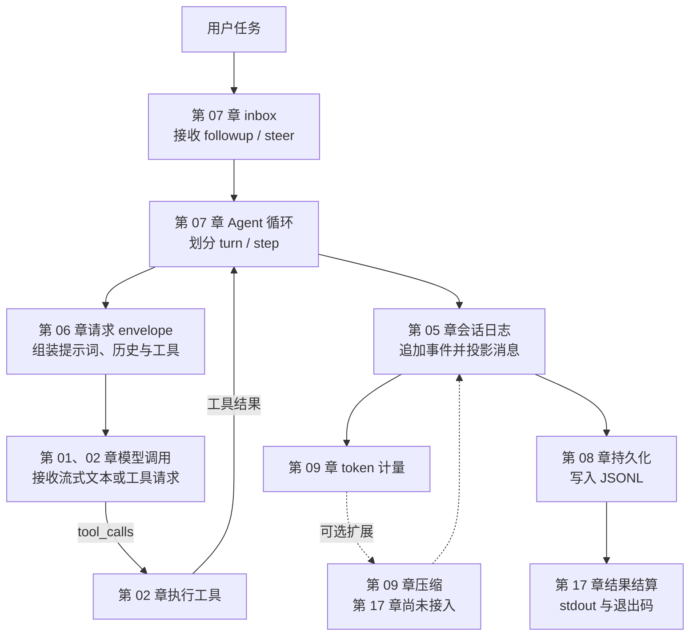

<p align="center">
  
</p>

<p align="center"><b>用 Python 从一次模型调用开始，逐步构建 DeepSeek Harness 的核心运行机制</b></p>
<p align="center">
  <a href="README_EN.md">English</a>
</p>

<div align="center">

[](LICENSE) [](pyproject.toml)

</div>

---

## 项目介绍

调用一次大语言模型并不复杂：发送消息，等待回复，再把文本显示出来。真正让 Agent 能够持续完成任务，还需要处理另一组问题。模型如何调用工具？多轮对话如何保存？上下文越来越长时怎样压缩？文件和命令怎样限制权限？任务执行到一半时，新的用户消息又该如何进入当前流程？

[DeepSeek Harness](https://github.com/deepseek-ai/DeepSeek-Harness)（简称 DSH）围绕这些问题建立了一套完整的 Agent 运行系统。它使用 TypeScript 编写，代码分布在上百个包中。对于主要使用 Python 的学习者，直接进入这套 monorepo，往往需要同时理解语言语法、工程结构和 Agent 机制，学习重点很容易被分散。

mini-harness 将 DSH 的核心机制拆成 17 个 Python 章节。课程从最小的流式模型调用开始，依次加入工具、会话、提示词、持久化、上下文压缩、文件与命令能力、技能、子 agent 和外部搜索，最后把主路径组装成一个能够接收任务、保存会话并返回结果的 headless Agent。

课程主要讲解 DSH 的 headless 运行路径。这里的 headless 指不启动网页、桌面界面或 HTTP 服务，程序直接接收任务，运行 Agent 和工具，完成后从标准输出返回结果。这条路径保留了 Agent 的核心运行过程，也便于在终端中观察每一步发生了什么。

完成全部章节后，将能够解释并实现以下机制：

- 流式响应如何从数据分片组装成一条完整消息；
- 模型如何提出工具调用，程序如何执行工具并把结果送回模型；
- 会话事件如何记录、投影、持久化、恢复和压缩；
- 插件、服务与依赖如何启动，并在卸载时按顺序清理资源；
- 文件、Shell、技能、Goal、Todo 和子 agent 如何接入运行循环；
- 一个 headless Agent 如何完成组装、执行、落盘和结果结算。

## 适合哪些读者

这套课程面向具备 Python 基础、希望理解 Agent 内部运行方式的开发者和自学者。开始学习前，只需要能够阅读函数、类、字典和异常处理，并了解通过 API 调用大语言模型的基本概念。课程不要求 TypeScript 经验，也不要求提前掌握 Agent 框架、事件溯源或上下文工程。

代码中会出现 `async / await`、`dataclass`、生成器和 JSON 序列化。相关概念会在第一次使用时结合当前问题讲解，因此无需先单独学习一套完整的异步编程或类型系统课程。

## 快速开始

项目使用 [uv](https://docs.astral.sh/uv/) 管理 Python 环境和依赖，需要 Python 3.11 或更高版本。

### 运行本地章节

第 03、04、08、10、11、12、13、16 章只演示本地机制，不访问模型，也不需要 API Key。下面的命令会安装依赖并运行这 8 章：

```bash
uv sync
uv run python scripts/run_all.py --local-only
```

### 从第 01 章开始学习

第 01 章会连接 DeepSeek API，先从模板创建本地配置：

```bash
cp .env.example .env
# 编辑 .env，填入自己的 DEEPSEEK_API_KEY
uv sync
uv run python chapters/01-streaming-agent/src/demo.py
```

`.env` 已加入 Git 忽略规则。联网章节按照“进程环境变量优先、项目根目录 `.env` 作为本地回退”的顺序读取 `DEEPSEEK_API_KEY`。mini-harness 只从这里读取密钥，模型和端点直接写在各章代码中；如果运行官方 DSH，`DEEPSEEK_BASE_URL`、`DSH_MODEL` 等启动级变量应通过进程环境设置，官方启动器会拒绝从 `.env` 读取它们。

全部章节可以通过一条命令运行，其中 9 章会访问 DeepSeek API 并产生模型用量：

```bash
uv run python scripts/run_all.py
```

## 课程如何组织

17 个章节分为五个部分。每一部分先建立一个可以运行的基础，再围绕前一部分留下的问题增加新的机制。

### 第一部分：建立最小 Agent

这一部分从模型请求与响应开始。完成两章后，程序已经能够接收任务、读取流式输出，并在模型需要时执行计算工具。

| 章节 | 核心问题 | 运行方式 |
|---|---|---|
| [01｜流式输出与消息组装](chapters/01-streaming-agent/README.md) | SSE 返回的是连续分片，程序如何把它们组装成稳定消息？ | DeepSeek API |
| [02｜工具调用](chapters/02-tool-calling/README.md) | 模型如何发起工具调用，工具结果又如何进入下一次模型请求？ | DeepSeek API |

### 第二部分：理解插件与依赖

Agent 的能力会不断增加。插件系统负责组织这些能力的安装、依赖和清理，使各模块能够按照明确的生命周期协作。

| 章节 | 核心问题 | 运行方式 |
|---|---|---|
| [03｜迷你插件系统](chapters/03-python-cordis/README.md) | 插件如何等待依赖、进入运行状态，并在卸载时释放资源？ | 本地 |
| [04｜服务与依赖](chapters/04-services-scopes/README.md) | 服务如何注册、拒绝重名并在提供者变化后重新解析，严格访问为什么能够暴露依赖错误？ | 本地 |

### 第三部分：建立持续运行的 Agent

一次模型调用只处理一个请求，持续运行的 Agent 还需要记录历史、接收后续消息、恢复会话，并在上下文接近上限时压缩旧内容。

| 章节 | 核心问题 | 运行方式 |
|---|---|---|
| [05｜会话日志](chapters/05-session-log/README.md) | append-only 事件如何还原对话消息，并保留每次运行的过程？ | DeepSeek API |
| [06｜请求 envelope 组装](chapters/06-prompt-tools/README.md) | System Prompt、历史消息和工具 schema 如何组成一次模型请求？ | DeepSeek API |
| [07｜常驻 Agent 与 inbox](chapters/07-agent-inbox/README.md) | followup 与 steer 如何分别进入下一个 turn 和当前 turn 的下一个 step？ | DeepSeek API |
| [08｜会话持久化](chapters/08-persistence/README.md) | JSONL 日志如何安全写入，并在进程重启后恢复？ | 本地 |
| [09｜上下文工程](chapters/09-context-engineering/README.md) | 程序如何估算 token 压力，并用摘要替换较早的历史？ | DeepSeek API |

### 第四部分：扩展 Agent 的能力

运行循环建立后，Agent 开始与本地环境和外部服务交互。这一部分分别处理文件、命令、技能、长期任务状态、子 agent 和网络搜索。

| 章节 | 核心问题 | 运行方式 |
|---|---|---|
| [10｜文件系统](chapters/10-filesystem/README.md) | 路径围栏、读后写检查和观察记录如何降低文件误操作风险？ | 本地 |
| [11｜命令执行与审批](chapters/11-shell-sandbox/README.md) | Shell 命令如何经过权限判断、审批、超时和结果回收？ | 本地 |
| [12｜技能与按需加载](chapters/12-instructions-skills/README.md) | 技能目录如何只暴露摘要，并在使用时加载完整指令？ | 本地 |
| [13｜Goal 与 Todo](chapters/13-goal-plan-todo/README.md) | 长任务如何保存目标 revision 和任务清单快照？ | 本地 |
| [14｜Subagent 委派](chapters/14-subagents-workflow/README.md) | 子 agent 如何获得独立上下文，并把部分结果或最终结果返回父任务？ | DeepSeek API |
| [15｜网络搜索与网页抓取](chapters/15-external-capabilities/README.md) | Agent 如何使用 DeepSeek Web Search，并将搜索结果转成可引用的上下文？ | DeepSeek API + Web Search |

### 第五部分：组装完整运行入口

最后两章从两个方向处理系统边界：第 16 章单独讲配置与 RPC，第 17 章组装命令行运行入口。它们是并列的教学主题；当前 capstone 没有把第 16 章的 Settings/RPC 接入命令行。

| 章节 | 核心问题 | 运行方式 |
|---|---|---|
| [16｜配置与 RPC](chapters/16-settings-jsonrpc/README.md) | 分层配置如何结算，JSON-RPC 如何校验并分发外部请求？ | 本地 |
| [17｜headless 组装](chapters/17-headless-capstone/README.md) | 客户端、Agent、会话持久化和结果结算如何形成一个命令行程序？ | DeepSeek API |

## 一次任务如何完成

第 01、02、05、06、07、08、09、17 章组成 Agent 的主要运行路径。下面展示各章之间的概念关系；实线是第 17 章已经接通的路径，压缩是第 09 章单独演示、留待继续集成的扩展点：



第 03、04 章提供插件和依赖管理，第 10、11 章约束本地操作，第 12 到 16 章增加可选能力。这些机制可以围绕主要运行路径独立学习，也能在完整系统中按需接入。

## 每章的学习方式

每章都围绕一个具体问题展开，正文依次包含问题背景、运行过程、关键代码、分段讲解、真实输出、官方源码对照和练习。章节中的 `src/` 目录保存当前章节的完整实现，不会从一个共享教学包中导入已经写好的核心逻辑，因此代码可以与正文逐段对应。

完整学习按 01 到 17 章推进。若只想先了解课程的实现深度，可以依次阅读 01、02、09、17：第 01 章建立模型连接，第 02 章形成 Agent 的最小闭环，第 09 章处理长上下文，第 17 章展示最终组装。

一次章节学习可以按下面的顺序进行：

1. 先阅读开头的问题背景，明确本章为什么需要新增这个机制。
2. 运行 `src/demo.py`，观察输入、事件和输出之间的关系。
3. 对照正文阅读完整代码，重点跟踪数据结构在各函数之间如何流动。
4. 打开章末的官方源码链接，比较 TypeScript 实现与 Python 表达的差异。
5. 完成练习，将当前实现扩展到新的场景或失败路径。

## TypeScript 与 Python 的对应

课程对齐的是 DSH 的行为、数据流和生命周期。TypeScript 与 Python 的语言机制不同，因此代码采用 Python 中更直接的表达方式：

| DSH / TypeScript | mini-harness / Python | 对应关系 |
|---|---|---|
| Proxy 拦截属性读取 | `__getattr__` | 在读取未声明服务时立即报告错误 |
| fiber 状态机与级联清理 | `PluginHandle` 状态机与逆序清理 | 保留插件启动、运行、失败和卸载生命周期 |
| epoch 依赖重算与 notify | 依赖签名与全量重算 | 服务变化后重新判断插件是否可以启动 |
| waterfall 事件 | 递归 `waterfall` dispatch | 中间件逐层包裹核心执行器，结果沿调用链返回 |
| Promise 并发 | `ThreadPoolExecutor` | 多个子 agent 并发运行，结果按任务归集 |
| discriminated union | frozen dataclass 联合 | 用明确类型表示不同消息和事件 |
| JSON 快照冻结 | 递归校验与冻结 | 日志只接受能够稳定序列化和重放的数据 |

## 官方源码依据

课程中的机制和术语均对照 DeepSeek Harness 官方源码。当前审计基线固定到 2026-08-19 的 [`141eb6fef83422698aef7a981029e843e8161534`](https://github.com/deepseek-ai/DeepSeek-Harness/tree/141eb6fef83422698aef7a981029e843e8161534)（`0.1.0-rc.8`），避免上游继续变化后让课程结论失去可复现性。每章末尾提供当前主题的官方路径、保留的核心语义，以及为了教学而主动省略的工程能力。

<details>
<summary><strong>查看 17 章官方源码对照表</strong></summary>

| 章 | 教学主题 | 官方源码入口 |
|---|---|---|
| 01 | SSE 与完整消息提交 | `packages/llm/llm-deepseek/src/adapter.ts`、`packages/llm/llm/src/assembler.ts` |
| 02 | 工具调用往返 | `packages/core/agent-loop/src/agent.ts`、`packages/core/tools` |
| 03 | 插件生命周期 | `vendor/cordis/src/fiber.ts`、`vendor/cordis/src/context.ts` |
| 04 | 服务、fiber 上下文与 waterfall | `vendor/cordis/src/reflect.ts`、`vendor/cordis/src/events.ts` |
| 05 | 事件日志与请求 envelope | `packages/core/session`、`packages/core/agent-loop/src/agent.ts` |
| 06 | 提示词与工具注册表 | `packages/core/system-prompt`、`packages/core/tools` |
| 07 | turn、step 与 Inbox | `packages/core/agent/src/inbox.ts`、`packages/core/agent-loop/src/agent.ts` |
| 08 | 仅追加 JSONL 与恢复 | `packages/session/session-persistence-jsonl` |
| 09 | 回放感知计量与压缩 | `packages/llm/token-meter`、`packages/compaction/compaction-basic` |
| 10 | 文件围栏与观察策略 | `packages/fs/fs-sandbox`、`packages/fs/fs-observation-policy` |
| 11 | Shell 沙箱与审批 | `packages/shell/bash-sandbox`、`packages/interaction/user-approval` |
| 12 | Skill 注册表与渐进加载 | `packages/skill/skill`、`packages/skill/tool-skill` |
| 13 | Goal 与 todo | `packages/goal/goal`、`packages/todo/tool-todo` |
| 14 | Subagent provider 与委派 | `packages/subagent/subagent`、`packages/subagent/tool-subagent` |
| 15 | Web capability seam | `packages/web/tool-web`、`packages/web/web-search-deepseek`、`packages/web/web-fetch-http` |
| 16 | Settings 与 Typert 网关 | `packages/settings/settings`、`packages/api/gateway` |
| 17 | Headless runner | `packages/bundle/headless` |

</details>

## 仓库结构

```text
mini-harness/
├── chapters/
│   ├── 01-streaming-agent/
│   │   ├── README.md      # 问题、原理、关键代码、输出、源码对照与练习
│   │   └── src/           # 当前章节的完整实现和 demo.py
│   ├── ...
│   └── 17-headless-capstone/
├── scripts/run_all.py     # 发现并运行 17 个章节 demo
├── docs/images/logo.svg
├── .env.example
└── pyproject.toml
```

## 安全边界

文件和命令章节会显式演示不同权限模式：第 10 章在临时工作区使用 `workspace-write` 验证写入围栏，第 11 章从 `read-only` 开始，再演示审批与一次性授权。文件路径会先规范化再检查允许范围，命令执行带有超时和结果回收。这些机制用于减少学习和本地实验中的误操作。

路径围栏仍运行在普通 Python 进程中，不能替代操作系统级沙箱。子进程拥有当前用户已经具备的系统权限。课程也没有实现图形界面、HTTP 服务、热重载和云端隔离环境，这些能力不影响 headless 运行路径的学习。

## 后续学习方向

完成 17 章后，可以沿着以下方向继续扩展：

- 在第 09 章加入压缩前的工具结果剪枝；
- 在第 14 章实现 fork 子 agent 与 workflow 脚本编排；
- 接入 MCP 客户端，将外部服务动态注册为工具；
- 实现 Code Mode，把多个工具接口折叠成一个代码执行入口；
- 在第 02 章补充流式工具参数分片的增量组装；
- 对照 DSH 的 Web、Host 和平台沙箱，研究 headless 路径之外的系统组成。

## 许可

项目采用 MIT License，第三方源码与许可信息见 [THIRD_PARTY_NOTICES.md](THIRD_PARTY_NOTICES.md)。
