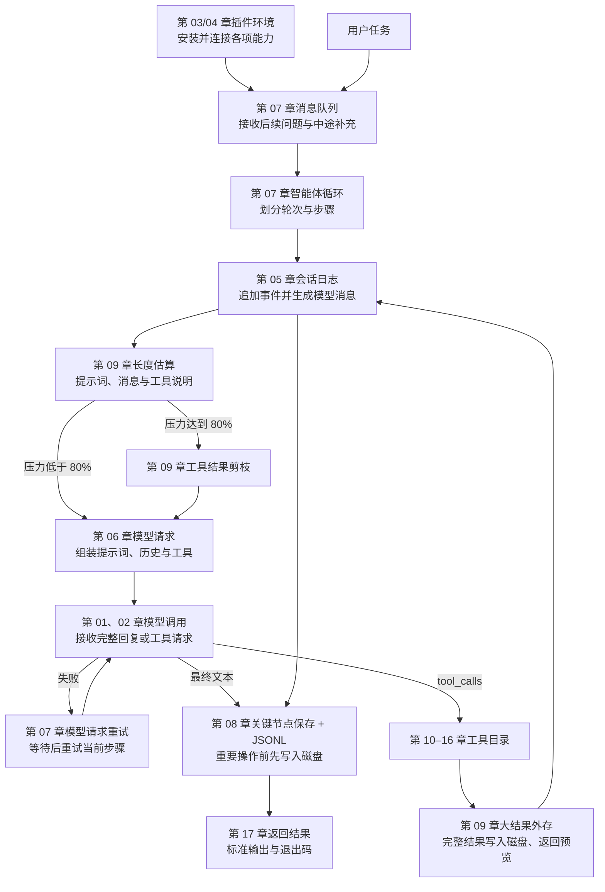

<p align="center">
  
</p>

<p align="center"><b>用 Python 从一次模型调用开始，逐步构建 DeepSeek Harness 的核心运行机制</b></p>
<p align="center">
  <a href="README_EN.md">English</a>
</p>

<div align="center">

[](LICENSE) [](pyproject.toml)

</div>

---

## 项目介绍

调用一次大语言模型并不复杂：发送消息，等待回复，再把文本显示出来。要让智能体持续完成任务，还需要处理另一组问题。模型如何调用工具？多轮对话如何保存？上下文越来越长时怎样压缩？文件和命令怎样限制权限？任务执行到一半时，新的用户消息又该如何进入当前流程？

[DeepSeek Harness](https://github.com/deepseek-ai/DeepSeek-Harness)（简称 DSH）围绕这些问题建立了一套完整的智能体运行系统。它使用 TypeScript 开发，源码由许多相互协作的模块组成。如果你主要使用 Python，直接阅读官方源码时，还要同时熟悉 TypeScript 和较复杂的项目结构，容易分散对智能体运行机制的注意力。

mini-harness 将 DSH 的核心机制拆成 17 个 Python 章节。课程从最小的流式模型调用开始，依次加入工具、会话、提示词、持久化、上下文压缩、文件与命令能力、技能、子智能体和网络搜索，最后组装出一个能够接收任务、保存会话并返回结果的命令行智能体。

课程主要讲解 DSH 的命令行运行方式，官方称为 headless。它不启动网页、桌面界面或 HTTP 服务，而是直接接收任务、运行智能体和工具，再把结果输出到终端。这种方式保留了智能体的核心运行过程，也便于观察每一步发生了什么。

完成全部章节后，将能够解释并实现以下机制：

- 流式响应如何从数据分片组装成一条完整消息；
- 模型如何提出工具调用，程序如何执行工具并把结果送回模型；
- 会话事件如何记录、投影、持久化、恢复和压缩；
- 模型、工具、提示词、会话和运行策略如何通过插件协作，并在卸载时按顺序清理资源；
- 文件、命令、技能、长期目标、任务清单和子智能体如何接入运行循环；
- 一个命令行智能体如何完成组装、执行、保存和结果返回。

## 适合哪些读者

这套课程面向具备 Python 基础、希望理解智能体内部运行方式的开发者和自学者。开始学习前，只需要能够阅读函数、类、字典和异常处理，并了解通过 API 调用大语言模型的基本概念。课程不要求 TypeScript 经验，也不要求提前掌握智能体框架、事件溯源或上下文工程。

代码中会出现 `async / await`、`dataclass`、生成器和 JSON 序列化。相关概念会在第一次使用时结合当前问题讲解，因此无需先单独学习一套完整的异步编程或类型系统课程。

## 快速开始

项目使用 [uv](https://docs.astral.sh/uv/) 管理 Python 环境和依赖，需要 Python 3.11 或更高版本。

先安装项目依赖：

```bash
uv sync
```

第 01 章会连接 DeepSeek API。从模板创建本地配置，并填入自己的密钥：

```bash
cp .env.example .env
# 编辑 .env，填入自己的 DEEPSEEK_API_KEY
```

`.env` 已加入 Git 忽略规则，不会被正常的 Git 操作提交。联网章节会优先读取进程环境变量中的 `DEEPSEEK_API_KEY`，没有时再读取项目根目录的 `.env`。

最后运行第 01 章，观察一次非流式调用、一次流式调用和完整消息组装：

```bash
uv run python chapters/01-streaming-agent/src/demo.py
```

这次运行会产生真实的 DeepSeek API 用量。完成后继续阅读[第 01 章说明](chapters/01-streaming-agent/README.md)，再按章节顺序学习。第 03、04 章只运行本地代码，其他章节的运行方式和联网范围会在各章开头说明。

## 课程如何组织

17 个章节分为五个部分。每一部分先建立一个可以运行的基础，再围绕前一部分留下的问题增加新的机制。

### 第一部分：建立最小智能体

这一部分从模型请求与响应开始。完成两章后，程序已经能够接收任务、读取流式输出，并在模型需要时执行计算工具。

| 章节 | 核心问题 | 运行方式 |
|---|---|---|
| [01｜流式输出与消息组装](chapters/01-streaming-agent/README.md) | SSE 返回的是连续分片，程序如何把它们组装成稳定消息？ | DeepSeek API |
| [02｜工具调用](chapters/02-tool-calling/README.md) | 模型如何发起工具调用，工具结果又如何进入下一次模型请求？ | DeepSeek API |

### 第二部分：理解插件与依赖

智能体的能力会不断增加。插件系统负责组织这些能力的安装、依赖和清理，使各模块能够按照明确的生命周期协作。

| 章节 | 核心问题 | 运行方式 |
|---|---|---|
| [03｜迷你插件系统](chapters/03-python-cordis/README.md) | 插件如何安装、进入运行状态，并在卸载时释放资源？ | 本地 |
| [04｜服务与依赖](chapters/04-services-scopes/README.md) | 服务如何注册、拒绝重名并在提供者变化后重新解析，严格访问为什么能够暴露依赖错误？ | 本地 |

### 第三部分：建立持续运行的智能体

一次模型调用只处理一个请求，持续运行的智能体还需要记录历史、接收后续消息、恢复会话，并在上下文接近上限时压缩旧内容。

| 章节 | 核心问题 | 运行方式 |
|---|---|---|
| [05｜会话日志](chapters/05-session-log/README.md) | 只追加的事件日志如何还原对话，同时保留完整运行过程？ | DeepSeek API |
| [06｜组装模型请求](chapters/06-prompt-tools/README.md) | 系统提示词、历史消息和工具说明如何组成一次模型请求？ | DeepSeek API |
| [07｜多轮运行与消息队列](chapters/07-agent-inbox/README.md) | 后续问题和中途补充的要求应在什么时候进入运行过程？ | DeepSeek API |
| [08｜会话持久化](chapters/08-persistence/README.md) | JSONL 如何恢复中断的会话，重要操作前又应保存哪些记录？ | DeepSeek API |
| [09｜上下文工程](chapters/09-context-engineering/README.md) | 摘要、结果裁剪和外部存储如何共同控制上下文长度？ | DeepSeek API |

### 第四部分：扩展智能体的能力

运行循环建立后，智能体开始与本地环境和外部服务交互。这一部分分别处理文件、命令、技能、长期任务状态、子智能体和网络搜索。

| 章节 | 核心问题 | 运行方式 |
|---|---|---|
| [10｜文件系统](chapters/10-filesystem/README.md) | 路径围栏、读后写检查和观察记录如何降低文件误操作风险？ | DeepSeek API |
| [11｜命令执行与审批](chapters/11-shell-sandbox/README.md) | 终端命令如何经过权限判断、审批、超时和结果回收？ | DeepSeek API |
| [12｜技能与按需加载](chapters/12-instructions-skills/README.md) | 技能目录如何只暴露摘要，并在使用时加载完整指令？ | DeepSeek API |
| [13｜目标、计划与任务清单](chapters/13-goal-plan-todo/README.md) | 长任务状态、计划评审与结构化用户问答怎样协作？ | DeepSeek API |
| [14｜子智能体、后台任务与工作流](chapters/14-subagents-workflow/README.md) | 子任务如何隔离上下文、在前台或后台运行，并安全返回结果？ | DeepSeek API |
| [15｜网络搜索与网页抓取](chapters/15-external-capabilities/README.md) | 智能体如何搜索网络，并把搜索结果整理成可以核对的来源？ | DeepSeek API + Web Search |

### 第五部分：组装完整运行入口

最后两章从两个方向处理系统入口：第 16 章讲配置与进程间调用，第 17 章用 mini-Cordis 把模型、会话、提示词、工具以及第 10–16 章的能力组装成一个完整的插件系统。JSON-RPC 使用 `--rpc` 在标准输入输出中逐行传递请求，不启动监听端口。

| 章节 | 核心问题 | 运行方式 |
|---|---|---|
| [16｜配置与 RPC](chapters/16-settings-jsonrpc/README.md) | 多层配置如何合并，JSON-RPC 如何校验并分发外部请求？ | DeepSeek API |
| [17｜命令行智能体的完整组装](chapters/17-headless-capstone/README.md) | “一切皆插件”怎样把第 10–16 章的能力接入同一个智能体？ | DeepSeek API |

## 一次任务如何完成

第 17 章把前面各章接进同一条执行路径。摘要压缩仍由第 09 章独立演示；完整示例会在每次请求前估算系统提示词、当前消息和工具说明的长度。使用量达到上下文窗口的 80% 时，程序才裁剪较早的大型工具结果；刚产生的超大结果则会先保存到文件，只把预览交给模型。模型因输入过长而报错后的自动恢复尚未接入。



第 03、04 章建立的插件与服务机制会在第 17 章重新出现。文件、命令和技能等能力会成为模型可以选择的工具；模型连接、会话保存、失败重试和上下文控制则在程序内部工作。它们都通过插件接入，但只有需要模型主动调用的能力才会出现在工具清单中。

## 每章的学习方式

每章都围绕一个具体问题展开，正文依次包含问题背景、运行过程、关键代码、分段讲解、真实输出、官方源码对照和练习。章节中的 `src/` 目录保存当前章节的完整实现，不会从一个共享教学包中导入已经写好的核心逻辑，因此代码可以与正文逐段对应。

完整学习按 01 到 17 章推进。若只想先了解课程的实现深度，可以依次阅读 01、02、09、17：第 01 章建立模型连接，第 02 章形成智能体的最小循环，第 09 章处理长上下文，第 17 章展示最终组装。

一次章节学习可以按下面的顺序进行：

1. 先阅读开头的问题背景，明确本章为什么需要新增这个机制。
2. 运行 `src/demo.py`，观察输入、事件和输出之间的关系。
3. 对照正文阅读完整代码，重点跟踪数据结构在各函数之间如何流动。
4. 打开章末的官方源码链接，比较 TypeScript 实现与 Python 表达的差异。
5. 完成练习，将当前实现扩展到新的场景或失败路径。

## 进一步了解：TypeScript 与 Python 的对应

课程保留的是 DSH 的主要行为、数据流和生命周期。下面这张表用于帮助想继续阅读官方源码的读者建立对应关系；第一次学习时可以先跳过。TypeScript 与 Python 的语言机制不同，因此课程代码采用 Python 中更直接的表达方式：

| DSH / TypeScript | mini-harness / Python | 对应关系 |
|---|---|---|
| Proxy 拦截属性读取 | `__getattr__` | 在读取未声明服务时立即报告错误 |
| 插件任务（fiber）状态机与级联清理 | `PluginHandle` 状态机与逆序清理 | 保留插件启动、运行、失败和卸载生命周期 |
| 依赖版本（epoch）变化通知 | 依赖签名与全量重算 | 服务变化后重新判断插件是否可以启动 |
| 顺序处理链（waterfall）事件 | 递归调用 `waterfall` | 多层处理逻辑依次包裹核心执行器，结果沿调用链返回 |
| Promise 并发 | `ThreadPoolExecutor` | 多个子智能体并发运行，结果按任务归集 |
| 可区分联合类型 | 冻结的数据类联合 | 用明确类型表示不同消息和事件 |
| JSON 快照冻结 | 递归校验与冻结 | 日志只接受能够稳定序列化和重放的数据 |

## 官方源码依据

课程中的机制和术语均与 DeepSeek Harness 官方源码核对。课程使用 2026-08-19 的 [`141eb6fef83422698aef7a981029e843e8161534`](https://github.com/deepseek-ai/DeepSeek-Harness/tree/141eb6fef83422698aef7a981029e843e8161534)（`0.1.0-rc.8`）作为固定参考版本，避免官方源码继续变化后无法复现文中的结论。每章末尾都会列出相关源码位置，并说明课程保留了什么、简化了什么。

<details>
<summary><strong>查看 17 章官方源码对照表</strong></summary>

| 章 | 教学主题 | 官方源码入口 |
|---|---|---|
| 01 | SSE 与完整消息提交 | `packages/llm/llm-deepseek/src/adapter.ts`、`packages/llm/llm/src/assembler.ts` |
| 02 | 工具调用往返 | `packages/core/agent-loop/src/agent.ts`、`packages/core/tools` |
| 03 | 插件生命周期 | `vendor/cordis/src/fiber.ts`、`vendor/cordis/src/context.ts` |
| 04 | 服务、插件上下文与顺序处理链 | `vendor/cordis/src/reflect.ts`、`vendor/cordis/src/events.ts` |
| 05 | 事件日志与完整模型请求 | `packages/core/session`、`packages/core/agent-loop/src/agent.ts` |
| 06 | 提示词与工具注册表 | `packages/core/system-prompt`、`packages/core/tools` |
| 07 | 轮次、步骤与消息队列 | `packages/core/agent/src/inbox.ts`、`packages/core/agent-loop/src/agent.ts` |
| 08 | 仅追加 JSONL 与恢复 | `packages/session/session-persistence-jsonl` |
| 09 | 回放感知计量与压缩 | `packages/llm/token-meter`、`packages/compaction/compaction-basic` |
| 10 | 文件围栏与观察策略 | `packages/fs/fs-sandbox`、`packages/fs/fs-observation-policy` |
| 11 | 命令沙箱与审批 | `packages/shell/bash-sandbox`、`packages/interaction/user-approval` |
| 12 | 技能注册表与渐进加载 | `packages/skill/skill`、`packages/skill/tool-skill` |
| 13 | 长期目标与任务清单 | `packages/goal/goal`、`packages/todo/tool-todo` |
| 14 | 子智能体服务与委派 | `packages/subagent/subagent`、`packages/subagent/tool-subagent` |
| 15 | 网络能力扩展位置 | `packages/web/tool-web`、`packages/web/web-search-deepseek`、`packages/web/web-fetch-http` |
| 16 | 配置与 Typert 网关 | `packages/settings/settings`、`packages/api/gateway` |
| 17 | Cordis 插件集合与命令行运行器 | `packages/bundle/base`、`packages/bundle/headless` |

</details>

## 仓库结构

```text
mini-harness/
├── chapters/
│   ├── 01-streaming-agent/
│   │   ├── README.md      # 问题、原理、关键代码、输出、源码对照与练习
│   │   └── src/           # 当前章节的完整实现和 demo.py
│   ├── ...
│   └── 17-headless-capstone/
├── docs/images/logo.svg
├── .env.example
└── pyproject.toml
```

## 安全边界

文件和命令章节会把真实模型调用限制在临时工作区：第 10 章使用 `workspace-write`，要求模型先读、再改、最后复查；第 11 章只批准示例指定的两条精确命令。文件路径会先规范化再检查允许范围，命令执行带有审批、超时和结果回收。这些机制用于减少学习和本地实验中的误操作。

路径围栏仍运行在普通 Python 进程中，不能替代操作系统级沙箱。子进程拥有当前用户已经具备的系统权限。课程也没有实现图形界面、HTTP 服务、热重载和云端隔离环境，这些能力不影响命令行运行主线的学习。

## 后续学习方向

完成 17 章后，可以沿着以下方向继续扩展：

- 在第 17 章接入第 09 章的自动摘要压缩，并处理模型输入超过上限后的恢复；
- 将第 14 章教学版 Python Workflow 替换为官方 Worker Thread JavaScript 引擎；
- 接入 MCP 客户端，将外部服务动态注册为工具；
- 实现 Code Mode，把多个工具接口折叠成一个代码执行入口；
- 在第 02 章补充流式工具参数分片的增量组装；
- 对照 DSH 的网页界面、宿主服务和平台沙箱，研究命令行运行方式之外的系统组成。

## 许可

项目采用 MIT License，第三方源码与许可信息见 [THIRD_PARTY_NOTICES.md](THIRD_PARTY_NOTICES.md)。
