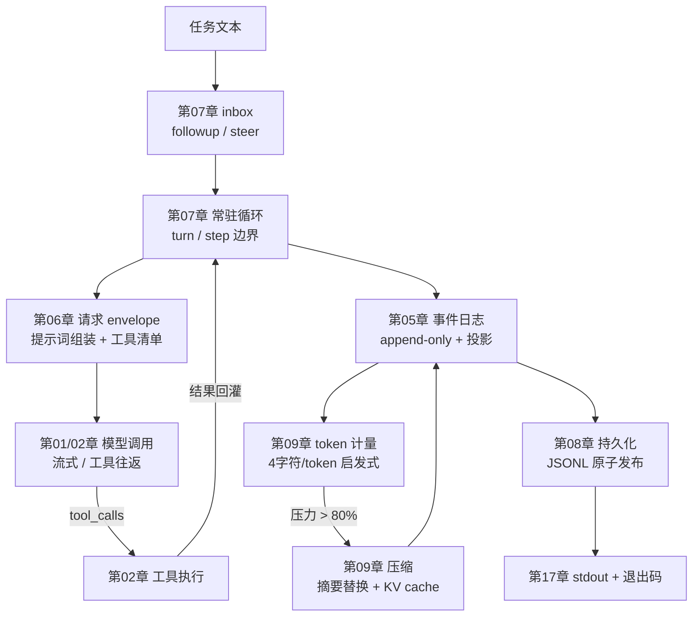

<p align="center">
  
</p>

<p align="center"><b>用 Python 理解 DeepSeek Harness 如何驱动一个 Agent</b></p>
<p align="center">
  <a href="README_EN.md">English</a>
</p>

<div align="center">

[](LICENSE)
[](pyproject.toml)

</div>

---

## 项目介绍

DeepSeek Harness（简称 DSH）是一个 TypeScript 写的 Agent 框架，官方仓库有
上百个包。它把插件、作用域、事件日志、工具管线和上下文工程这些概念组织得很紧凑，但对习惯了 Python 的开发者来说，读源码之前还得先熟悉 TypeScript，
学习成本不小。

这个项目把 DSH 的核心机制用 Python 3.11+ 重新实现了一遍，做成 17 个可以
独立运行的章节。课程覆盖 DSH 的 headless 运行路径，也就是不打开网页、不挂终端界面，直接把任务交给 Agent，等它完成后取回结果。

学完全部章节，会从零实现这些东西：

- 模型流式输出、消息协议和工具调用往返；
- 一个会等待依赖、能自动清理资源的插件系统；
- 可以追溯、压缩、恢复的对话日志；
- 默认只读的文件与命令工具，以及可开关的外部能力；
- 一个能保存会话、返回最终文本的完整 Agent。

其中 9 章会调用真实的 DeepSeek 模型（01、02、05、06、07、09、14、15、
17），第 15 章还会做真实的网页搜索和抓取；其余 8 章只跑本地机制，不需要
API Key。每一章的代码都是自包含的，不依赖任何外部包，教程正文里给出了
完整实现和逐段讲解。

## 快速开始

项目用 [uv](https://docs.astral.sh/uv/) 管理依赖，需要 Python 3.11 以上。
在仓库根目录执行：

```bash
cp .env.example .env
# 编辑 .env，填入自己的 DEEPSEEK_API_KEY
uv sync
uv run python chapters/01-streaming-agent/src/demo.py
```

`.env` 已被 Git 忽略，不会被提交。运行全部章节：

```bash
uv run python scripts/run_all.py              # 全部 17 章，其中 9 章联网产生用量
uv run python scripts/run_all.py --local-only # 只跑 8 个本地章节
```

17 个章节只会读取 `DEEPSEEK_API_KEY` 这一个环境变量。`DEEPSEEK_BASE_URL`、
`DSH_MODEL` 这类启动级变量不要写进 `.env`，官方 DSH 启动器会拒绝从文件
读取它们，报错提示改用 `export`。

## 学习路径

每章的结构都一样：先讲这个机制解决什么问题，再给出完整代码和逐段讲解，
然后是真实运行输出、官方源码对照和练习。建议按顺序学习，只想快速浏览的
话先跑 01、02、09、17 这四章。async、dataclass 这些 Python 概念会在用到
的时候随章讲解，不需要提前准备。

| 阶段 | 章节 | 学完能回答什么问题 |
|---|---|---|
| 最小闭环 | [01 流式 Agent](chapters/01-streaming-agent/README.md)（调模型）· [02 工具调用](chapters/02-tool-calling/README.md)（调模型） | 模型的流式增量怎么变成稳定消息，工具调用如何完成往返 |
| 插件底座 | [03 迷你插件系统](chapters/03-python-cordis/README.md)（本地）· [04 服务与依赖](chapters/04-services-scopes/README.md)（本地） | 插件怎么等待依赖自动启动，卸载时怎么级联清理，读服务为什么必须声明 |
| 状态与执行 | [05 会话日志](chapters/05-session-log/README.md)（调模型）· [06 请求 envelope](chapters/06-prompt-tools/README.md)（调模型）· [07 常驻 Agent](chapters/07-agent-inbox/README.md)（调模型）· [08 持久化](chapters/08-persistence/README.md)（本地） | 事件溯源、提示词组装、轮次边界、原子落盘和崩溃恢复如何配合 |
| 上下文工程 | [09 计量与压缩](chapters/09-context-engineering/README.md)（调模型） | 4 字符每 token 的估算、80% 阈值和摘要替换各自解决什么问题 |
| 本地能力 | [10 文件系统](chapters/10-filesystem/README.md)（本地）· [11 Shell 与审批](chapters/11-shell-sandbox/README.md)（本地）· [12 Skills](chapters/12-instructions-skills/README.md)（本地） | 路径围栏、读后写检查、命令审批链和按需加载指令如何工作 |
| 编排与扩展 | [13 Goal 与 Todo](chapters/13-goal-plan-todo/README.md)（本地）· [14 Subagent](chapters/14-subagents-workflow/README.md)（调模型）· [15 外部能力](chapters/15-external-capabilities/README.md)（调模型） | 长任务状态机、子 agent 的隔离与并行、真实网页搜索如何组织 |
| 装配 | [16 配置与 RPC](chapters/16-settings-jsonrpc/README.md)（本地）· [17 收口组装](chapters/17-headless-capstone/README.md)（调模型） | 配置分层、JSON-RPC 线格式，以及前 16 章如何组装成可运行的整体 |

## 17 章如何衔接

一次任务从进来到出去，走过的路径是这样的：



第 03、04 章的插件系统和第 10、11 章的沙箱与审批不在这条路径上，它们是
独立的能力，任何章节需要时都能接入。第 12 到 16 章各自覆盖一块独立主题：
Skills、Goal 与 Todo、Subagent、外部搜索、配置与 RPC。

阅读顺序上，01、02、05、06、07、08、09、17 是连续的，每章在前一章的
代码基础上增加一个机制；其余章节可以按兴趣单独学习。

课程没有覆盖的部分包括内核级 shell 沙箱、流式工具分片组装、fork 子 agent
和压缩前的剪枝，它们在第 02、09、14 章的练习里作为延伸题目出现，并给出
了对应的官方源码位置。

## 官方源码对照

每个机制都能在官方源码里找到对应物，每章末尾的对照小节是分章视图。所有
链接固定到 [`master@47f943859bef60e4160492346772ded9b24f765a`](https://github.com/deepseek-ai/DeepSeek-Harness/tree/47f943859bef60e4160492346772ded9b24f765a)
（下文以 `@SHA` 简写）：

| 章 | 教学版机制 | 官方路径（前缀 `https://github.com/deepseek-ai/DeepSeek-Harness/blob/@SHA/`） | 关键行号 |
|----|-----------|--------------------------------------------------------------------------------|----------|
| 01 | SSE 流式 | `packages/llm/llm-deepseek/src/adapter.ts` | 286（text/event-stream） |
| 01 | 分片组装 | `packages/llm/llm/src/assembler.ts` | 60-63（text-delta） |
| 02 | 工具调用往返 | `packages/core/agent-loop/README.zh.md` | 105（工具调用与结果回灌） |
| 02 | 工具注册 | `packages/core/tools/README.zh.md` | 5（流水线）、20（register） |
| 03 | 插件生命周期 | `vendor/cordis/src/fiber.ts` | 184（Fiber）、148（状态机）、415（effect） |
| 03 | Context/Proxy | `vendor/cordis/src/context.ts` | 74（Proxy） |
| 04 | 服务与依赖 | `vendor/cordis/src/reflect.ts` | 277（provide）、314（notify）、144（严格访问） |
| 04 | waterfall 事件 | `vendor/cordis/src/events.ts` | 234-238 |
| 05 | 事件溯源 | `packages/core/session/README.zh.md` | 5（仅追加）、39（append）、40-41（投影） |
| 05 | 轮次消息记录 | `packages/core/agent-loop/README.zh.md` | 105（仅写日志与发送的区分） |
| 06 | 提示词组装 | `packages/core/system-prompt/README.zh.md` | 5（组装注册表）、20（section）、24（variable） |
| 06 | schema 投影 | `packages/core/tools/README.zh.md` | 24（schemas 不含 execute） |
| 07 | inbox 与 send | `packages/core/agent-loop/README.zh.md` | 58（followup/steer/inject）、76（循环只做三件事） |
| 08 | JSONL 后端 | `packages/session/session-persistence-jsonl/README.zh.md` | 5（仅追加）、43（原子发布）、44（失败回滚） |
| 09 | token 估算 | `packages/llm/token-meter/README.zh.md` | 9（4 字符/token）、32（projectedTokens） |
| 09 | 压缩策略 | `packages/compaction/compaction-basic/README.zh.md` | 32（0.8/0.16）、18（KV cache 复用）、17（收敛）、164（失败保留原文） |
| 10 | 文件沙箱 | `packages/fs/fs-sandbox/README.zh.md` | 16（可写根）、21（约束非边界）、23（结构化拒绝） |
| 11 | 命令沙箱 | `packages/shell/bash-sandbox/README.zh.md` | 15（danger-full-access）、85（只覆盖文件影响） |
| 11 | 审批 | `packages/interaction/user-approval/README.zh.md` | 四结果、fail closed |
| 12 | 技能 | `packages/skill/skill/README.zh.md` | 17（摘要目录）、56（渐进加载）、44（renderSkillContent） |
| 13 | 目标状态机 | `packages/goal/goal/README.zh.md` | 5（事件溯源）、22（单一目标）、24（goal/change）、28（续行不持久化） |
| 13 | 任务清单 | `packages/todo/tool-todo/README.zh.md` | 5（整体替换）、9（快照事件）、25（校验） |
| 14 | 子 agent | `packages/subagent/tool-subagent/README.zh.md` | 5（委派工具）、11（失败保留部分文本） |
| 14 | fork 例外 | `packages/subagent/subagent-fork-in-process/README.zh.md` | 5（继承父对话种子） |
| 15 | Web Search | `packages/web/web-search-deepseek/README.zh.md` | Anthropic 端点 + 服务器工具 + 严格模式 |
| 16 | RPC 网关 | `packages/api/gateway/README.zh.md` | 5（Host/Client 端点）、9（invoke 校验） |
| 17 | headless 组合 | `packages/bundle/headless/README.zh.md` | 5（不挂载 Host）、7（runner 语义） |

固定提交的 monorepo 包版本是 `0.1.0-rc.5`，同期 npm 发布包为
`0.1.0-rc.6`，本表按 Git 源码版本记录。

## TypeScript 与 Python 的对应

教学版对齐的是行为与生命周期，不要求模仿 TypeScript 语法：

| DSH / TypeScript | mini-harness / Python |
|---|---|
| Proxy 拦截属性读取 | `__getattr__` 严格服务访问 |
| fiber 状态机 + 级联清理 | `PluginHandle` 状态机 + 逆序清理 |
| epoch 依赖重算 + notify | 依赖签名（uid:version）+ 全量重算 |
| waterfall 事件 | 递归 dispatch 的 `waterfall` |
| Promise 并发 | `ThreadPoolExecutor` 并行子 agent |
| discriminated union + frozen | frozen dataclass 联合 |
| JSON 快照冻结 | 递归冻结，拒绝非纯 JSON |

## 会反复用到的 Python 概念

章节里会在用到时讲解，这里列一份总览：

- **frozen dataclass**：创建后不可修改的数据对象。对话历史会被反复读取，
  任何一处悄悄改动都会让后续行为对不上，用语言约束直接消灭这类问题。
- **async / await**：网络等待期间让程序处理别的事情。记住三个要点，
  `async def` 定义异步函数，`await` 等待结果，`asyncio.run` 启动。
- **生成器（yield）**：函数里出现 `yield` 就变成生成器，每产出一个值就
  交给调用方，然后暂停等待下一次迭代，这是流式消费的天然形态。
- **错误作为信息**：工具失败、文件被外部修改、审批被拒绝，都转成结构化
  文本回灌给模型，而不是让程序崩溃。Agent 的健壮性来自让模型看见错误。
- **冻结与严格 JSON**：日志和消息只接受纯 JSON，拒绝 NaN、集合和循环
  引用，写入时冻结，这是持久化与重放的前提。

## 仓库结构

```text
mini-harness/
├── chapters/              # 17 章：每章 = 教程正文 README + 自包含 src/ 代码
│   ├── 01-streaming-agent/
│   │   ├── README.md      # 原理 → 完整代码 → 逐段讲解 → 真实输出 → 官方对照 → 练习
│   │   └── src/           # 本章实现（零外部依赖）+ demo.py
│   └── ...
├── scripts/run_all.py     # 运行全部章节 demo
├── docs/images/logo.svg   # 门面图
└── pyproject.toml
```

## 扩展路线

- 压缩前的剪枝，第 09 章练习 3 预留了实现位置
- fork 子 agent，第 14 章练习 3 预留了实现位置
- workflow 脚本编排，第 14 章练习 4 预留了实现位置
- MCP 客户端与协议适配
- Code Mode，把工具折叠成 run_code
- 流式工具分片组装，第 02 章练习 4 预留了实现位置

## 安全边界

默认权限是 read-only，写操作和 Shell 需要显式升级或审批；文件路径先规范化
再检查围栏；命令执行带超时和一次性授权。这些措施用来降低学习和本地实验
中的误操作风险。Python 子进程仍拥有当前用户的系统权限，路径围栏不是
操作系统级沙箱，官方也明确过同样的边界。项目不提供图形界面、HTTP 服务、
热重载和云端沙箱。

## 许可

MIT License，第三方归属见 [THIRD_PARTY_NOTICES.md](THIRD_PARTY_NOTICES.md)。
