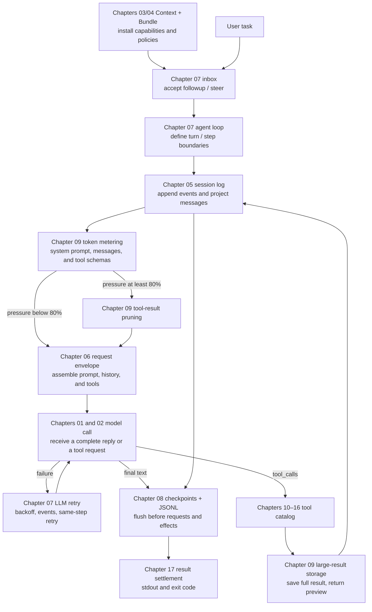

<p align="center">
  
</p>

<p align="center"><b>Start with one model call and build the core of DeepSeek Harness in Python</b></p>
<p align="center">
  <a href="README.md">中文</a>
</p>

<div align="center">

[](LICENSE) [](pyproject.toml)

</div>

---

## About the course

Calling a large language model once is straightforward: send a message, wait for the response, and display the text. An agent that can work on a task over time has a different set of problems to solve. How does the model call a tool? Where does conversation history live? What happens when the context approaches its limit? How are file and shell operations constrained? How does a new user message reach an agent that is already running?

[DeepSeek Harness](https://github.com/deepseek-ai/DeepSeek-Harness) (DSH) provides a complete agent runtime built around these questions. Its TypeScript codebase contains many cooperating modules. A Python developer reading it for the first time must often learn the language, the project structure, and the agent mechanisms at the same time. That makes it easy to lose sight of the system itself.

mini-harness turns the core DSH mechanisms into 17 Python chapters. The course begins with a minimal streaming model call, then adds tools, sessions, prompt assembly, persistence, context compaction, filesystem and shell access, skills, sub-agents, and web search. The final chapter assembles the main execution path into a headless agent that accepts a task, persists its session, and returns a result.

The course focuses on the headless execution path. Here, headless means that no web page, desktop interface, or HTTP service is started. A program receives a task, runs the agent and its tools, and writes the result to standard output. This keeps the agent's main execution path visible from a terminal.

After completing the course, learners will be able to explain and implement:

- how streaming response chunks become a complete message;
- how a model requests a tool and receives the tool result in the next model call;
- how session events are recorded, projected, persisted, recovered, and compacted;
- how model, tools, prompt, session, and runtime policies cooperate as plugins and clean up in reverse order;
- how filesystem, shell, skills, goals, todo lists, and sub-agents connect to the runtime loop;
- how a headless agent is assembled, runs a task, flushes state, and returns a final result.

## Who this course is for

The course is written for developers and self-directed learners who know basic Python and want to understand how an agent runtime works internally. The only prerequisites are familiarity with functions, classes, dictionaries, and exceptions, plus a basic idea of how an application calls an LLM API. No TypeScript experience or previous agent-framework knowledge is required.

The code uses `async / await`, dataclasses, generators, and JSON serialization where they help explain a mechanism. Each concept is introduced when it first becomes useful, so a separate course on asynchronous programming or Python's type system is not required beforehand.

## Quick start

The project uses [uv](https://docs.astral.sh/uv/) to manage Python and its dependencies. Python 3.11 or newer is required.

Install the project dependencies first:

```bash
uv sync
```

Chapter 01 connects to the DeepSeek API. Create a local configuration from the template and add your key:

```bash
cp .env.example .env
# Edit .env and add your DEEPSEEK_API_KEY
```

The repository's Git ignore rules cover `.env`, so normal Git operations will not commit it. Live chapters first look for `DEEPSEEK_API_KEY` in the process environment, then fall back to the repository-level `.env` file.

Run chapter 01 to see a non-streaming call, a streaming call, and complete-message assembly:

```bash
uv run python chapters/01-streaming-agent/src/demo.py
```

This run uses the live DeepSeek API and incurs usage. Continue with the [chapter 01 guide](chapters/01-streaming-agent/README.md), then follow the chapters in order. Chapters 03 and 04 are fully local; every chapter states its own network requirements at the top.

## Course structure

The 17 chapters are organized into five parts. Each part establishes a runnable foundation, then adds the mechanism needed to solve the next group of problems.

### Part I: Build the smallest agent

The course starts with model requests and responses. At the end of these two chapters, the program can accept a task, assemble a streaming answer, and execute a calculator when the model asks for one.

| Chapter | Core question | Runtime |
|---|---|---|
| [01 · Streaming output and message assembly](chapters/01-streaming-agent/README.md) | How do SSE chunks become a stable assistant message? | DeepSeek API |
| [02 · Tool calling](chapters/02-tool-calling/README.md) | How does the model request a tool, and how does the result enter the next model call? | DeepSeek API |

### Part II: Understand plugins and dependencies

An agent gains more capabilities as it grows. The plugin system coordinates their installation, dependencies, and cleanup through an explicit lifecycle.

| Chapter | Core question | Runtime |
|---|---|---|
| [03 · A minimal plugin system](chapters/03-python-cordis/README.md) | How is a plugin installed, activated, and disposed with its resources? | Local |
| [04 · Services and dependencies](chapters/04-services-scopes/README.md) | How are services registered, duplicate names rejected, and dependencies resolved again after an implementation changes? | Local |

### Part III: Build a persistent agent runtime

A single model call handles one request. A persistent agent also needs to record history, accept follow-up messages, recover sessions, and compact old context before the model limit is reached.

| Chapter | Core question | Runtime |
|---|---|---|
| [05 · Session log](chapters/05-session-log/README.md) | How does an append-only event log reconstruct messages and preserve each run? | DeepSeek API |
| [06 · Request envelope assembly](chapters/06-prompt-tools/README.md) | How do the system prompt, message history, and tool schemas become one model request? | DeepSeek API |
| [07 · Resident agent and inbox](chapters/07-agent-inbox/README.md) | How do followup, steer, and bounded LLM retries enter explicit boundaries? | DeepSeek API |
| [08 · Session persistence](chapters/08-persistence/README.md) | How does JSONL recover a crash, and where are semantic checkpoints required? | DeepSeek API |
| [09 · Context engineering](chapters/09-context-engineering/README.md) | How do summaries, tool-result pruning, and spill control context size? | DeepSeek API |

### Part IV: Extend the agent's capabilities

Once the runtime loop is in place, the agent can interact with the local environment and external services. These chapters add files, shell commands, skills, long-running task state, sub-agents, and web search.

| Chapter | Core question | Runtime |
|---|---|---|
| [10 · Filesystem](chapters/10-filesystem/README.md) | How do path fences, read-before-write checks, and observations reduce accidental file changes? | DeepSeek API |
| [11 · Shell execution and approval](chapters/11-shell-sandbox/README.md) | How does a command pass through permissions, approval, timeouts, and result collection? | DeepSeek API |
| [12 · Skills and on-demand loading](chapters/12-instructions-skills/README.md) | How does a skill catalog expose summaries and load the full instructions only when selected? | DeepSeek API |
| [13 · Goal, Plan Mode, and Todo](chapters/13-goal-plan-todo/README.md) | How do durable task state, plan review, and structured user questions cooperate? | DeepSeek API |
| [14 · Subagents, Jobs, and Workflow](chapters/14-subagents-workflow/README.md) | How do isolated, forked, and continuable children run in foreground or background workflows? | DeepSeek API |
| [15 · Web search and page fetching](chapters/15-external-capabilities/README.md) | How does an agent call DeepSeek Web Search and turn sources into usable context? | DeepSeek API + Web Search |

### Part V: Assemble the runtime boundary

The final two chapters approach the system boundary from different directions. Chapter 16 teaches settings and RPC independently; chapter 17 uses mini-Cordis to compose the model, session, prompt, tools, chapters 10–16, and runtime policies into one plugin tree. JSON-RPC uses newline-delimited stdio through `--rpc` and opens no listening port.

| Chapter | Core question | Runtime |
|---|---|---|
| [16 · Settings and RPC](chapters/16-settings-jsonrpc/README.md) | How are layered settings settled, and how does JSON-RPC validate and dispatch requests? | DeepSeek API |
| [17 · Complete headless assembly](chapters/17-headless-capstone/README.md) | How does “everything is a plugin” connect chapters 10–16 and runtime policies to one agent? | DeepSeek API |

## How one task moves through the system

Chapter 17 connects the earlier mechanisms into one execution path. Model-based summary compaction remains an independent chapter 09 demonstration. Before each request, the final program estimates the length of the system prompt, messages, and tool definitions. At 80% of the context limit, it shortens older large tool results. A newly generated result that is too large is saved to a file, and the model receives a preview. Automatic recovery after the model service rejects an oversized request is not implemented.



The plugin and service mechanisms from chapters 03 and 04 return in chapter 17. Capabilities such as files, shell commands, and skills become tools the model can choose. The model connection, session persistence, retries, and context controls work inside the program. All of them are plugins, but only capabilities that require an explicit model decision belong in the tool catalog.

## How each chapter works

Each chapter begins with one concrete problem. The tutorial then moves through the runtime flow, key code, a guided walkthrough, real output, references to the official source, and exercises. The chapter's `src/` directory contains its complete implementation. Core logic is not hidden behind an imported teaching package, so the code remains directly traceable to the explanation.

The full route runs from chapter 01 through chapter 17. A shorter preview is 01, 02, 09, and 17: chapter 01 establishes the model connection, chapter 02 closes the smallest agent loop, chapter 09 handles long context, and chapter 17 shows the assembled program.

A chapter is designed to be studied in this order:

1. Read the opening problem and identify why the next mechanism is necessary.
2. Run `src/demo.py` and follow the relationship between inputs, events, and outputs.
3. Read the complete implementation alongside the walkthrough, tracking how data moves between functions.
4. Open the official source links at the end of the chapter and compare the TypeScript implementation with the Python version.
5. Complete the exercises by extending the implementation to a new scenario or failure path.

## TypeScript ideas, Python forms

The course aligns with DSH behavior, data flow, and lifecycle rather than TypeScript syntax. Where the languages differ, the implementation uses a direct Python equivalent:

| DSH / TypeScript | mini-harness / Python | Preserved behavior |
|---|---|---|
| Proxy-based property access | `__getattr__` | Fail immediately when an undeclared service is read |
| Fiber state machine and cascade cleanup | `PluginHandle` state machine and reverse-order cleanup | Preserve plugin startup, active, failure, and disposal states |
| Epoch recomputation and notify | Dependency signatures and a full rescan | Re-evaluate whether plugins can start after a service changes |
| Waterfall events | Recursive `waterfall` dispatch | Wrap the core executor in middleware and return results outward |
| Promise concurrency | `ThreadPoolExecutor` | Run child agents concurrently and collect results by task |
| Discriminated unions | Frozen dataclass unions | Represent message and event variants explicitly |
| Frozen JSON snapshots | Recursive validation and freezing | Keep log data stable enough to serialize and replay |

## Official source baseline

The course checks its mechanisms and terminology against the official DeepSeek Harness source. Its reference version is commit [`141eb6fef83422698aef7a981029e843e8161534`](https://github.com/deepseek-ai/DeepSeek-Harness/tree/141eb6fef83422698aef7a981029e843e8161534), dated 2026-08-19 and released as `0.1.0-rc.8`. Pinning the source keeps every conclusion reproducible. Each chapter identifies the upstream source, the semantics retained in Python, and the engineering features intentionally omitted for teaching.

<details>
<summary><strong>Open the source map for all 17 chapters</strong></summary>

| Ch. | Teaching topic | Official source entry |
|---|---|---|
| 01 | SSE and complete-message commit | `packages/llm/llm-deepseek/src/adapter.ts`, `packages/llm/llm/src/assembler.ts` |
| 02 | Tool-call round trip | `packages/core/agent-loop/src/agent.ts`, `packages/core/tools` |
| 03 | Plugin lifecycle | `vendor/cordis/src/fiber.ts`, `vendor/cordis/src/context.ts` |
| 04 | Services, fiber context, and waterfall | `vendor/cordis/src/reflect.ts`, `vendor/cordis/src/events.ts` |
| 05 | Event log and request envelope | `packages/core/session`, `packages/core/agent-loop/src/agent.ts` |
| 06 | Prompt and tool registries | `packages/core/system-prompt`, `packages/core/tools` |
| 07 | Turns, steps, and Inbox | `packages/core/agent/src/inbox.ts`, `packages/core/agent-loop/src/agent.ts` |
| 08 | Append-only JSONL and recovery | `packages/session/session-persistence-jsonl` |
| 09 | Replay-aware metering and compaction | `packages/llm/token-meter`, `packages/compaction/compaction-basic` |
| 10 | Filesystem fence and observation policy | `packages/fs/fs-sandbox`, `packages/fs/fs-observation-policy` |
| 11 | Shell sandbox and approval | `packages/shell/bash-sandbox`, `packages/interaction/user-approval` |
| 12 | Skill registry and progressive loading | `packages/skill/skill`, `packages/skill/tool-skill` |
| 13 | Goal and todo | `packages/goal/goal`, `packages/todo/tool-todo` |
| 14 | Subagent service and delegation | `packages/subagent/subagent`, `packages/subagent/tool-subagent` |
| 15 | Web search and page fetching | `packages/web/tool-web`, `packages/web/web-search-deepseek`, `packages/web/web-fetch-http` |
| 16 | Settings and Typert gateway | `packages/settings/settings`, `packages/api/gateway` |
| 17 | Cordis Bundle and headless runner | `packages/bundle/base`, `packages/bundle/headless` |

</details>

## Repository layout

```text
mini-harness/
├── chapters/
│   ├── 01-streaming-agent/
│   │   ├── README.md      # problem, principle, key code, output, references, exercises
│   │   └── src/           # complete implementation for this chapter and demo.py
│   ├── ...
│   └── 17-headless-capstone/
├── docs/images/logo.svg
├── .env.example
└── pyproject.toml
```

## Safety boundary

The filesystem and shell chapters keep live model actions inside temporary workspaces. Chapter 10 uses `workspace-write` and requires the model to read, edit, and verify a file. Chapter 11 approves only the two exact commands used by the example. Paths are normalized before allowed-root checks, and command execution includes approval, timeouts, and result collection.

The path fence still runs inside an ordinary Python process and does not replace an operating-system sandbox. Child processes retain the permissions of the current user. The course also leaves out the graphical interface, HTTP service, hot reload, and cloud isolation because they are outside the headless execution path covered here.

## Where to go next

The 17 chapters leave several natural extensions:

- connect chapter 09's model-based summary compaction to chapter 17 and recover when the model service rejects an oversized request;
- replace chapter 14's teaching Python workflow with the official Worker Thread JavaScript engine;
- connect an MCP client and register external services as tools;
- implement Code Mode, collapsing many tool interfaces into one code-execution entry point;
- assemble streaming tool-call argument chunks in chapter 02;
- study the DSH Web, Host, and platform sandboxes beyond the headless path.

## License

The project is released under the MIT License. Third-party source and license information is listed in [THIRD_PARTY_NOTICES.md](THIRD_PARTY_NOTICES.md).
