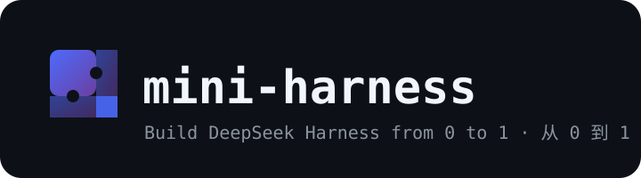
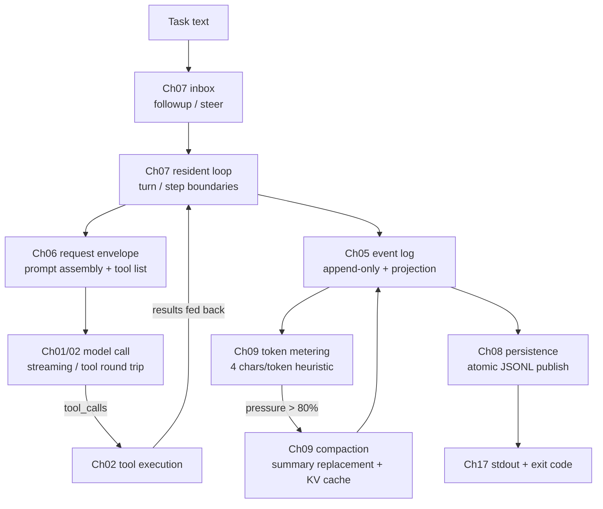

<p align="center">
  
</p>

<p align="center"><b>Understand how DeepSeek Harness drives an agent, in Python</b></p>
<p align="center">
  <a href="README.md">中文</a>
</p>

<div align="center">

[](LICENSE)
[](pyproject.toml)

</div>

---

## About

DeepSeek Harness (DSH) is an agent framework written in TypeScript, with over a
hundred packages in the official repository. It organizes plugins, scopes, event
logs, tool pipelines and context engineering into a very compact design, but for
developers who work in Python, the source code requires learning TypeScript
first, which raises the cost of entry.

This project reimplements DSH's core mechanisms in Python 3.11+, as 17 chapters
that each run on their own. The course covers DSH's headless path: no web page,
no terminal UI, just hand a task to an agent and collect the result when it
finishes.

By the end of the course you will have built, with your own hands:

- model streaming, the message protocol, and tool-calling round trips;
- a plugin system that waits for dependencies and cleans up after itself;
- conversation logs that can be traced, compacted, and recovered;
- read-only-by-default file and command tools, plus switchable external abilities;
- a complete agent that persists sessions and returns final text.

Nine chapters call the real DeepSeek model (01, 02, 05, 06, 07, 09, 14, 15, 17),
and chapter 15 also performs real web search and page fetching; the other eight
chapters run local mechanisms only and need no API key. Every chapter's code is
self-contained with no external package imports, and the tutorial includes the
full implementation with line-by-line explanations.

## Quick start

The project uses [uv](https://docs.astral.sh/uv/) for dependencies and requires
Python 3.11 or newer. From the repository root:

```bash
cp .env.example .env
# edit .env and put in your DEEPSEEK_API_KEY
uv sync
uv run python chapters/01-streaming-agent/src/demo.py
```

`.env` is git-ignored. To run everything:

```bash
uv run python scripts/run_all.py              # all 17 chapters; 9 make live calls
uv run python scripts/run_all.py --local-only # the 8 local chapters
```

The 17 chapters read exactly one environment variable, `DEEPSEEK_API_KEY`.
Variables such as `DEEPSEEK_BASE_URL` or `DSH_MODEL` should not be written into
`.env`: the official DSH launcher refuses to read launch-level variables from a
file and asks for `export` instead.

## Learning path

Every chapter follows the same structure: first the problem a mechanism solves,
then the complete code with line-by-line explanations, followed by real output,
official source references, and exercises. Reading in order works best; for a
quick tour, run chapters 01, 02, 09 and 17. Python concepts like `async` and
dataclasses are explained where they first appear.

| Stage | Chapters | What you can explain afterwards |
|---|---|---|
| Minimal loop | [01 Streaming agent](chapters/01-streaming-agent/README.md) (live) · [02 Tool calling](chapters/02-tool-calling/README.md) (live) | How streaming deltas become stable messages; how a tool round trip works |
| Plugin base | [03 Mini plugin system](chapters/03-python-cordis/README.md) (local) · [04 Services & deps](chapters/04-services-scopes/README.md) (local) | How plugins wait for dependencies and cascade cleanup; why reading a service requires declaring it |
| State & execution | [05 Session log](chapters/05-session-log/README.md) (live) · [06 Request envelope](chapters/06-prompt-tools/README.md) (live) · [07 Resident agent](chapters/07-agent-inbox/README.md) (live) · [08 Persistence](chapters/08-persistence/README.md) (local) | How event sourcing, prompt assembly, turn boundaries, atomic writes and crash recovery fit together |
| Context engineering | [09 Metering & compaction](chapters/09-context-engineering/README.md) (live) | What the 4-chars-per-token estimate, the 80% threshold and summary replacement each solve |
| Local abilities | [10 Filesystem](chapters/10-filesystem/README.md) (local) · [11 Shell & approval](chapters/11-shell-sandbox/README.md) (local) · [12 Skills](chapters/12-instructions-skills/README.md) (local) | How path fences, read-before-write checks, the command approval chain and on-demand instructions work |
| Orchestration | [13 Goal & Todo](chapters/13-goal-plan-todo/README.md) (local) · [14 Subagent](chapters/14-subagents-workflow/README.md) (live) · [15 External abilities](chapters/15-external-capabilities/README.md) (live) | The long-task state machine, sub-agent isolation and parallelism, and how real web search is organized |
| Assembly | [16 Settings & RPC](chapters/16-settings-jsonrpc/README.md) (local) · [17 Capstone](chapters/17-headless-capstone/README.md) (live) | Config layering, the JSON-RPC wire format, and how chapters 01-16 assemble into a runnable whole |

## How the chapters connect

One task's path through the system looks like this:



The plugin system in chapters 03 and 04, and sandbox plus approval in chapters
10 and 11, sit outside this path; they are independent abilities any chapter
can adopt. Chapters 12 through 16 each cover a standalone topic: Skills, Goal &
Todo, Subagent, external search, settings and RPC.

Chapters 01, 02, 05, 06, 07, 08, 09 and 17 form a continuous line, each adding
one mechanism on top of the previous code; the remaining chapters can be studied
in any order.

Parts the course does not cover include kernel-level shell sandboxing, streaming
tool-call assembly, fork sub-agents, and prune-before-compact. They appear as
extension exercises in chapters 02, 09 and 14, with pointers to the official
source.

## Official source map

Every mechanism has a counterpart in the official source; each chapter's
reference section is its per-chapter view. All links pin to
[`master@47f943859bef60e4160492346772ded9b24f765a`](https://github.com/deepseek-ai/DeepSeek-Harness/tree/47f943859bef60e4160492346772ded9b24f765a)
(abbreviated `@SHA` below):

| Ch | Teaching mechanism | Official path (prefix `https://github.com/deepseek-ai/DeepSeek-Harness/blob/@SHA/`) | Key lines |
|----|--------------------|--------------------------------------------------------------------------------------|-----------|
| 01 | SSE streaming | `packages/llm/llm-deepseek/src/adapter.ts` | 286 (text/event-stream) |
| 01 | Chunk assembly | `packages/llm/llm/src/assembler.ts` | 60-63 (text-delta) |
| 02 | Tool round trip | `packages/core/agent-loop/README.zh.md` | 105 (tool calls and results) |
| 02 | Tool registration | `packages/core/tools/README.zh.md` | 5 (pipeline), 20 (register) |
| 03 | Plugin lifecycle | `vendor/cordis/src/fiber.ts` | 184 (Fiber), 148 (states), 415 (effect) |
| 03 | Context/Proxy | `vendor/cordis/src/context.ts` | 74 (Proxy) |
| 04 | Services & deps | `vendor/cordis/src/reflect.ts` | 277 (provide), 314 (notify), 144 (strict access) |
| 04 | Waterfall events | `vendor/cordis/src/events.ts` | 234-238 |
| 05 | Event sourcing | `packages/core/session/README.zh.md` | 5 (append-only), 39 (append), 40-41 (projection) |
| 05 | Per-turn recording | `packages/core/agent-loop/README.zh.md` | 105 (log-only vs sent) |
| 06 | Prompt assembly | `packages/core/system-prompt/README.zh.md` | 5 (registry), 20 (section), 24 (variable) |
| 06 | Schema projection | `packages/core/tools/README.zh.md` | 24 (schemas without execute) |
| 07 | Inbox & send | `packages/core/agent-loop/README.zh.md` | 58 (followup/steer/inject), 76 (loop does three things) |
| 08 | JSONL backend | `packages/session/session-persistence-jsonl/README.zh.md` | 5 (append-only), 43 (atomic publish), 44 (rollback) |
| 09 | Token estimate | `packages/llm/token-meter/README.zh.md` | 9 (4 chars/token), 32 (projectedTokens) |
| 09 | Compaction policy | `packages/compaction/compaction-basic/README.zh.md` | 32 (0.8/0.16), 18 (KV cache reuse), 17 (convergence), 164 (keep original on failure) |
| 10 | Filesystem sandbox | `packages/fs/fs-sandbox/README.zh.md` | 16 (writable roots), 21 (constraint, not boundary), 23 (structured denial) |
| 11 | Shell sandbox | `packages/shell/bash-sandbox/README.zh.md` | 15 (danger-full-access), 85 (file effects only) |
| 11 | Approval | `packages/interaction/user-approval/README.zh.md` | four outcomes, fail closed |
| 12 | Skills | `packages/skill/skill/README.zh.md` | 17 (summary catalog), 56 (progressive loading), 44 (renderSkillContent) |
| 13 | Goal state machine | `packages/goal/goal/README.zh.md` | 5 (event sourcing), 22 (single goal), 24 (goal/change), 28 (continuation not persisted) |
| 13 | Task list | `packages/todo/tool-todo/README.zh.md` | 5 (full replacement), 9 (snapshot event), 25 (validation) |
| 14 | Sub-agent | `packages/subagent/tool-subagent/README.zh.md` | 5 (delegation tool), 11 (partial text kept on failure) |
| 14 | Fork exception | `packages/subagent/subagent-fork-in-process/README.zh.md` | 5 (seeded with parent turns) |
| 15 | Web Search | `packages/web/web-search-deepseek/README.zh.md` | Anthropic endpoint + server tool + strict mode |
| 16 | RPC gateway | `packages/api/gateway/README.zh.md` | 5 (host/client endpoints), 9 (invoke validation) |
| 17 | Headless bundle | `packages/bundle/headless/README.zh.md` | 5 (no host mounted), 7 (runner semantics) |

The pinned commit's monorepo version is `0.1.0-rc.5`; the npm packages published
around the same time are `0.1.0-rc.6`. This table follows the Git source.

## TypeScript ideas, Python shape

The course aligns behavior and lifecycle, without imitating TypeScript syntax:

| DSH / TypeScript | mini-harness / Python |
|---|---|
| Proxy-based property lookup | `__getattr__` strict service access |
| Fiber state machine + cascade cleanup | `PluginHandle` state machine + reverse-order cleanup |
| Epoch dependency recompute + notify | Dependency signature (uid:version) + full rescan |
| Waterfall events | Recursive-dispatch `waterfall` |
| Promise concurrency | `ThreadPoolExecutor` for parallel sub-agents |
| Discriminated unions, frozen data | Frozen dataclasses |
| Frozen JSON snapshots | Recursive freezing, non-JSON rejected |

## Python concepts that keep coming back

Chapters explain these where they appear; this overview is for reference:

- **Frozen dataclass**: a data object that cannot change after creation.
  Conversation history is read over and over; one silent mutation breaks
  everything downstream. The language constraint removes that class of bugs.
- **async / await**: let the program do other work while waiting on the
  network. Three things to remember: `async def` defines an async function,
  `await` waits for a result, `asyncio.run` starts it.
- **Generators (yield)**: a function with `yield` becomes a generator; it hands
  each value to the caller and pauses until the next iteration, the natural
  shape for streaming.
- **Errors as information**: tool failures, externally modified files and denied
  approvals become structured text fed back to the model instead of crashing
  the program. Agent robustness comes from letting the model see errors.
- **Freezing and strict JSON**: logs and messages accept only plain JSON, reject
  NaN, sets and cycles, and freeze on write. This is the precondition for
  persistence and replay.

## Repository layout

```text
mini-harness/
├── chapters/              # 17 chapters: tutorial README + self-contained src/ code
│   ├── 01-streaming-agent/
│   │   ├── README.md      # principle → full code → walkthrough → real output → refs → exercises
│   │   └── src/           # this chapter's implementation (no external imports) + demo.py
│   └── ...
├── scripts/run_all.py     # runs all chapter demos
├── docs/images/logo.svg   # logo
└── pyproject.toml
```

## Extension roadmap

- Prune-before-compact, with an implementation slot in chapter 09, exercise 3
- Fork sub-agents, with an implementation slot in chapter 14, exercise 3
- Workflow script orchestration, with an implementation slot in chapter 14, exercise 4
- MCP client and protocol adaptation
- Code Mode, collapsing tools into run_code
- Streaming tool-call assembly, with an implementation slot in chapter 02, exercise 4

## Safety boundary

The default mode is read-only; writes and shell commands require explicit
escalation or approval. Paths are normalized before fence checks, and commands
carry timeouts and one-shot grants. These measures reduce accidental damage
while learning. Python subprocesses still run with the current user's
permissions, and the path fence is not an OS-level sandbox; the official project
states the same boundary. The project ships no web UI, no HTTP server, no hot
reload, and no cloud sandbox.

## License

MIT licensed; third-party attributions in
[THIRD_PARTY_NOTICES.md](THIRD_PARTY_NOTICES.md).
