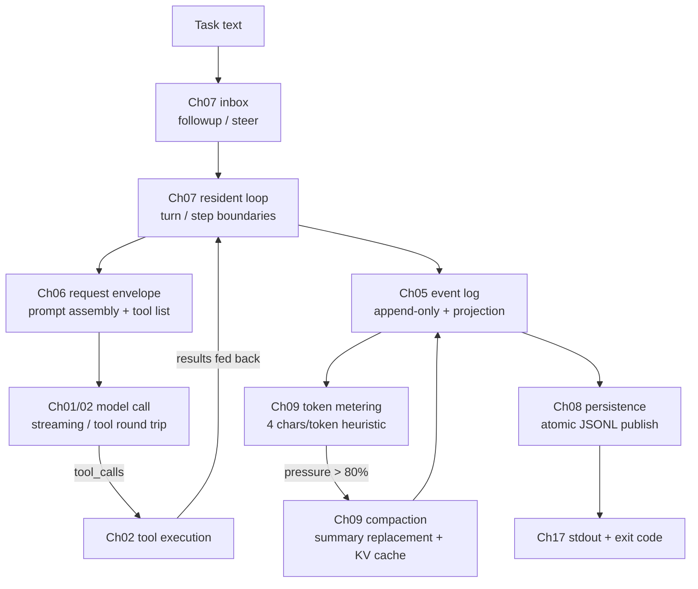

<p align="center">
  
</p>

<p align="center"><b>Understand how DeepSeek Harness drives an agent, in Python</b></p>
<p align="center">
  <a href="README.md">中文</a>
</p>

<div align="center">

[](LICENSE)
[](pyproject.toml)

</div>

---

## You know Python, but DeepSeek Harness reads like a wall

You can call an LLM and write a simple agent, yet opening the DeepSeek Harness (DSH)
TypeScript monorepo still buries you under plugins, scopes, event logs, tool pipelines
and context engineering. Learning TypeScript first, then hunting for the main line in
a production repo, often costs more than the mechanisms themselves.

mini-harness turns that main line into a Python 3.11+ course. It focuses on DSH's
**headless path**: hand a task to an agent, wait for it to finish, collect the result —
no web UI, no TUI, no HTTP server.

Across 17 chapters you implement, with your own hands:

- visible model streaming, the message protocol, and tool-calling round trips;
- a Python plugin system that waits for dependencies and cleans up after itself;
- conversation logs you can trace, compact, and recover;
- read-only-by-default file and command tools, plus controllable external abilities;
- a complete agent that persists sessions and returns final text.

Nine chapters call the real DeepSeek model (01, 02, 05, 06, 07, 09, 14, 15, 17);
chapter 15 also makes real Web Search and page-fetch calls. The other eight chapters
are purely local and need no API key. **Every chapter's code is self-contained** — no
black-box imports; the tutorial pastes the core code verbatim and walks through it
line by line.

## Run it in 5 minutes

The project uses [uv](https://docs.astral.sh/uv/). With Python 3.11+ installed:

```bash
cp .env.example .env
# edit .env and put in your DEEPSEEK_API_KEY
uv sync
uv run python chapters/01-streaming-agent/src/demo.py
```

`.env` is git-ignored. To run everything:

```bash
uv run python scripts/run_all.py              # all 17 chapters (9 make live calls)
uv run python scripts/run_all.py --local-only # the 8 local chapters
```

> Environment note: the 17 chapters read exactly one variable, `DEEPSEEK_API_KEY`.
> Do not put `DEEPSEEK_BASE_URL`, `DSH_MODEL` or similar launch-level variables into
> `.env` — the official DSH launcher refuses to read them from `.env`.

## Learning path and chapters

Every chapter follows one rhythm: **principle (why it exists) → complete code →
line-by-line walkthrough → real output → official source references → exercises**.
Study in order; for a quick preview, run 01, 02, 09 and 17. Python concepts such as
`async` and dataclasses are explained where they first appear — no prior study needed.

| Stage | Chapters | What you can explain afterwards |
|---|---|---|
| Minimal loop | [01 Streaming agent](chapters/01-streaming-agent/README.md) (live) · [02 Tool calling](chapters/02-tool-calling/README.md) (live) | How deltas become stable messages; how a tool round trip works |
| Plugin base | [03 Mini plugin system](chapters/03-python-cordis/README.md) (local) · [04 Services & deps](chapters/04-services-scopes/README.md) (local) | How plugins wait for dependencies and cascade cleanup; why reading a service requires declaring it |
| State & execution | [05 Session log](chapters/05-session-log/README.md) (live) · [06 Request envelope](chapters/06-prompt-tools/README.md) (live) · [07 Resident agent](chapters/07-agent-inbox/README.md) (live) · [08 Persistence](chapters/08-persistence/README.md) (local) | Event sourcing, prompt assembly, turn boundaries, atomic writes and crash recovery |
| Context engineering | [09 Metering & compaction](chapters/09-context-engineering/README.md) (live) | The 4-chars/token heuristic, the 80% threshold, and KV-cache-friendly summary replacement |
| Local abilities | [10 Filesystem](chapters/10-filesystem/README.md) (local) · [11 Shell & approval](chapters/11-shell-sandbox/README.md) (local) · [12 Skills](chapters/12-instructions-skills/README.md) (local) | Path fences, read-before-write CAS, the command approval chain, on-demand instructions |
| Orchestration | [13 Goal & Todo](chapters/13-goal-plan-todo/README.md) (local) · [14 Subagent](chapters/14-subagents-workflow/README.md) (live) · [15 External abilities](chapters/15-external-capabilities/README.md) (live) | The long-task state machine, subagent isolation and parallelism, real web search |
| Assembly | [16 Settings & RPC](chapters/16-settings-jsonrpc/README.md) (local) · [17 Capstone](chapters/17-headless-capstone/README.md) (live) | Config layering, the JSON-RPC wire format, and assembling chapters 01-16 into a runnable package |

## The chapters, strung together

One task's path through the system looks like this:



Besides this main path, two independent lines run alongside: the plugin system in
chapters 03/04 (every ability is installed as a plugin that waits for dependencies
and cleans up after itself), and sandbox plus approval in chapters 10/11 (writing
files and running commands both go through permission checks). Chapters 12 to 16
are standalone abilities: Skills, Goal & Todo, Subagent, external search, settings
& RPC.

Reading order: 01→02→05→06→07→08→09→17 is continuous, each chapter adding one
mechanism on top of the previous code; 03/04 and 10-16 can be studied on their own.

Things the project does not include, and why: kernel-level shell sandboxing (the
course implements permission decisions, not OS-level isolation), streaming tool-call
assembly, fork subagents, and prune-before-compact — hooks for these are left in the
exercises of chapters 02, 09 and 14, with official references.

## Official source map

Every mechanism has a counterpart in the official source; each chapter's "official
source" section is its per-chapter view. All links pin to
[`master@47f943859bef60e4160492346772ded9b24f765a`](https://github.com/deepseek-ai/DeepSeek-Harness/tree/47f943859bef60e4160492346772ded9b24f765a)
(abbreviated `@SHA` below); line numbers were verified against that commit:

| Ch | Teaching mechanism | Official path (`https://github.com/deepseek-ai/DeepSeek-Harness/blob/@SHA/` + path) | Key lines |
|----|--------------------|--------------------------------------------------------------------------------------|-----------|
| 01 | SSE streaming | `packages/llm/llm-deepseek/src/adapter.ts` | 286 (text/event-stream) |
| 01 | Chunk assembly | `packages/llm/llm/src/assembler.ts` | 60-63 (text-delta) |
| 02 | Tool round trip | `packages/core/agent-loop/README.zh.md` | 105 (tool calls & results) |
| 02 | Tool registration | `packages/core/tools/README.zh.md` | 5 (pipeline), 20 (register) |
| 03 | Plugin lifecycle | `vendor/cordis/src/fiber.ts` | 184 (Fiber), 148 (states), 415 (effect) |
| 03 | Context/Proxy | `vendor/cordis/src/context.ts` | 74 (Proxy) |
| 04 | Services & deps | `vendor/cordis/src/reflect.ts` | 277 (provide), 314 (notify), 144 (strict access) |
| 04 | Waterfall events | `vendor/cordis/src/events.ts` | 234-238 (waterfall) |
| 05 | Event sourcing | `packages/core/session/README.zh.md` | 5 (append-only truth), 39 (append), 40-41 (projection) |
| 05 | Per-turn recording | `packages/core/agent-loop/README.zh.md` | 105 (log-only vs sent) |
| 06 | Prompt assembly | `packages/core/system-prompt/README.zh.md` | 5 (registry), 20 (section), 24 (variable) |
| 06 | Schema projection | `packages/core/tools/README.zh.md` | 24 (schemas without execute) |
| 07 | Inbox & send | `packages/core/agent-loop/README.zh.md` | 58 (followup/steer/inject), 76 (loop does three things) |
| 08 | JSONL backend | `packages/session/session-persistence-jsonl/README.zh.md` | 5 (append-only), 43 (atomic publish), 44 (rollback) |
| 09 | Token heuristic | `packages/llm/token-meter/README.zh.md` | 9 (4 chars/token), 32 (projectedTokens) |
| 09 | Compaction policy | `packages/compaction/compaction-basic/README.zh.md` | 32 (0.8/0.16), 18 (KV cache), 17 (convergence), 164 (keep original on failure) |
| 10 | Filesystem sandbox | `packages/fs/fs-sandbox/README.zh.md` | 16 (writable roots), 21 (constraint, not boundary), 23 (structured denial) |
| 11 | Shell sandbox | `packages/shell/bash-sandbox/README.zh.md` | 15 (danger-full-access), 85 (file effects only) |
| 11 | Approval | `packages/interaction/user-approval/README.zh.md` | four outcomes, fail closed |
| 12 | Skills | `packages/skill/skill/README.zh.md` | 17 (summary catalog), 56 (progressive loading), 44 (renderSkillContent) |
| 13 | Goal state machine | `packages/goal/goal/README.zh.md` | 5 (event sourcing), 22 (single goal), 24 (goal/change), 28 (continuation not persisted) |
| 13 | Task list | `packages/todo/tool-todo/README.zh.md` | 5 (full replacement), 9 (snapshot event), 25 (validation) |
| 14 | Subagent | `packages/subagent/tool-subagent/README.zh.md` | 5 (delegation tool), 11 (partial text kept on failure) |
| 14 | Fork exception | `packages/subagent/subagent-fork-in-process/README.zh.md` | 5 (seeded with parent turns) |
| 15 | Web Search | `packages/web/web-search-deepseek/README.zh.md` | Anthropic endpoint + server tool + strict mode |
| 16 | RPC gateway | `packages/api/gateway/README.zh.md` | 5 (host/client endpoints), 9 (invoke validation) |
| 17 | Headless bundle | `packages/bundle/headless/README.zh.md` | 5 (no host mounted), 7 (runner semantics) |

Version note: the pinned commit's monorepo version is `0.1.0-rc.5`; the npm packages
published around the same time are `0.1.0-rc.6`. This table follows the Git source;
re-verify against the pinned SHA when in doubt.

## TypeScript ideas, Python shape

We align behavior and lifecycle, without asking you to imitate TypeScript syntax:

| DSH / TypeScript | mini-harness / Python |
|---|---|
| Proxy-based property lookup (explicit deps) | `__getattr__` strict service access |
| Fiber state machine + cascade cleanup | `PluginHandle` state machine + reverse-order cleanup |
| Epoch dependency recompute + notify | Dependency signature (uid:version) + full rescan |
| Waterfall onion events | Recursive-dispatch `waterfall` |
| Promise concurrency | `ThreadPoolExecutor` for parallel subagents |
| Discriminated unions, frozen data | Frozen dataclasses |
| Deep-frozen JSON snapshots | Recursive freezing, non-JSON rejected |

## Python concepts that keep coming back

Chapters explain these where they appear; this overview is for quick reference:

- **Frozen dataclass**: an object that cannot change after creation. Conversation
  history is read over and over; one silent mutation breaks everything downstream —
  the language constraint removes that bug class.
- **async / await**: let the program do other work while waiting on the network.
  Remember three things: `async def` defines an async function, `await` waits for a
  result, `asyncio.run(...)` starts it.
- **Generators (yield)**: a function with `yield` becomes a generator — it hands a
  value to the caller, pauses, and resumes on the next iteration. The natural shape
  for streaming consumption.
- **Errors as information**: tool failures, externally modified files, denied
  approvals all become structured text fed back to the model instead of crashing the
  program — agent robustness comes from letting the model see errors.
- **Deep freezing and strict JSON**: logs and messages accept only plain JSON (no
  NaN, no sets, no cycles) and freeze on write — the precondition for persistence
  and replay.

## Repository layout

```text
mini-harness/
├── chapters/              # 17 chapters: tutorial README + self-contained src/ code
│   ├── 01-streaming-agent/
│   │   ├── README.md      # principle → full code → walkthrough → real output → refs → exercises
│   │   └── src/           # this chapter's implementation (zero black-box imports) + demo.py
│   └── ...
├── scripts/run_all.py     # runs all chapter demos
├── docs/images/logo.svg   # logo
└── .github/workflows/ci.yml
```

## Extension roadmap

- [ ] Prune-before-compact (toolResultPruner; hook left in chapter 09, exercise 3)
- [ ] Fork subagents (seeded with parent turns; chapter 14, exercise 3)
- [ ] Workflow script orchestration (chapter 14, exercise 4)
- [ ] MCP client and protocol adaptation
- [ ] Code Mode (tools collapsed into run_code)
- [ ] Streaming tool-call assembly (chapter 02, exercise 4)

## Safety boundary

The default mode is `read-only`: writes and shell commands require explicit
escalation or approval; paths are normalized before fence checks; commands carry
timeouts and one-shot grants.

These measures reduce accidental damage while learning. Python subprocesses still
run with your user's permissions, and the path fence is not an OS-level sandbox
(the official project states the same boundary). The project ships no web UI, no
HTTP server, no hot reload, and no cloud sandbox.

## License

MIT licensed; third-party attributions in
[THIRD_PARTY_NOTICES.md](THIRD_PARTY_NOTICES.md).

If a chapter finally makes a Harness mechanism click for you, a ⭐ helps; if you
hit a snag, a minimal reproduction issue is welcome.
