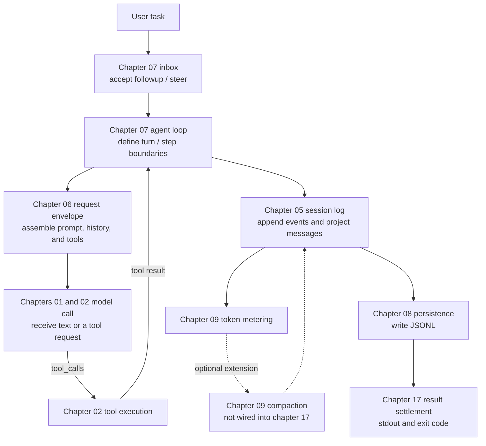

<p align="center">
  
</p>

<p align="center"><b>Start with one model call and build the core of DeepSeek Harness in Python</b></p>
<p align="center">
  <a href="README.md">中文</a>
</p>

<div align="center">

[](LICENSE) [](pyproject.toml)

</div>

---

## About the course

Calling a large language model once is straightforward: send a message, wait for the response, and display the text. An agent that can work on a task over time has a different set of problems to solve. How does the model call a tool? Where does conversation history live? What happens when the context approaches its limit? How are file and shell operations constrained? How does a new user message reach an agent that is already running?

[DeepSeek Harness](https://github.com/deepseek-ai/DeepSeek-Harness) (DSH) provides a complete agent runtime built around these questions. Its TypeScript monorepo contains more than a hundred packages. A Python developer reading it for the first time must often learn the language, the repository structure, and the agent mechanisms at the same time. That makes it easy to lose sight of the system itself.

mini-harness turns the core DSH mechanisms into 17 Python chapters. The course begins with a minimal streaming model call, then adds tools, sessions, prompt assembly, persistence, context compaction, filesystem and shell access, skills, sub-agents, and web search. The final chapter assembles the main execution path into a headless agent that accepts a task, persists its session, and returns a result.

The course focuses on the headless execution path. Here, headless means that no web page, desktop interface, or HTTP service is started. A program receives a task, runs the agent and its tools, and writes the result to standard output. This keeps the agent's main execution path visible from a terminal.

After completing the course, learners will be able to explain and implement:

- how streaming response chunks become a complete message;
- how a model requests a tool and receives the tool result in the next model call;
- how session events are recorded, projected, persisted, recovered, and compacted;
- how plugins and services start from declared dependencies and clean up in reverse order;
- how filesystem, shell, skills, goals, todo lists, and sub-agents connect to the runtime loop;
- how a headless agent is assembled, runs a task, flushes state, and returns a final result.

## Who this course is for

The course is written for developers and self-directed learners who know basic Python and want to understand how an agent runtime works internally. The only prerequisites are familiarity with functions, classes, dictionaries, and exceptions, plus a basic idea of how an application calls an LLM API. No TypeScript experience or previous agent-framework knowledge is required.

The code uses `async / await`, dataclasses, generators, and JSON serialization where they help explain a mechanism. Each concept is introduced when it first becomes useful, so a separate course on asynchronous programming or Python's type system is not required beforehand.

## Quick start

The project uses [uv](https://docs.astral.sh/uv/) to manage Python and its dependencies. Python 3.11 or newer is required.

### Run the local chapters

Chapters 03, 04, 08, 10, 11, 12, 13, and 16 demonstrate local mechanisms only. They do not call a model and require no API key. The following commands install the dependencies and run all eight:

```bash
uv sync
uv run python scripts/run_all.py --local-only
```

### Start with chapter 01

Chapter 01 connects to the DeepSeek API. Create a local configuration from the tracked template first:

```bash
cp .env.example .env
# Edit .env and add your DEEPSEEK_API_KEY
uv sync
uv run python chapters/01-streaming-agent/src/demo.py
```

`.env` is covered by the repository's Git ignore rules. Live chapters look for `DEEPSEEK_API_KEY` in the process environment first and fall back to the repository-level `.env` file. mini-harness reads only the key from this source; each chapter keeps its model and endpoint in code. When running official DSH, launch-level settings such as `DEEPSEEK_BASE_URL` and `DSH_MODEL` belong in the process environment because the official launcher rejects them in `.env`.

One command runs all 17 chapters. Nine of them access the DeepSeek API and consume model usage:

```bash
uv run python scripts/run_all.py
```

## Course structure

The 17 chapters are organized into five parts. Each part establishes a runnable foundation, then adds the mechanism needed to solve the next group of problems.

### Part I: Build the smallest agent

The course starts with model requests and responses. At the end of these two chapters, the program can accept a task, assemble a streaming answer, and execute a calculator when the model asks for one.

| Chapter | Core question | Runtime |
|---|---|---|
| [01 · Streaming output and message assembly](chapters/01-streaming-agent/README.md) | How do SSE chunks become a stable assistant message? | DeepSeek API |
| [02 · Tool calling](chapters/02-tool-calling/README.md) | How does the model request a tool, and how does the result enter the next model call? | DeepSeek API |

### Part II: Understand plugins and dependencies

An agent gains more capabilities as it grows. The plugin system coordinates their installation, dependencies, and cleanup through an explicit lifecycle.

| Chapter | Core question | Runtime |
|---|---|---|
| [03 · A minimal plugin system](chapters/03-python-cordis/README.md) | How does a plugin wait for dependencies, become active, and release its resources? | Local |
| [04 · Services and dependencies](chapters/04-services-scopes/README.md) | How are services provided, duplicate names rejected, and dependencies resolved again after a provider changes? | Local |

### Part III: Build a persistent agent runtime

A single model call handles one request. A persistent agent also needs to record history, accept follow-up messages, recover sessions, and compact old context before the model limit is reached.

| Chapter | Core question | Runtime |
|---|---|---|
| [05 · Session log](chapters/05-session-log/README.md) | How does an append-only event log reconstruct messages and preserve each run? | DeepSeek API |
| [06 · Request envelope assembly](chapters/06-prompt-tools/README.md) | How do the system prompt, message history, and tool schemas become one model request? | DeepSeek API |
| [07 · Resident agent and inbox](chapters/07-agent-inbox/README.md) | How do followup and steer target the next turn and the next step of the current turn? | DeepSeek API |
| [08 · Session persistence](chapters/08-persistence/README.md) | How is a JSONL log published safely and recovered after a process restart? | Local |
| [09 · Context engineering](chapters/09-context-engineering/README.md) | How does the runtime estimate token pressure and replace older history with a summary? | DeepSeek API |

### Part IV: Extend the agent's capabilities

Once the runtime loop is in place, the agent can interact with the local environment and external services. These chapters add files, shell commands, skills, long-running task state, sub-agents, and web search.

| Chapter | Core question | Runtime |
|---|---|---|
| [10 · Filesystem](chapters/10-filesystem/README.md) | How do path fences, read-before-write checks, and observations reduce accidental file changes? | Local |
| [11 · Shell execution and approval](chapters/11-shell-sandbox/README.md) | How does a command pass through permissions, approval, timeouts, and result collection? | Local |
| [12 · Skills and on-demand loading](chapters/12-instructions-skills/README.md) | How does a skill catalog expose summaries and load the full instructions only when selected? | Local |
| [13 · Goal and Todo](chapters/13-goal-plan-todo/README.md) | How does a long-running task persist a goal revision and todo-list snapshots? | Local |
| [14 · Subagent delegation](chapters/14-subagents-workflow/README.md) | How does a child agent receive isolated context and return partial or final results? | DeepSeek API |
| [15 · Web search and page fetching](chapters/15-external-capabilities/README.md) | How does an agent call DeepSeek Web Search and turn sources into usable context? | DeepSeek API + Web Search |

### Part V: Assemble the runtime boundary

The final two chapters approach the system boundary from different directions. Chapter 16 teaches settings and RPC independently; chapter 17 assembles a command-line runner. The current capstone does not wire chapter 16's Settings or RPC into that command.

| Chapter | Core question | Runtime |
|---|---|---|
| [16 · Settings and RPC](chapters/16-settings-jsonrpc/README.md) | How are layered settings settled, and how does JSON-RPC validate and dispatch requests? | Local |
| [17 · Headless assembly](chapters/17-headless-capstone/README.md) | How do the client, agent, session persistence, and result settlement become a command-line program? | DeepSeek API |

## How one task moves through the system

Chapters 01, 02, 05, 06, 07, 08, 09, and 17 form the main execution path. The solid edges below are wired in chapter 17; compaction is demonstrated independently in chapter 09 and remains an integration point:



Chapters 03 and 04 provide plugin and dependency management, chapters 10 and 11 constrain local operations, and chapters 12 through 16 add optional capabilities. These mechanisms can be studied independently around the main execution path and connected when a larger runtime needs them.

## How each chapter works

Each chapter begins with one concrete problem. The tutorial then moves through the runtime flow, key code, a guided walkthrough, real output, references to the official source, and exercises. The chapter's `src/` directory contains its complete implementation. Core logic is not hidden behind an imported teaching package, so the code remains directly traceable to the explanation.

The full route runs from chapter 01 through chapter 17. A shorter preview is 01, 02, 09, and 17: chapter 01 establishes the model connection, chapter 02 closes the smallest agent loop, chapter 09 handles long context, and chapter 17 shows the assembled program.

A chapter is designed to be studied in this order:

1. Read the opening problem and identify why the next mechanism is necessary.
2. Run `src/demo.py` and follow the relationship between inputs, events, and outputs.
3. Read the complete implementation alongside the walkthrough, tracking how data moves between functions.
4. Open the official source links at the end of the chapter and compare the TypeScript implementation with the Python version.
5. Complete the exercises by extending the implementation to a new scenario or failure path.

## TypeScript ideas, Python forms

The course aligns with DSH behavior, data flow, and lifecycle rather than TypeScript syntax. Where the languages differ, the implementation uses a direct Python equivalent:

| DSH / TypeScript | mini-harness / Python | Preserved behavior |
|---|---|---|
| Proxy-based property access | `__getattr__` | Fail immediately when an undeclared service is read |
| Fiber state machine and cascade cleanup | `PluginHandle` state machine and reverse-order cleanup | Preserve plugin startup, active, failure, and disposal states |
| Epoch recomputation and notify | Dependency signatures and a full rescan | Re-evaluate whether plugins can start after a service changes |
| Waterfall events | Recursive `waterfall` dispatch | Wrap the core executor in middleware and return results outward |
| Promise concurrency | `ThreadPoolExecutor` | Run child agents concurrently and collect results by task |
| Discriminated unions | Frozen dataclass unions | Represent message and event variants explicitly |
| Frozen JSON snapshots | Recursive validation and freezing | Keep log data stable enough to serialize and replay |

## Official source baseline

The course checks its mechanisms and terminology against the official DeepSeek Harness source. The current audit baseline is commit [`141eb6fef83422698aef7a981029e843e8161534`](https://github.com/deepseek-ai/DeepSeek-Harness/tree/141eb6fef83422698aef7a981029e843e8161534), dated 2026-08-19 and released as `0.1.0-rc.8`. Pinning the source keeps every conclusion reproducible. Each chapter identifies the upstream source, the semantics retained in Python, and the engineering features intentionally omitted for teaching.

<details>
<summary><strong>Open the source map for all 17 chapters</strong></summary>

| Ch. | Teaching topic | Official source entry |
|---|---|---|
| 01 | SSE and complete-message commit | `packages/llm/llm-deepseek/src/adapter.ts`, `packages/llm/llm/src/assembler.ts` |
| 02 | Tool-call round trip | `packages/core/agent-loop/src/agent.ts`, `packages/core/tools` |
| 03 | Plugin lifecycle | `vendor/cordis/src/fiber.ts`, `vendor/cordis/src/context.ts` |
| 04 | Services, fiber context, and waterfall | `vendor/cordis/src/reflect.ts`, `vendor/cordis/src/events.ts` |
| 05 | Event log and request envelope | `packages/core/session`, `packages/core/agent-loop/src/agent.ts` |
| 06 | Prompt and tool registries | `packages/core/system-prompt`, `packages/core/tools` |
| 07 | Turns, steps, and Inbox | `packages/core/agent/src/inbox.ts`, `packages/core/agent-loop/src/agent.ts` |
| 08 | Append-only JSONL and recovery | `packages/session/session-persistence-jsonl` |
| 09 | Replay-aware metering and compaction | `packages/llm/token-meter`, `packages/compaction/compaction-basic` |
| 10 | Filesystem fence and observation policy | `packages/fs/fs-sandbox`, `packages/fs/fs-observation-policy` |
| 11 | Shell sandbox and approval | `packages/shell/bash-sandbox`, `packages/interaction/user-approval` |
| 12 | Skill registry and progressive loading | `packages/skill/skill`, `packages/skill/tool-skill` |
| 13 | Goal and todo | `packages/goal/goal`, `packages/todo/tool-todo` |
| 14 | Subagent providers and delegation | `packages/subagent/subagent`, `packages/subagent/tool-subagent` |
| 15 | Web capability seam | `packages/web/tool-web`, `packages/web/web-search-deepseek`, `packages/web/web-fetch-http` |
| 16 | Settings and Typert gateway | `packages/settings/settings`, `packages/api/gateway` |
| 17 | Headless runner | `packages/bundle/headless` |

</details>

## Repository layout

```text
mini-harness/
├── chapters/
│   ├── 01-streaming-agent/
│   │   ├── README.md      # problem, principle, key code, output, references, exercises
│   │   └── src/           # complete implementation for this chapter and demo.py
│   ├── ...
│   └── 17-headless-capstone/
├── scripts/run_all.py     # discovers and runs all 17 chapter demos
├── docs/images/logo.svg
├── .env.example
└── pyproject.toml
```

## Safety boundary

The filesystem and shell chapters demonstrate their permission modes explicitly. Chapter 10 uses `workspace-write` inside a temporary workspace to exercise the write fence; chapter 11 starts in `read-only` and then demonstrates approval and one-shot grants. Paths are normalized before allowed-root checks, and command execution includes timeouts and result collection.

The path fence still runs inside an ordinary Python process and does not replace an operating-system sandbox. Child processes retain the permissions of the current user. The course also leaves out the graphical interface, HTTP service, hot reload, and cloud isolation because they are outside the headless execution path covered here.

## Where to go next

The 17 chapters leave several natural extensions:

- add tool-result pruning before compaction in chapter 09;
- implement forked sub-agents and workflow scripts in chapter 14;
- connect an MCP client and register external services as tools;
- implement Code Mode, collapsing many tool interfaces into one code-execution entry point;
- assemble streaming tool-call argument chunks in chapter 02;
- study the DSH Web, Host, and platform sandboxes beyond the headless path.

## License

The project is released under the MIT License. Third-party source and license information is listed in [THIRD_PARTY_NOTICES.md](THIRD_PARTY_NOTICES.md).
