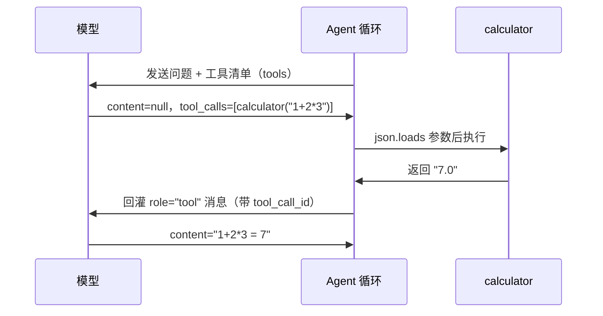

# 02｜工具调用

> 预计时间：70 分钟 ｜ 前置：完成第 01 章 ｜ 本章调用真实 DeepSeek 模型

第 01 章的客户端已经能够发送问题并接收回答，但模型目前只能生成文字，不能直接计算、读取文件或访问网络。要让程序根据模型的判断执行外部操作，需要在模型与 Python 函数之间建立一套明确的调用协议。

本章从算术问题开始。语言模型生成的是最可能出现的文本，并不等同于执行精确计算；可靠的算术应交给计算器完成。Function Calling（函数调用）也称 Tool Calling（工具调用），它允许模型描述“要调用哪个工具、传入什么参数”，再由程序执行真正的函数。

本章实现一次完整的模型到工具再到模型的往返：模型不直接回答，而是发出一份调用 calculator、参数为 1+2*3 的请求；我们的代码执行真正的计算，把结果 7 送回模型；模型基于 7 给出最终答案。这个往返是 Agent 循环的最小形态，后面所有章节都在扩展它。

## 学习目标

完成本章后，你将能够：

- 读懂 OpenAI 兼容协议中的 `tool_calls`、`arguments` 与 `tool_call_id`；
- 用 JSON Schema 描述一个工具的名称、用途和参数；
- 安全执行模型生成的参数，并把成功或失败结果回传给模型；
- 写出带轮次上限的最小 Agent 工具调用循环。

## 2.1 模型为什么会调用工具

### 两条输出通道

OpenAI 兼容协议里，模型回复一条消息时可以走两条通道之一：

1. 文字通道，`content` 字段里直接写回答，第 01 章用的就是它；
2. 工具调用通道，`tool_calls` 字段里声明要调用某个工具以及参数。

模型在训练阶段学习了这套约定：当问题需要算数、查资料或读文件时，它可以输出工具调用；拿到工具结果后，再通过文字通道给出最终答案。是否选择工具由模型判断，程序负责提供可用工具的说明，并执行模型请求的调用。

### 一次工具调用的协议长什么样

模型回复中的 `tool_calls` 字段长这样，这是真实请求返回的完整结构：

```json
{
  "choices": [
    {
      "message": {
        "role": "assistant",
        "content": null,
        "tool_calls": [
          {
            "id": "call_00_xxxx",
            "type": "function",
            "function": {
              "name": "calculator",
              "arguments": "{\"expression\": \"1+2*3\"}"
            }
          }
        ]
      }
    }
  ]
}
```

三个必须记住的细节：

1. `arguments` 是 JSON 字符串，不是对象。协议规定参数以文本传输，执行前必须 `json.loads` 解析。这是新手最常见的坑，直接拿字符串当字典用。
2. `id` 是本次调用的身份证。工具结果回灌时必须带上它，让模型知道这条结果是回答哪次调用的。
3. `content` 是 `null`。模型请求工具时通常不说话，文字通道空着。

### 完整往返的四个阶段

```
第一阶段：把问题与工具说明书发给模型
第二阶段：模型不回答，返回 tool_calls 请求
第三阶段：执行工具，把结果作为新消息回灌，再问模型
第四阶段：模型基于结果走文字通道，给出最终答案
```

按照第 07 章会正式定义的术语，这四个阶段构成两个 step：第一次模型调用和随后的工具执行属于 step 1，回灌结果后的第二次模型调用属于 step 2。

画成时序图：



下面动手实现。本章代码在 `chapters/02-tool-calling/src/`，四个文件：

```
chapters/02-tool-calling/src/
├── client.py     # 第 01 章的客户端 + 工具支持
├── calculator.py # 本章新增：一个安全的计算器工具
├── agent.py      # 本章新增：工具调用循环
└── demo.py       # 跑一次完整往返
```

## 2.2 工具的说明书：JSON Schema

模型要正确使用工具，需要一份说明书：工具叫什么、干什么用、接受什么参数。这份说明书用 JSON Schema 描述，一种用 JSON 描述数据结构的标准格式。先定义 `Tool` 数据类和第一个工具 `calculator`：

```python
@dataclass(frozen=True)
class Tool:
    name: str
    description: str
    parameters: dict[str, Any]  # JSON Schema
    execute: Callable[[dict[str, Any]], str]


calculator = Tool(
    name="calculator",
    description="计算一个四则运算表达式，支持 + - * / 与括号，例如 '1+2*3'",
    parameters={
        "type": "object",
        "properties": {
            "expression": {
                "type": "string",
                "description": "要计算的数学表达式，例如 '1+2*(3-1)'",
            }
        },
        "required": ["expression"],
    },
    execute=_run_calculator,
)
```

逐段理解：

- `name`、`description`、`parameters` 是给模型看的。模型读它们决定什么时候该用这个工具、参数怎么填。说明书写得好不好，直接决定模型用得对不对，`description` 里那句例如 1+2*3 看似多余，实际能显著提高模型传参的准确率。
- `parameters` 是 JSON Schema，声明参数是一个对象，含一个必填的字符串字段 `expression`。模型据此生成 `{"expression": "1+2*3"}` 这样的 JSON。
- `execute` 由程序调用，负责执行实际计算；它与给模型阅读的说明书相互分离。

### 实现一个不用 `eval` 的计算器

`execute` 内部怎么算表达式？新手的第一个念头是 `eval(expression)`，方便，但极其危险：`eval` 会执行任意 Python 代码，而 `expression` 是模型生成的字符串，属于不可信输入。模型一旦被诱导返回 `"__import__('os').system('rm -rf ...')"`，`eval` 会真的执行它。

这里需要建立一个贯穿全书的安全原则：模型生成的内容属于外部输入，执行前必须校验。本章实现一个递归下降解析器，只接受数字和四则运算符，其余字符一律报错：

```python
def _evaluate(source: str) -> float:
    tokens = _tokenize(source)      # "1+2*(3-1)" → ["1","+","2","*","(","3","-","1",")"]
    position = 0

    def peek() -> str | None:
        return tokens[position] if position < len(tokens) else None

    def take() -> str:
        nonlocal position
        token = tokens[position]
        position += 1
        return token

    def parse_expression() -> float:      # 加减层：优先级最低
        value = parse_term()
        while peek() in ("+", "-"):
            operator = take()
            right = parse_term()
            value = value + right if operator == "+" else value - right
        return value

    def parse_term() -> float:            # 乘除层：优先级高于加减
        value = parse_factor()
        while peek() in ("*", "/"):
            operator = take()
            right = parse_factor()
            if operator == "*":
                value *= right
            else:
                if right == 0:
                    raise ValueError("除数为零")
                value /= right
        return value

    def parse_factor() -> float:          # 最内层：数字、括号、负号
        token = take()
        if token == "(":
            value = parse_expression()
            if take() != ")":
                raise ValueError("缺少右括号")
            return value
        if token == "-":
            return -parse_factor()
        return float(token)

    result = parse_expression()
    if position != len(tokens):
        raise ValueError(f"表达式在 {tokens[position]!r} 处意外结束")
    return result
```

这里体现了一个经典的编程思想，递归下降：每个语法层级一个函数，`expression` 调 `term`，`term` 调 `factor`，`factor` 遇到括号又回头调 `expression`。层级的嵌套顺序本身就是运算符优先级，乘除在更深的层先算，加减在外层后算。`1+2*3` 因此天然等于 `1+(2*3)`。

`_tokenize` 负责词法分析，把字符串切成有意义的词元：

```python
def _tokenize(source: str) -> list[str]:
    tokens: list[str] = []
    index = 0
    while index < len(source):
        char = source[index]
        if char.isspace():
            index += 1
        elif char in "+-*/()":
            tokens.append(char)
            index += 1
        elif char.isdigit() or char == ".":
            number = ""
            while index < len(source) and (source[index].isdigit() or source[index] == "."):
                number += source[index]
                index += 1
            tokens.append(number)
        else:
            raise ValueError(f"非法字符: {char!r}")
    return tokens
```

任何不在这三类里的字符，字母、引号、下划线，直接抛错。`eval` 能执行的危险代码在这里连词法分析都过不了。完整的 `calculator.py` 见源码目录。

## 2.3 消息模型升级

第 01 章的 `Message` 只有 `role` 和 `content`。工具调用要求消息能表达更多信息，升级如下：

```python
@dataclass(frozen=True)
class ToolCall:
    id: str
    name: str
    arguments: str  # JSON 字符串，执行前要解析


@dataclass(frozen=True)
class Message:
    role: str
    content: str | None = None
    reasoning_content: str | None = None
    tool_calls: tuple[ToolCall, ...] = ()
    tool_call_id: str | None = None
```

三个扩展点的作用：

- `reasoning_content` 保存模型返回的思考内容。它不直接显示给用户，但属于 assistant 历史；后续请求必须按原文回传。rc.8 将这条规则统一到所有带思考的 assistant 轮次，不再只回传同时带工具调用的轮次。
- `tool_calls` 挂在 `assistant` 消息上，表示这条回复里模型请求调用这些工具。用 `tuple` 而不是 `list`，配合 `frozen=True` 的不可变性承诺，tuple 自身不可变。
- `tool_call_id` 挂在 `role="tool"` 的消息上，与 `ToolCall.id` 一一对应。协议规定工具结果回灌时必须标明它是回答哪次调用的，模型一轮可能同时请求多个工具，没有 id 就对不上号。

于是对话历史里出现了第四种角色 `tool`：

| 角色 | 谁说的话 | 何时出现 |
|------|----------|----------|
| `system` | 系统 | 历史最前面，设定行为规则 |
| `user` | 人 | 提问 |
| `assistant` | 模型 | 回答，或携带 tool_calls 请求工具 |
| `tool` | 工具 | 工具的执行结果，回灌给模型 |

`tool` 消息不进入人类视角的对话，它是给模型看的工作记录。官方 Harness 内部同样把工具结果作为消息回灌，官方文档写明已接纳的 user 消息、assistant 消息、工具调用与结果都会记录，并在后续 step 中发送。

## 2.4 客户端升级

请求侧需要把工具清单发给模型，协议里叫 `tools` 字段；响应侧需要把 `tool_calls` 解析成 `ToolCall` 对象。第 01 章的 `chat()` 升级如下：

```python
class DeepSeekClient:
    # 第 01 章部分略

    def chat(self, messages: list[Message], tools: list[Tool] | None = None) -> Message:
        payload = {
            "model": self.MODEL,
            "messages": [self._wire_message(m) for m in messages],
        }
        if tools:
            payload["tools"] = [
                {
                    "type": "function",
                    "function": {
                        "name": tool.name,
                        "description": tool.description,
                        "parameters": tool.parameters,
                    },
                }
                for tool in tools
            ]
        with httpx.Client(timeout=60) as client:
            response = client.post(
                f"{self.BASE_URL}/chat/completions",
                headers={
                    "Authorization": f"Bearer {self.api_key}",
                    "Content-Type": "application/json",
                },
                json=payload,
            )
            response.raise_for_status()
            data = response.json()

        choice = data["choices"][0]
        raw_message = choice["message"]
        tool_calls: list[ToolCall] = []
        for raw_call in raw_message.get("tool_calls") or []:
            tool_calls.append(
                ToolCall(
                    id=raw_call["id"],
                    name=raw_call["function"]["name"],
                    arguments=raw_call["function"]["arguments"],
                )
            )
        return Message(
            role="assistant",
            content=raw_message.get("content"),
            reasoning_content=raw_message.get("reasoning_content"),
            tool_calls=tuple(tool_calls),
        )
```

四处与第 01 章的差异：

- 返回值从 `str` 变成 `Message`。模型回复现在可能有调用无文字，只返回字符串会丢掉信息。从这里开始，客户端始终返回完整的 `Message`。
- `tools` 清单里每个工具包一层 `{"type": "function", "function": {...}}`，这是协议要求的嵌套结构，`type` 固定为 `"function"`。
- `reasoning_content` 单独保存模型的思考内容，下一次请求会按原文回传，不与给用户显示的 `content` 混在一起。
- `raw_message.get("tool_calls") or []` 是兜底，普通文字回复里没有这个字段，用 `get` 加空列表避免 KeyError。

`_wire_message` 负责反向转换，内部 `Message` 转协议 dict，其中 `role="tool"` 的消息必须带上 `tool_call_id`：

```python
    @staticmethod
    def _wire_message(m: Message) -> dict[str, Any]:
        wire: dict[str, Any] = {"role": m.role}
        if m.content is not None:
            wire["content"] = m.content
        elif m.role == "assistant":
            wire["content"] = ""
        if m.reasoning_content:
            wire["reasoning_content"] = m.reasoning_content
        if m.tool_calls:
            wire["tool_calls"] = [
                {
                    "id": call.id,
                    "type": "function",
                    "function": {"name": call.name, "arguments": call.arguments},
                }
                for call in m.tool_calls
            ]
        if m.tool_call_id is not None:
            wire["tool_call_id"] = m.tool_call_id
        return wire
```

assistant 没有可见文本时仍发送空字符串 `content`，而不是 `null` 或直接省略；部分兼容网关会拒绝缺少文本且没有工具调用的思考历史。非空 `reasoning_content` 会按原文回传，`tool_calls` 和 `tool_call_id` 则各自在需要时出现。

## 2.5 Agent 循环：把四个阶段串起来

模型已经能够请求工具，程序也已经能够执行工具，下一步是把请求、执行和回传串成循环：

```python
def run_agent(
    client: DeepSeekClient,
    tools: list[Tool],
    system_prompt: str,
    user_prompt: str,
    max_steps: int = 10,
) -> list[Message]:
    tools_by_name = {tool.name: tool for tool in tools}
    history: list[Message] = [
        Message(role="system", content=system_prompt),
        Message(role="user", content=user_prompt),
    ]

    for _step in range(max_steps):
        reply = client.chat(history, tools)
        history.append(reply)

        if not reply.tool_calls:
            return history

        for call in reply.tool_calls:
            tool = tools_by_name.get(call.name)
            if tool is None:
                result = f"Error: 模型请求了未注册的工具 {call.name!r}"
            else:
                try:
                    args = json.loads(call.arguments)
                    result = tool.execute(args)
                except Exception as error:
                    result = f"工具执行出错: {error}"
            history.append(
                Message(role="tool", content=result, tool_call_id=call.id)
            )

    raise RuntimeError(f"Agent 在 {max_steps} 个 step 内没有结束")
```

循环里有三个关键决策：

**决策一：终止条件。** 循环什么时候停？只有一种自然终点，模型不再请求工具，也就是 `reply.tool_calls` 为空。`max_steps` 是安全阀：模型可能陷入反复请求同一个工具的死循环，比如参数一直填错，没有上限程序就会永远转下去。官方 Harness 对失控轮次的治理更精细，第 07 章展开。

**决策二：错误回灌而不是中断。** 工具执行失败时，比如参数解析失败、除数为零，程序不崩溃，而是把错误文本作为工具结果回灌。模型读到工具执行出错：除数为零，下一轮会自己换参数重试。这模拟了人类遇到错误时的行为，Agent 的健壮性来自让模型看见错误。

**决策三：一轮可多工具。** `reply.tool_calls` 是列表而非单个值，模型一轮可以同时请求多个工具，逐个执行、逐个回灌。教学版串行执行，官方支持按并发安全性并行调度，第 05 章展开。

## 2.6 运行完整示例

```bash
uv run python chapters/02-tool-calling/src/demo.py
```

真实输出，模型行为每次略有差异，工具调用这一步是稳定的：

```
=== 完整对话历史 ===

[system]
你是一个数学助手。遇到算式时先调用 calculator 工具计算，再基于计算结果回答。

[user]
1+2*3 等于几？

[assistant → 请求工具] calculator({"expression": "1+2*3"})

[tool → 结果 #call_00_jB51DjtgejamjcVcM6wq4888] 7.0

[assistant]
根据运算优先级（先乘除后加减）：

**1 + 2 × 3 = 1 + 6 = 7**

答案是 **7**。
```

对照 2.1 的四个阶段：模型请求了工具，我们执行并回灌，模型基于 7.0 给出最终答案。模型最后的回答里主动展示了运算过程，它读懂了工具结果，并把它组织成人话。

### 错误路径：模型怎样面对失败

把 demo 里的 `user_prompt` 改成帮我算 1/0，再跑一次。这是决策二的实战检验，工具执行抛错，错误被回灌，接下来发生什么：

```
[assistant → 请求工具] ['calculator({"expression": "1/0"})']
[tool → 结果] 工具执行出错: 除数为零
[assistant] 关于 1/0 的计算结果如下：

1/0 在数学中是未定义的（无意义），无法计算。

为什么？
- 任何数除以 0 都没有定义：没有任何数乘以 0 能等于 1
- 从极限角度看，1/0 两侧分别趋向正负无穷，不收敛于同一个值

计算工具也正确地拒绝了这一操作，返回了错误。
```

模型读取了错误信息，没有重复调用同一个失败工具，而是据此解释除数为零为什么没有定义。这个结果说明，工具错误也可以成为下一步推理的输入。2.5 节把工具异常转换成文本回传，而不是让整个循环直接退出，正是为了保留这种修正机会。

## 本章小结

- `Tool` 与 `calculator`：工具等于给模型看的说明书加给程序跑的执行器；计算器用递归下降解析器实现，拒绝 `eval`
- `ToolCall` 与扩展后的 `Message`：思考内容回传、工具请求、`tool` 角色回灌、`tool_call_id` 对应关系
- `DeepSeekClient.chat()` 升级：注入 `tools` 清单、解析 `tool_calls`、返回完整 `Message`
- `run_agent()`：两 step 的最小往返，终止条件、错误回灌、多工具执行三个关键决策

## 对照官方

| 官方代码 | 我们对应实现 | 说明 |
|----------|--------------|------|
| [`packages/core/agent-loop/README.zh.md`](https://github.com/deepseek-ai/DeepSeek-Harness/blob/141eb6fef83422698aef7a981029e843e8161534/packages/core/agent-loop/README.zh.md) | `run_agent()` | 官方循环同样记录工具调用与结果并回灌；它是流式、多 step 的完整版，第 07 章继续对齐 |
| [`packages/core/tools/README.zh.md`](https://github.com/deepseek-ai/DeepSeek-Harness/blob/141eb6fef83422698aef7a981029e843e8161534/packages/core/tools/README.zh.md) | `Tool` | 官方 `ToolDefinition` 注册进 `ctx.tools`，执行经过 pre-execute、execute、post-execute 管线 |
| [`packages/llm/llm/src/assembler.ts`](https://github.com/deepseek-ai/DeepSeek-Harness/blob/141eb6fef83422698aef7a981029e843e8161534/packages/llm/llm/src/assembler.ts) | `chat()` 的解析 | 官方组装器在流式模式下逐分片拼装 tool-call 块；本章用非流式 `chat()` 拿完整 tool_calls，流式工具分片见练习 4 |
| [`packages/llm/llm-deepseek/src/serialize.ts`](https://github.com/deepseek-ai/DeepSeek-Harness/blob/141eb6fef83422698aef7a981029e843e8161534/packages/llm/llm-deepseek/src/serialize.ts) | `_wire_message()` | 对齐 assistant 空文本与每个带思考轮次的 `reasoning_content` 回传；教学版消息仍是纯文本，不实现官方图片附件序列化 |

## 练习

1. **让模型面对一次失败。** 把 `user_prompt` 改成帮我算 1/0，观察模型与循环如何协作处理除数为零。模型收到错误后做了什么？它放弃了吗？它重复调用同一个工具了吗？把观察到的行为记录下来。
2. **加一个工具。** 仿照 `calculator` 定义一个 `datetime` 工具，返回当前时间，无参数。把现在几点这个问题交给 Agent，观察模型何时选择调用它而不是直接回答。如果模型直接回答了，想想说明书的哪部分没写清楚。
3. **验证说明书的力量。** 把 `calculator.description` 里的示例句删掉，反复问几个算式，对比模型传参格式的准确率变化。示例句为什么能提高准确率？给出你的解释。
4. **流式工具分片。** 官方在流式模式下，`tool_calls` 是逐分片到达的，`delta.tool_calls` 里名字和参数分开推送。扩展第 01 章的 `stream()`，把 `delta.tool_calls` 拼装成完整的 `ToolCall` 列表，再与官方 `assembler.ts` 的实现对照，找出官方的处理和你自己的差异。
