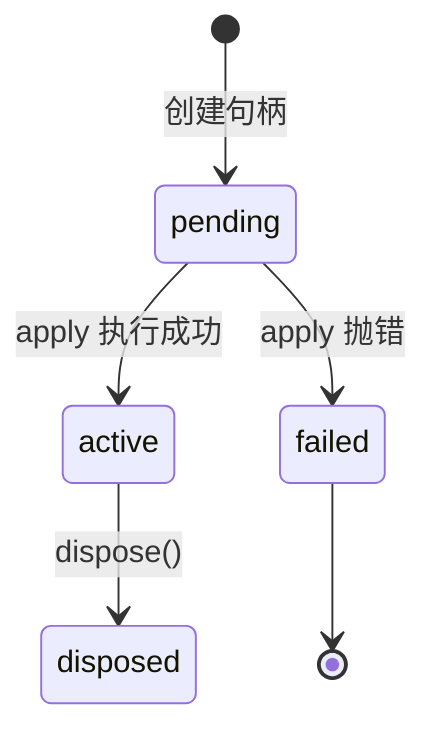

# 03｜迷你插件系统

> 预计时间：60 分钟 ｜ 前置：完成第 02 章 ｜ 本章纯本地运行，不调用模型

第 02 章的 Agent 已经能够调用工具，但模型连接、工具注册和循环逻辑仍然由主程序直接组织。继续加入会话日志、上下文压缩和沙箱后，这些职责会集中在少数文件中，修改其中一项能力也容易影响其他部分。

DeepSeek Harness 采用“一切皆插件”的设计：模型、工具、循环、压缩和沙箱分别实现为独立插件，再安装到统一的运行环境中。这样，每项能力可以单独组织，并负责管理自己创建的资源。

这一章实现这套插件系统的底座，一个约 150 行的迷你版本，叫 mini-cordis。官方底座的 TypeScript 库叫 cordis，DSH 把它 vendor 进仓库。本章完成它的三块基石：安装插件、管理生命周期、自动清理。依赖注入与服务查找留到第 04 章。

## 学习目标

完成本章后，你将能够：

- 说明插件系统如何拆分 Agent 中彼此独立的能力；
- 用 `Context` 与 `PluginHandle` 表示插件的安装和生命周期；
- 把资源的创建与清理函数绑定，并按逆序释放；
- 通过事件自动解绑和父子级联，避免插件卸载后残留资源。

## 3.1 Agent 框架为什么需要插件

先想清楚一个问题：普通脚本不需要插件系统，Agent 框架为什么需要？三个场景会给出答案。

**场景一：组织。** 真实 Agent 的能力清单很长，包括模型连接、工具注册、会话存储、上下文压缩和权限检查。如果每项能力都直接写进主流程，函数会不断变长，修改一项能力也容易影响其他部分。插件系统把每项能力拆成独立模块。没有插件系统的 Agent 主流程可能是这样：

```python
def run_everything():
    api_key = load_api_key()          # 模型连接的细节
    client = DeepSeekClient(api_key)  # 还是模型连接的细节
    tools = [calculator]              # 工具的细节
    history = [...]                   # 会话的细节
    for turn in range(10):            # 循环的细节
        ...
        # 压缩、权限、日志……全都要挤进这个函数
```

每一项能力都在这个函数里占一段。五六个能力尚可应付，二十个能力时这个函数已经无法维护。插件系统的写法把每一项能力独立成函数：

```python
ctx.plugin(deepseek_client)   # 只关心模型连接
ctx.plugin(tool_registry)     # 只关心工具
ctx.plugin(agent_loop)        # 只关心循环
```

主流程只剩一张清单，每项能力在自己的插件里展开。

**场景二：复用与替换。** 官方把用 DeepSeek 模型做成一个插件。换一家模型厂商，只换插件，其余一切不动。把文件系统做成插件，同一套 Agent 代码跑在普通目录和沙箱里，只是插件不同。能力的可替换性是插件系统带来的最直接好处。

**场景三：清理。** 插件运行时会创建事件监听器、后台任务、文件句柄和网络连接。插件卸载时，这些资源也必须释放。遗漏一个监听器，就可能让已经卸载的插件继续响应事件，并随着多次安装不断累积。插件系统把资源创建和清理绑定在一起，卸载时统一执行。

## 3.2 Context：插件的运行环境

所有插件都安装到同一个运行环境中，这个环境称为 Context：

```python
class Context:
    def __init__(self) -> None:
        self._handles: list[PluginHandle] = []
        self._listeners: dict[str, list[Callable[..., Any]]] = {}
        self._current: PluginHandle | None = None

    def plugin(self, plugin: PluginFn, config: Any = None) -> PluginHandle:
        return PluginHandle(self, plugin, config)
```

三个字段的职责：

- `_handles` 是所有已安装插件的句柄清单，环境对谁住在里面的登记簿。
- `_listeners` 是事件名到监听器列表的映射，3.5 节的事件总线。
- `_current` 是正在安装中的插件句柄。插件安装期间注册的资源都应归属于当前句柄，因此环境需要记录此刻正在安装哪个插件。3.6 节的级联销毁也依赖这个字段。

`plugin()` 方法本身只有一行，把安装工作交给 `PluginHandle` 的构造器。下一节将说明它如何管理一次安装的完整生命周期。

## 3.3 PluginHandle：一次安装的生命周期

`plugin()` 返回的句柄代表这次安装本身。它记录状态、保管资源、负责卸载。状态机如下：



状态只有四种：刚创建时是 `pending`，插件函数执行成功后是 `active`，执行抛错是 `failed`，被卸载后是 `disposed`，不可复活。实现：

```python
class PluginHandle:
    _next_uid = 1

    def __init__(self, ctx: "Context", plugin: PluginFn, config: Any) -> None:
        self.uid = PluginHandle._next_uid
        PluginHandle._next_uid += 1
        self.name = getattr(plugin, "__name__", f"plugin#{self.uid}")
        self.config = config
        self.state = "pending"

        self._ctx = ctx
        self._plugin = plugin
        self._disposers: list[Disposer] = []
        self._error: Exception | None = None

        # 1) 登记到环境
        ctx._handles.append(self)

        # 2) 级联销毁的关键一步（见 3.6 节）
        if ctx._current is not None:
            ctx._current.collect(self.dispose)

        # 3) 立即安装
        self._run()
```

逐段看：

- `uid` 是全局递增的编号，每个句柄终身唯一。第 04 章的依赖重算会用它判断服务的提供者变了没有。
- `_disposers` 是清理函数清单。这个插件在运行期间创建的所有资源，其清理方式都登记在这里，卸载时逐个执行。它是场景三的落地。
- 构造器最后一步 `_run()` 执行插件本体。

`_run` 负责执行插件并维护安装状态：

```python
    def _run(self) -> None:
        previous = self._ctx._current
        self._ctx._current = self  # 让安装期间注册的资源都记到本句柄名下
        try:
            result = self._plugin(self._ctx, self.config)
            if result is not None:
                self.collect(_once(result))
            self.state = "active"
        except Exception as error:
            self.state = "failed"
            self._error = error
            try:
                self._dispose_all()
            except Exception as cleanup_error:
                raise ExceptionGroup(
                    "插件安装失败，回滚清理也失败", [error, cleanup_error]
                ) from None
            raise
        finally:
            self._ctx._current = previous
```

三个要点：

1. `_current` 的切换与恢复。执行插件函数前把 `_current` 指向自己，执行后恢复成上一个。于是插件函数内部的任何注册都知道记到谁名下。`try/finally` 保证即使插件抛错，`_current` 也一定恢复，否则环境会一直以为还有插件在安装。
2. 插件函数返回的清理函数。插件本体可以返回一个函数作为自己的收尾动作，`_once` 保证手动清理和插件卸载不会把它执行两遍。
3. 安装失败先回滚。插件在抛错前可能已经注册监听器或子插件，必须逆序清掉，再把原异常抛给调用方；若安装与回滚都失败，`ExceptionGroup` 会保留两边的诊断。

卸载的实现同样简单，逆序执行清单：

```python
    def dispose(self) -> None:
        if self.state == "disposed":
            return
        self._dispose_all()
        self.state = "disposed"

    def _dispose_all(self) -> None:
        disposers = list(reversed(self._disposers))
        self._disposers.clear()
        errors = []
        for disposer in disposers:
            try:
                disposer()
            except Exception as error:
                errors.append(error)
        if errors:
            raise ExceptionGroup("插件资源清理失败", errors)
```

注意 `reversed`：后注册的资源先清理。这个顺序不是随便选的，资源之间常常有依赖，先打开文件再启动读文件的任务，销毁时倒过来拆才安全，就像搭积木要先拆最上面那块。某个清理函数抛错时，剩余资源仍会继续清理，最后再统一抛出错误。清单在执行前已经清空，加上 single-shot 包装，重复卸载或手动解绑不会重复释放资源。

## 3.4 effect：把资源与清理绑在一起

有了句柄和清单，还差一个入口：插件函数怎样注册一份资源加上它的清理方式。这个入口叫 effect：

```python
    def effect(self, fn: Callable[[], Disposer | None]) -> Disposer:
        raw_disposer = fn()
        disposer = _once(raw_disposer) if raw_disposer is not None else None
        if disposer is not None and self._current is not None:
            self._current.collect(disposer)
        return disposer if disposer is not None else (lambda: None)
```

`effect` 的参数是一个启动函数，它立即执行，创建资源，返回一个停止函数，释放资源。停止函数被自动登记到当前插件的清理清单。典型用法：

```python
def stop_task() -> None:
    print("停止后台任务")

ctx.effect(lambda: stop_task)
```

这里有两个点要解释清楚：

为什么多套一层 `lambda`？Python 在调用函数前会先求值所有参数。如果直接写 `ctx.effect(stop_task)`，`stop_task` 会被立即调用，后台任务刚注册就被停了，返回的 `None` 也不是清理函数。包一层 `lambda: stop_task` 后，`effect` 拿到的是能返回停止函数的函数：立即执行它拿到 `stop_task`，还没调用，把 `stop_task` 登记进清单。简单说，effect 的参数是怎么启动，返回值是怎么停止。

为什么清理不能靠自觉？插件作者在插件函数末尾手写清理逻辑。插件可能提前 `return`、可能中途抛异常、可能被别的插件卸载，每一条路径都要记得清理，漏一条就是资源泄漏。effect 把清理交给句柄统一执行，作者只需要在创建资源的同一行交出清理方式。官方 cordis 的 effect 正是同一设计，所有副作用都从这一个入口进入，卸载时统一回收。

## 3.5 事件：插件之间的交流

插件之间需要通信。最基本的形态是事件：一个插件广播，其他插件监听：

```python
    def on(self, event: str, listener: Callable[..., Any]) -> Disposer:
        self._listeners.setdefault(event, []).append(listener)

        def remove_listener() -> None:
            listeners = self._listeners.get(event)
            if listeners is not None and listener in listeners:
                listeners.remove(listener)

        remove = _once(remove_listener)
        if self._current is not None:
            self._current.collect(remove)
        return remove

    def emit(self, event: str, *args: Any) -> None:
        for listener in list(self._listeners.get(event, [])):
            listener(*args)
```

`on` 会把解绑函数 `remove` 收集到当前插件名下。这样，插件卸载时，它注册的所有监听器都会自动解绑。没有这一步，监听器会在插件卸载后继续留在事件表中，后续广播仍然会调用它。

`emit` 同步调用全部监听器，不等待返回值。这是事件总线最简单的形态，第 04 章会加入能拦截、能改写的升级版，waterfall。

## 3.6 级联：子插件随父插件销毁

回到 3.3 节构造器里的第 2 步：

```python
        if ctx._current is not None:
            ctx._current.collect(self.dispose)
```

它的含义是：如果本插件是在另一个插件的安装过程中被安装的，也就是子插件，把销毁自己挂到父插件的清理清单上。于是卸载父插件时，子插件自动被销毁，这就是级联清理。真实场景里这非常常见：一个 Agent 框架插件内部会安装十几个子插件，模型、工具、日志，卸载框架时十几项能力一起退场，不需要调用方逐个点名。

结合 3.3 节的逆序清单，级联清理的顺序是：父插件的清单从后往前执行，后注册的子插件先销毁，然后再清理父插件自己的资源。demo 会输出这个顺序。

## 3.7 运行完整示例

本章代码共两个文件，全部自包含，无需 API：

```
chapters/03-python-cordis/src/
├── context.py   # 本章实现：Context / PluginHandle / effect / 事件
└── demo.py      # 安装 → 广播 → 卸载 → 再广播的完整演示
```

```bash
uv run python chapters/03-python-cordis/src/demo.py
```

完整输出，本地确定性运行，每次一致：

```
=== 1. 安装 heartbeat ===
  [heartbeat] apply 执行：注册 ping 监听器
  [heartbeat] 启动后台任务（模拟每 10 秒保存一次状态）
  [heartbeat] 安装子插件 child
  [child] apply 执行：安装完成
  [heartbeat] 安装完成
  [state] heartbeat: active

=== 2. 广播：监听器生效 ===
  [heartbeat] 收到: 第一次广播

=== 3. 卸载 heartbeat（注意清理的先后顺序） ===
  [child] 清理执行（父插件卸载 → 子插件被销毁）
  [heartbeat] 停止后台任务
  [state] heartbeat: disposed

=== 4. 再次广播：监听器已自动解绑 ===
  （上面没有收到消息 = 监听器随插件卸载自动解绑）
```

对照输出回看三个机制：

1. 安装。第 1 节里 heartbeat 注册监听器、启动后台任务、安装子插件，句柄状态从 `pending` 变成 `active`。
2. 级联加逆序。第 3 节卸载 heartbeat 时，先执行 child 的清理，子插件销毁，它注册得最晚，再停止后台任务，最后解绑监听器，正是 3.3 节 `reversed` 的效果。
3. 自动解绑。第 4 节第二次广播没有任何监听器响应，没有任何一行手写代码去解绑，它是 `on` 里那行 `collect(remove)` 的自动效果。

### 内存推演：每个时刻环境里有什么

上面的机制串起来后，停下来做一次内存推演，把 demo 的每一步执行后，环境里两个关键结构的状态列出来。看懂了这张表，才算真正看懂了插件系统：

| 时刻 | `_handles`（句柄清单） | heartbeat 的 `_disposers`（清理清单） | `_current` |
|------|------------------------|----------------------------------------|------------|
| 创建 Context | `[]` | — | `None` |
| `ctx.plugin(heartbeat)` 执行中 | `[heartbeat]` | `[]` | `heartbeat` |
| 执行到 `ctx.on("ping")` 后 | `[heartbeat]` | `[解绑 ping 监听器]` | `heartbeat` |
| 执行到 `ctx.effect(...)` 后 | `[heartbeat]` | `[解绑监听器, 停止任务]` | `heartbeat` |
| `ctx.plugin(child)` 内部 | `[heartbeat, child]` | `[解绑监听器, 停止任务, child.dispose]` | `child` |
| heartbeat 安装完成 | `[heartbeat, child]` | 同上 | `None`（已恢复） |
| `heartbeat.dispose()` | `[heartbeat, child]` | 逆序执行：`child.dispose` → `停止任务` → `解绑监听器` | `None` |
| 卸载完成后 | `[heartbeat(disposed), child(disposed)]` | `[]`（已清空） | `None` |

两行是重点：

- `child.dispose` 进入 heartbeat 清单的时刻，不是 child 安装完成之后，而是 child 构造器运行到第 2 步时。此时 `_current` 仍指向 heartbeat，因此嵌套安装产生的子句柄会归父插件管理。
- `_current` 的轨迹：heartbeat 安装时指向 heartbeat，进到 child 的安装时切换为 child，child 装完恢复 heartbeat，heartbeat 装完恢复 `None`。3.3 节的 `try/finally` 保证这条轨迹任何情况下都能走完。

## 本章小结

- `Context`：插件的家，句柄登记簿加事件总线加 `_current` 安装标记
- `PluginHandle`：一次安装的一生，状态机、清理清单、逆序卸载
- `effect`：资源与清理的绑定入口，启动函数立即执行，停止函数自动登记
- `on` 与 `emit`：事件总线，监听器随插件自动解绑
- 级联：子插件把销毁挂到父插件清单，卸载父即卸载子

## 对照官方

官方底座 cordis 被 vendor 在 DSH 仓库的 `vendor/cordis` 目录，TypeScript 实现，约三十个文件。本章概念与它一一对应：

| 官方实现 | 我们对应实现 | 说明 |
|----------|--------------|------|
| [`vendor/cordis/src/context.ts`](https://github.com/deepseek-ai/DeepSeek-Harness/blob/99f6f02fecdb7dff40c3fbc9470f5907c29f74ca/vendor/cordis/src/context.ts) | `Context` | 官方 Context 是 Proxy，服务属性读取会进入反射层；第 04 章用 Python `__getattr__` 表达同一约束 |
| [`vendor/cordis/src/fiber.ts`](https://github.com/deepseek-ai/DeepSeek-Harness/blob/99f6f02fecdb7dff40c3fbc9470f5907c29f74ca/vendor/cordis/src/fiber.ts) | `PluginHandle` | 官方把插件句柄叫 fiber，拥有更完整的安装、依赖与卸载状态机 |
| 同上 | `effect` | 官方 effect 同样立即执行并收集清理函数，还支持异步清理与更完整的错误隔离 |
| [`vendor/cordis/src/reflect.ts`](https://github.com/deepseek-ai/DeepSeek-Harness/blob/99f6f02fecdb7dff40c3fbc9470f5907c29f74ca/vendor/cordis/src/reflect.ts) | 第 04 章 | 官方拒绝读取未声明的服务，第 04 章对齐这一依赖显式化规则 |

没有实现的部分包括官方的热重载、配置 schema 校验、异步 effect 等工程能力，它们不在教学范围里。核心的依赖注入与服务作用域正是下一章的内容。

## 练习

1. **制造一次残留监听器。** 在 demo 的 heartbeat 里直接调用 `ctx._listeners["ping"].append(...)` 绕过 `on`，卸载后再广播，观察现象。这个监听器会让程序报错还是继续执行？解释差异产生的原因。
2. **让安装失败。** 写一个 apply 抛异常的插件，观察句柄状态与 `_current` 是否被正确恢复。之后安装的插件还正常吗？如果 `try/finally` 被删掉会发生什么，动手验证。
3. **三层嵌套。** 让 child 内部再安装 grandchild，观察三层级联的清理顺序，用纸笔排出预期顺序再与输出对比。清理顺序由什么决定？
4. **重复卸载。** 对同一个句柄调用两次 `dispose()`，确认清理函数只执行一次。想想 `disposed` 守卫放在开头和结尾的区别，哪种写法在并发场景下更安全。
