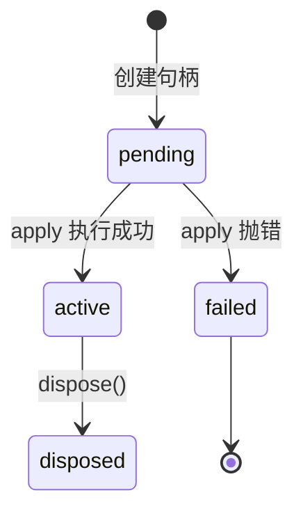

# 03｜一切皆插件：手写迷你插件系统

> 预计时间：60 分钟 ｜ 前置：完成第 02 章 ｜ 本章纯本地运行，不调用模型

第 02 章结束时，我们的小 Agent 已经会调用工具了。但把 `client.py`、
`calculator.py`、`agent.py` 三个文件摊开看，会发现一个尴尬的事实：模型的
连接、工具的注册、循环的逻辑，全部混在一起。再往后每加一个能力（会话日志、
压缩、沙箱……），这些文件会越长越大，最终变成谁都不敢碰的一坨。

现在看官方的 DeepSeek Harness：仓库里约 190 个包、几千个文件，却能一直保持
有序演进。秘密在哪里？官方公布的核心设计只有一句话——**一切皆插件**
（everything is a plugin）：模型、工具、循环、压缩、沙箱，每项能力都是一个
独立插件，装在一个统一的环境里，各自声明依赖、各自负责清理。

这一章，我们亲手实现这套插件系统的底座——一个约 150 行的迷你版本，我们叫它
**mini-cordis**（官方底座的 TypeScript 库叫 cordis，DSH 把它 vendor 进仓库）。
本章完成它的三块基石：安装插件、管理生命周期、自动清理。依赖注入与服务
查找留到第 04 章。

## 3.1 原理：Agent 框架为什么需要「插件」

先想清楚这个问题：为什么普通脚本不需要插件系统，而 Agent 框架需要？三个
场景会给出答案。

**场景一：组织。** 一个真实 Agent 的能力清单很长——模型连接、工具注册、
会话存储、上下文压缩、权限检查……如果每项能力都写死在主流程里，主流程
会变成几千行的「上帝函数」，改一处动全身。插件系统把每项能力切成独立的
小块，各自只关心自己。

**场景二：复用与替换。** 官方把「用 DeepSeek 模型」做成一个插件。换一家
模型厂商，只换插件，其余一切不动。把「文件系统」做成插件，同一套 Agent
代码跑在普通目录和沙箱里，只是插件不同。能力的可替换性是插件系统带来的
最直接好处。

**场景三：清理。** 这是新手最容易忽略、也是最容易翻车的一点。插件运行
时会创建各种资源：事件监听器、后台任务、打开的文件、网络连接。插件被
卸载时，这些资源必须被释放——忘记释放一个监听器，就会留下一个永远收
不到清理通知的「幽灵」，程序越跑越慢。插件系统把「创建」和「清理」绑在
一起，卸载时自动执行。

把三个场景并排看，「组织」的痛点最直观。没有插件系统的 Agent 主流程
长这样（示意）：

```python
def run_everything():
    api_key = load_api_key()          # 模型连接的细节
    client = DeepSeekClient(api_key)  # 还是模型连接的细节
    tools = [calculator]              # 工具的细节
    history = [...]                   # 会话的细节
    for turn in range(10):            # 循环的细节
        ...
        # 压缩、权限、日志……全都要挤进这个函数
```

每一项能力都在这个函数里占一段。五六个能力尚可应付，二十个能力时，
这个函数已经无法维护。插件系统的写法把每一项能力独立成函数：

```python
ctx.plugin(deepseek_client)   # 只关心模型连接
ctx.plugin(tool_registry)     # 只关心工具
ctx.plugin(agent_loop)        # 只关心循环
```

主流程只剩一张清单，每项能力在自己的插件里展开。官方 Harness 的底座
cordis 就是为这三个场景设计的。下面逐个实现。

## 3.2 Context：插件的家

所有插件都装进一个环境，这个环境叫 **Context**（上下文）。它是本章最核心
的数据结构：

```python
class Context:
    """插件安装的环境：管理句柄与事件监听器。"""

    def __init__(self) -> None:
        self._handles: list[PluginHandle] = []
        self._listeners: dict[str, list[Callable[..., Any]]] = {}
        self._current: PluginHandle | None = None

    def plugin(self, plugin: PluginFn, config: Any = None) -> PluginHandle:
        """安装一个插件，返回它的句柄。"""
        return PluginHandle(self, plugin, config)
```

三个字段的职责：

- `_handles`：所有已安装插件的句柄清单——环境对「谁住在里面」的登记簿。
- `_listeners`：事件名到监听器列表的映射——第 3.5 节的事件总线。
- `_current`：**正在安装中的插件句柄**。这个字段是全章最精妙的一笔：安装
  插件期间，它注册的一切资源都要记到它名下，所以环境需要知道「现在是谁
  在安装」。第 3.6 节的级联销毁也靠它。

`plugin()` 方法本身只有一行：把安装工作全部交给 `PluginHandle` 的构造器。
「安装一个插件」这件事的完整生命周期，由下一节的主角负责。

## 3.3 PluginHandle：一次安装的一生

`plugin()` 返回的句柄（handle）代表「这次安装」本身。它记录状态、保管
资源、负责卸载。状态机如下：



状态只有四种：刚创建时是 `pending`（待安装），插件函数执行成功后是
`active`（已生效），执行抛错是 `failed`，被卸载后是 `disposed`（已销毁，
不可复活）。实现：

```python
class PluginHandle:
    _next_uid = 1

    def __init__(self, ctx: "Context", plugin: PluginFn, config: Any) -> None:
        self.uid = PluginHandle._next_uid
        PluginHandle._next_uid += 1
        self.name = getattr(plugin, "__name__", f"plugin#{self.uid}")
        self.config = config
        self.state = "pending"

        self._ctx = ctx
        self._plugin = plugin
        self._disposers: list[Disposer] = []
        self._error: Exception | None = None

        # 1) 登记到环境
        ctx._handles.append(self)

        # 2) 级联销毁的关键一步（见 3.6 节）
        if ctx._current is not None:
            ctx._current.collect(self.dispose)

        # 3) 立即安装
        self._run()
```

逐段看：

- `uid`：全局递增的编号，每个句柄终身唯一。第 04 章的依赖重算会用它判断
  「服务的提供者变了没有」。
- `_disposers`：**清理函数清单**。这个插件在运行期间创建的所有资源，其
  清理方式都登记在这里。卸载时逐个执行。它是「场景三：清理」的落地。
- 构造器最后一步 `_run()`：执行插件本体。

`_run` 是全章最关键的几行：

```python
    def _run(self) -> None:
        previous = self._ctx._current
        self._ctx._current = self  # 让安装期间注册的资源都记到本句柄名下
        try:
            result = self._plugin(self._ctx, self.config)
            if result is not None:
                self._disposers.append(result)
            self.state = "active"
        except Exception as error:
            self.state = "failed"
            self._error = error
            raise
        finally:
            self._ctx._current = previous
```

三个要点：

1. **`_current` 的切换与恢复**：执行插件函数前把 `_current` 指向自己，执行
   后恢复成上一个。于是插件函数内部的任何注册（`ctx.on`、`ctx.effect`）
   都知道「记到谁名下」。`try/finally` 保证即使插件抛错，`_current` 也一定
   恢复——否则环境会一直以为「还有插件在安装」。
2. **插件函数返回的清理函数**：插件本体可以返回一个函数作为自己的收尾
   动作，构造器把它收进清单。
3. **失败即抛出**：插件安装失败时句柄标记 `failed` 并重新抛出异常——安装
   是「要么成功要么响亮失败」的操作，不能静默留下一个半成品。

卸载的实现同样简单——逆序执行清单：

```python
    def dispose(self) -> None:
        if self.state == "disposed":
            return
        for disposer in reversed(self._disposers):
            disposer()
        self._disposers.clear()
        self.state = "disposed"
```

注意 `reversed`：**后注册的资源先清理**。这个顺序不是随便选的——资源之间
常常有依赖（先打开文件，再启动读文件的任务），销毁时倒过来拆才安全，
就像搭积木要先拆最上面那块。另外 `disposed` 状态有守卫：重复卸载是空
操作，保证清理函数最多执行一次。

## 3.4 effect：把资源与清理绑在一起

有了句柄和清单，还差一个入口：插件函数怎样「注册一份资源 + 它的清理
方式」？这个入口叫 **effect**（副作用）：

```python
    def effect(self, fn: Callable[[], Disposer | None]) -> Disposer:
        disposer = fn()
        if disposer is not None and self._current is not None:
            self._current.collect(disposer)
        return disposer if disposer is not None else (lambda: None)
```

`effect` 的参数是一个**启动函数**：它立即执行（创建资源），返回一个**停止
函数**（释放资源）。停止函数被自动登记到当前插件的清理清单。典型用法：

```python
def stop_task() -> None:
    print("停止后台任务")

ctx.effect(lambda: stop_task)
```

这里有两个值得解释清楚的点：

**为什么多套一层 `lambda`？** Python 在调用函数前会先求值所有参数。如果
直接写 `ctx.effect(stop_task)`，`stop_task` 会被**立即调用**——后台任务
刚注册就被停了，返回的 `None` 也不是清理函数。包一层 `lambda: stop_task`
后，`effect` 拿到的是「一个能返回停止函数的函数」：立即执行它拿到
`stop_task`（还没调用），把 `stop_task` 登记进清单。简言之：**effect 的
参数是「怎么启动」，返回值是「怎么停止」**。

**为什么清理不能靠自觉？** 设想插件作者在插件函数末尾手写清理逻辑。插件
可能提前 `return`、可能中途抛异常、可能被别的插件卸载——每一条路径都要
记得清理，漏一条就是资源泄漏。effect 把清理交给句柄统一执行，作者只需要
在创建资源的同一行交出清理方式。官方 cordis 的 effect（`fiber.ts` 第
415 行）正是同一设计：所有副作用都从这一个入口进入，卸载时统一回收。

## 3.5 事件：插件之间的交流

插件之间需要通信。最基本的形态是**事件**：一个插件广播（emit），其他插件
监听（on）：

```python
    def on(self, event: str, listener: Callable[..., Any]) -> Disposer:
        self._listeners.setdefault(event, []).append(listener)

        def remove() -> None:
            self._listeners[event].remove(listener)

        if self._current is not None:
            self._current.collect(remove)
        return remove

    def emit(self, event: str, *args: Any) -> None:
        for listener in list(self._listeners.get(event, [])):
            listener(*args)
```

`on` 里有一行容易看漏却至关重要：解绑函数 `remove` 被 `collect` 到了当前
插件名下。它的效果是——**监听器随插件走**：插件被卸载时，它注册的所有
监听器自动解绑。没有这一行，就会出现 3.1 节说的「幽灵监听器」：插件没了，
监听器还在，每次广播都在给一个不存在的插件递消息。

`emit` 同步调用全部监听器，不等待返回值。这是事件总线最简单的形态；
第 04 章会加入能拦截、能改写的升级版——瀑布（waterfall）。

## 3.6 级联：子插件随父插件销毁

回到 3.3 节构造器里的第 2 步：

```python
        if ctx._current is not None:
            ctx._current.collect(self.dispose)
```

它的含义：**如果本插件是在另一个插件的安装过程中被安装的（子插件），
把「销毁自己」挂到父插件的清理清单上**。于是卸载父插件时，子插件自动
被销毁——这就是级联清理。真实场景里这非常常见：一个「Agent 框架」插件
内部会安装十几个子插件（模型、工具、日志……），卸载框架时十几项能力
一起退场，不需要调用方逐个点名。

结合 3.3 的逆序清单，级联的完整顺序是：父插件的清单从后往前执行，排在
后面的子插件销毁先发生，然后才是父插件自己的资源。demo 里会亲眼看到
这个顺序。

## 3.7 跑一遍完整 demo

本章代码共两个文件，全部自包含，无需 API：

```
chapters/03-python-cordis/src/
├── context.py   # 本章实现：Context / PluginHandle / effect / 事件
└── demo.py      # 安装 → 广播 → 卸载 → 再广播的完整演示
```

```bash
uv run python chapters/03-python-cordis/src/demo.py
```

完整输出（本地确定性运行，每次一致）：

```
=== 1. 安装 heartbeat ===
  [heartbeat] apply 执行：注册 ping 监听器
  [heartbeat] 启动后台任务（模拟每 10 秒保存一次状态）
  [heartbeat] 安装子插件 child
  [child] apply 执行：安装完成
  [heartbeat] 安装完成
  [state] heartbeat: active

=== 2. 广播：监听器生效 ===
  [heartbeat] 收到: 第一次广播

=== 3. 卸载 heartbeat（注意清理的先后顺序） ===
  [child] 清理执行（父插件卸载 → 子插件被销毁）
  [heartbeat] 停止后台任务
  [state] heartbeat: disposed

=== 4. 再次广播：监听器已自动解绑 ===
  （上面没有收到消息 = 监听器随插件卸载自动解绑）
```

对照输出回看三个机制：

1. **安装**（第 1 节）：heartbeat 注册监听器、启动后台任务、安装子插件，
   句柄状态从 `pending` 变成 `active`。
2. **级联 + 逆序**（第 3 节）：卸载 heartbeat 时，先执行 child 的清理
   （子插件销毁，它注册得最晚），再停止后台任务，最后解绑监听器——正是
   3.3 节 `reversed` 的效果。
3. **自动解绑**（第 4 节）：第二次广播没有任何监听器响应。没有任何一行
   手写代码去解绑——它是 `on` 里那行 `collect(remove)` 的自动效果。

### 3.7.1 内存推演：每个时刻环境里有什么

上面的机制串起来后，值得停下来做一次「内存推演」——把 demo 的每一步
执行后，环境里两个关键结构的状态列出来。看懂了这张表，才算真正看懂了
插件系统：

| 时刻 | `_handles`（句柄清单） | heartbeat 的 `_disposers`（清理清单） | `_current` |
|------|------------------------|----------------------------------------|------------|
| 创建 Context | `[]` | — | `None` |
| `ctx.plugin(heartbeat)` 执行中 | `[heartbeat]` | `[]` | `heartbeat` |
| 执行到 `ctx.on("ping")` 后 | `[heartbeat]` | `[解绑 ping 监听器]` | `heartbeat` |
| 执行到 `ctx.effect(...)` 后 | `[heartbeat]` | `[解绑监听器, 停止任务]` | `heartbeat` |
| `ctx.plugin(child)` 内部 | `[heartbeat, child]` | `[解绑监听器, 停止任务, child.dispose]` | `child` |
| heartbeat 安装完成 | `[heartbeat, child]` | 同上 | `None`（已恢复） |
| `heartbeat.dispose()` | `[heartbeat, child]` | 逆序执行：`child.dispose` → `停止任务` → `解绑监听器` | `None` |
| 卸载完成后 | `[heartbeat(disposed), child(disposed)]` | `[]`（已清空） | `None` |

两个最值得注意的行：

- **child.dispose 进入 heartbeat 清单**的时刻：不是 child 装完之后，而是
  child 构造器运行到第 2 步（`ctx._current.collect(self.dispose)`）时——
  那时 `_current` 还指向 heartbeat。这就是「安装期间的一切归安装者」。
- **`_current` 的轨迹**：heartbeat 安装时指向 heartbeat，进到 child 的
  安装时切换为 child，child 装完恢复 heartbeat，heartbeat 装完恢复
  `None`。3.3 节的 `try/finally` 保证这条轨迹任何情况下都能走完。

## 3.8 本章小结：亲手写了什么

- `Context`：插件的家——句柄登记簿 + 事件总线 + `_current` 安装标记
- `PluginHandle`：一次安装的一生——pending/active/failed/disposed 状态机、
  清理清单、逆序卸载
- `effect`：资源与清理的绑定入口——启动函数立即执行，停止函数自动登记
- `on`/`emit`：事件总线——监听器随插件自动解绑
- 级联：子插件把销毁挂到父插件清单，卸载父即卸载子

## 3.9 对照官方 DSH

官方底座 cordis 被 vendor 在 DSH 仓库的 `vendor/cordis` 目录（TypeScript
实现，约三十个文件）。本章概念与它一一对应：

| 官方实现 | 我们对应实现 | 说明 |
|----------|--------------|------|
| [`vendor/cordis/src/context.ts`](https://github.com/deepseek-ai/DeepSeek-Harness/blob/47f943859bef60e4160492346772ded9b24f765a/vendor/cordis/src/context.ts) | `Context` | 官方 Context 是一个 Proxy（第 74 行）：读 `ctx.xxx` 会走服务查找。我们第 04 章用 Python 的 `__getattr__` 实现同样效果 |
| [`vendor/cordis/src/fiber.ts`](https://github.com/deepseek-ai/DeepSeek-Harness/blob/47f943859bef60e4160492346772ded9b24f765a/vendor/cordis/src/fiber.ts) | `PluginHandle` | 官方把插件句柄叫 Fiber（第 184 行），状态机比我们多 LOADING/UNLOADING 两个中间态（第 148 行） |
| [`vendor/cordis/src/fiber.ts`](https://github.com/deepseek-ai/DeepSeek-Harness/blob/47f943859bef60e4160492346772ded9b24f765a/vendor/cordis/src/fiber.ts) | `effect` | 官方 effect（第 415 行）同样「立即执行、收集返回的清理」，且支持异步清理与错误隔离 |
| [`vendor/cordis/src/reflect.ts`](https://github.com/deepseek-ai/DeepSeek-Harness/blob/47f943859bef60e4160492346772ded9b24f765a/vendor/cordis/src/reflect.ts) | （第 04 章） | 官方读未声明的服务直接报错「cannot get property without inject」（第 144 行）——依赖显式化，第 04 章对齐 |

没有实现的部分：官方的 HMR（热重载）、配置 schema 校验、异步 effect 等
这些工程能力不在教学范围内。核心的依赖注入（inject/provide）与作用域
（isolate）正是下一章的内容。

## 3.10 练习

1. **故意漏清理**：在 demo 的 heartbeat 里直接调用
   `ctx._listeners["ping"].append(...)` 绕过 `on`，卸载后再广播，观察
   「幽灵监听器」现象——它会让程序挂掉还是静默执行？
2. **失败的安装**：写一个 `apply` 抛异常的插件，观察句柄状态与
   `_current` 是否被正确恢复（之后安装的插件是否还正常）。
3. **多层嵌套**：让 child 内部再安装 grandchild，观察三层级联的清理顺序，
   用纸笔排出预期顺序再与输出对比。
4. **重复卸载**：对同一个句柄调用两次 `dispose()`，确认清理函数只执行
   一次；思考「disposed 守卫」放在开头和结尾的区别。
