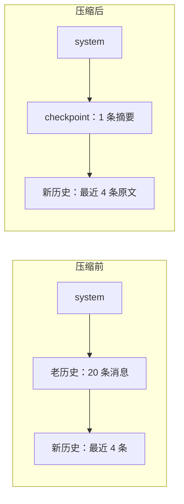

# 09｜上下文工程：计量压力，压缩历史

> 预计时间：90 分钟 ｜ 前置：完成第 08 章 ｜ 本章调用真实 DeepSeek 模型（压缩摘要由模型生成）

一个真实的长任务 Agent 会遇到它的头号物理约束：**上下文窗口**。模型
一次能「看到」的输入总量有上限（DeepSeek 官方默认 100 万 token，但
再大也有顶），而 Agent 的每一轮都要把**完整历史**发给模型。长任务跑
上一两个小时，历史轻松突破几十万 token——逼近窗口后，请求要么被
服务商拒绝，要么贵得离谱。

官方的对策是**上下文工程**（context engineering）里的两件套：

1. **计量（metering）**：随时知道当前历史占了窗口的百分之几；
2. **压缩（compaction）**：压力过高时，把最老的一段历史**浓缩**成
   一条摘要，替换掉原文——历史变短，上下文腾出来。

这一章是官方最精妙的设计之一，值得花最多时间。我们把它拆成四步
实现：先学会「数」压力，再学「压」历史，然后亲手跑一次真实的压缩，
最后看官方为什么把「计量」和「压缩」拆成两个独立的包。

## 9.1 原理：窗口、token 与压力

**上下文窗口**（context window）是模型一次请求能处理的最大输入量，
单位是 token（模型眼中的「字块」——一个英文单词约 1-2 个 token，
一个汉字约 1 个 token）。请求的输入 = system 提示词 + 工具清单 +
消息历史，三者的总和叫**上下文压力**。

Agent 的每一轮都在追加历史，压力只涨不跌。涨到窗口的 80% 左右就该
紧张了：继续涨会撞上服务商的硬限制（请求直接失败），而那时 Agent
可能正干到一半。所以 Agent 需要一个「血压计」——每次请求前量一下
压力，逼近阈值就提前干预。

「量压力」这件事说起来简单，做起来有一个陷阱：**精确的 token 数
只有服务商知道**（各家分词器是私有的）。官方给了一个漂亮的务实
答案：**用启发式估算**——每 4 个字符算 1 个 token，外加每条消息的
结构开销（官方 token-meter 文档第 9 行原文：「每 token 按四个字符
估算，再加上角色、块与请求 envelope 字段的结构开销」）。估算不精确
（中文和 JSON 会被低估），但目的不是记账，是**判断压力趋势**——
80% 附近差几个百分点无所谓。引入真实 tokenizer 的复杂度换来的
精度，对这个用途是浪费。

## 9.2 计量器：4 字符 / token 的启发式

```python
CHARS_PER_TOKEN = 4
ROLE_OVERHEAD = 4

def estimate_tokens(text: str) -> int:
    return -(-len(text) // CHARS_PER_TOKEN)  # 向上取整

def estimate_message(message: Message) -> int:
    content = message.content or ""
    return estimate_tokens(content) + ROLE_OVERHEAD
```

两个常量都直接对应官方实现：

- `CHARS_PER_TOKEN = 4`：字符数除以 4 向上取整。`-(-len // 4)` 是
  向上取整的整除技巧（等价于 `math.ceil(len/4)`）。
- `ROLE_OVERHEAD = 4`：每条消息除了内容本身，角色标记（system/
  user/assistant）也要占 token，启发式把它摊成固定 4。

工具清单同样要计费——它每次请求都随 system 发送，是信封的一部分：

```python
class TokenMeter:
    def __init__(self, context_window: int = DEFAULT_CONTEXT_WINDOW) -> None:
        self.context_window = context_window

    def measure(self, messages, tools=None) -> Measurement:
        # ...逐条估算，汇总 message_tokens + tools_tokens = total_tokens

    def pressure(self, measurement: Measurement) -> Pressure:
        ratio = measurement.total_tokens / self.context_window
        return Pressure(
            total_tokens=measurement.total_tokens,
            context_window=self.context_window,
            ratio=ratio,
            over_threshold=ratio >= PRESSURE_THRESHOLD,  # 0.8
        )
```

注意 `pressure` 的职责边界：它只**读数**，不**决策**。超过 80% 之后
怎么办（压缩？警告？硬停？）是消费方的事。这个解耦是官方明确的设计
——token-meter 的文档第 53 行说计量与压缩解耦，压缩包依赖计量包，
反过来不行。教学版照抄这个边界。

## 9.3 压缩策略：保留新、浓缩旧

压力超阈值后怎么办？最直接的念头是「删掉最老的消息」。但直接删会
丢掉上下文——模型会忘记任务目标、忘记已经做完的事。官方的策略
精妙在**折中**：

1. **最近的历史保留原文**（默认占窗口的 16%）——正在进行的工作
   细节不能丢；
2. **更老的历史交给模型浓缩**——用一个「压缩调用」让模型把老历史
   总结成结构化的 checkpoint（检查点）；
3. **checkpoint 替换老历史**——不是追加在末尾，是**替换**掉原文。
   替换之后历史真的变短了，追加只会越加越长。



阈值与保留比例都对齐官方默认值（`compaction-basic` 配置表）：
`thresholdRatio = 0.8`、`retainRatio = 0.16`。

## 9.4 压缩调用：让模型自己总结自己

浓缩历史这个活，交给谁？当然是模型——还有谁更擅长读懂一段对话？
官方把「压缩」设计成一次特殊的模型调用：

```python
def build_summary_prompt(messages: list[Message], tail_start: int) -> list[Message]:
    return [
        messages[0],              # system：原样重放
        *messages[1:tail_start],  # 被压缩区逐字重放
        Message(role="user", content=COMPACTION_INSTRUCTION),
    ]
```

输入 = system 原文 + 被压缩区原文 + **一条固定的压缩指令**。压缩指令
是官方写好的长提示词（本章代码里逐字复刻，原文在官方
`compaction-basic` README 第 113 行起），它要求模型输出一个固定的
Markdown 结构：任务意图、技术概念、文件与代码、错误与修复、待办、
当前进度、下一步、关键上下文——八个小节，把对话的「骨架」提取出来。

这里藏着官方最漂亮的一个工程决策——**KV cache 复用**。模型的推理
服务会缓存「请求前缀」的计算结果：连续两次请求前缀相同时，第二次
几乎零成本复用。压缩调用的输入是「system + 被压缩区原文 + 指令」，
而 Agent 的下一次正常请求的前缀正是「system + 被压缩区（如果没压
的话）」——逐字相同。也就是说：**压缩调用重放的前缀，正是模型缓存
里还热着的那段**。官方文档第 18 行明说：「该调用会逐字回放会话自身
的系统提示词、工具与已遮蔽区域消息……从而复用提供方的热前缀
cache，而非使它失效」。教学版用同样的重放结构，效果一致。

## 9.5 替换：checkpoint 进历史，原文退场

压缩调用的输出是纯文本摘要，把它包装成一条 checkpoint 消息：

```python
SUMMARY_OPEN_TAG = "<compacted-summary>"
SUMMARY_CLOSE_TAG = "</compacted-summary>"

def build_checkpoint_message(summary: str) -> Message:
    return Message(
        role="user",
        content=(
            f"{CHECKPOINT_PREAMBLE}\n\n"
            f"{SUMMARY_OPEN_TAG}\n{summary}\n{SUMMARY_CLOSE_TAG}"
        ),
    )

def replace(messages, tail_start, checkpoint):
    return [messages[0], checkpoint, *messages[tail_start:]]
```

三个细节：

1. **checkpoint 是 role="user"**：它站在「用户消息」的位置上——
   对模型来说，它就是历史的一部分，正常阅读即可。
2. **`<compacted-summary>` 标签**：把摘要明确框起来。模型的训练
   语料里见过这个标记（官方同一套），能正确理解「这是一段被压缩
   的历史」。
3. **preamble（开场白）**：标签前有一段固定说明——「这是一个
   自动生成的检查点……把它当作已确立的背景，直接继续任务，不要
   复述它，也不要提及这个检查点」。没有这段话，模型可能会对着
   摘要重复一遍历史，浪费整次压缩。

**替换**是这一步的关键词：`[system, checkpoint, 新历史原文]`——
老历史原文彻底退场，未来的每轮请求都按新的短历史发送。这就是
压缩省 token 的全部秘密：不是把摘要藏起来，是把原文换掉。

## 9.6 失败处理：摘要必须真的更小

压缩调用的输出不可控——模型可能写一篇比原文还长的摘要。所以
压缩必须带**缩小校验**：

```python
        checkpoint = build_checkpoint_message(summary_text)
        checkpoint_tokens = estimate_message(checkpoint)

        if checkpoint_tokens >= shadowed_tokens:
            print(f"第 {attempt + 1} 次摘要未缩小（{checkpoint_tokens} >= "
                  f"{shadowed_tokens} token），拒绝")
            continue  # 重试：官方 compactionRetries 默认 1
```

`continue` 进入重试——再发一次压缩调用（官方叫「重试头部检查点
压缩」，最多 `compactionRetries` 次，默认 1）。重试用尽仍不缩小，
**保留原文继续跑**：带着超预算的历史走，也比把好端端的历史换成
一篇烂摘要强。官方文档第 164 行的原话是「自动路径只打一条警告
然后继续带着超预算历史跑」——压缩失败绝不能把会话搞坏。

## 9.7 跑一遍完整 demo

```bash
uv run python chapters/09-context-engineering/src/demo.py
```

demo 用一个缩小的「上下文窗口」（4000 token，教学用）让压力容易
触顶，长会话由脚本构造（不调用模型），**压缩摘要由真实模型生成**：

```
=== ① 长会话逐轮计量：压力爬升 ===
  [ 3 条]   9.4%
  [ 6 条]  27.7%
  ...
  [18 条]  81.5%  ← 越过 80% 阈值！
  ...
  [24 条] 108.3%  ← 越过 80% 阈值！
  阈值 = 3200 token（4000 × 0.8）

=== ② 触发压缩：真实模型重放前缀 + 官方压缩指令 ===
  压缩前：25 条消息，4334 token

=== ③ 压缩结果 ===
  ok: True（压力降到阈值以下，压缩收敛）
  被压缩区：21 条消息，3652 token
  checkpoint：980 token（含 preamble 与标签）
  压缩调用次数：1
  消息数：25 → 5
  token：4334 → 1662
  占用率：108.3% → 41.5%

=== ④ checkpoint 的真实内容（模型生成） ===
  This is an automatically generated checkpoint condensing an earlier span
  of the conversation to free up context. ...

  <compacted-summary>
  ## Primary Request and Intent
  - User requested implementation of multiple components for a GRPO
    training pipeline, asking sequentially for:
    1. GRPO training skeleton
    2. Reward model scoring
    ...
```

几个值得盯住的数字：25 条消息压到 5 条；4334 token 压到 1662；
占用率从 108.3%（已超窗！）回到 41.5%。而 checkpoint 的正文——
读一读它，八个小节条理清楚，任务意图、技术要点、下一步都在。
这就是「用模型浓缩模型自己的历史」的效果。

## 9.8 本章小结：亲手写了什么

- `TokenMeter`：4 字符/token 启发式、消息+工具信封计量、压力换算
  （只读数不决策）
- `should_compact` / `select_shadowed_start`：80% 阈值、尾部保留 16%
- 压缩调用：逐字复刻官方压缩指令、重放前缀复用 KV cache
- `build_checkpoint_message` / `replace`：preamble + 标签包装、替换
  而非追加
- 失败处理：缩小校验 + 重试 + 保留原文继续

## 9.9 对照官方 DSH

| 官方实现 | 我们对应实现 | 说明 |
|----------|--------------|------|
| [`packages/llm/token-meter/README.zh.md`](https://github.com/deepseek-ai/DeepSeek-Harness/blob/47f943859bef60e4160492346772ded9b24f765a/packages/llm/token-meter/README.zh.md) | `TokenMeter` | 4 字符/token 启发式（第 9 行）；官方计量还能复用 provider 真实用量、跟踪 projectedTokens（第 32 行）——教学版只保留启发式 |
| [`packages/compaction/compaction-basic/README.zh.md`](https://github.com/deepseek-ai/DeepSeek-Harness/blob/47f943859bef60e4160492346772ded9b24f765a/packages/compaction/compaction-basic/README.zh.md) | `compact` | 0.8/0.16 阈值（第 32 行）、KV cache 重放（第 18 行）、缩小校验与重试（第 17 行）、失败保留原文（第 164 行） |
| 同上（第 15 行） | （练习 3） | 官方还有一步「剪枝」：超大工具结果先被 toolResultPruner 改写，压力回安全区就跳过摘要——省一次模型调用 |

## 9.10 练习

1. **阈值实验**：把 CONTEXT_WINDOW 改成 20000（压力只有 20%），
   观察压缩不再触发；解释阈值判定在 Agent 循环里的位置。
2. **retain 实验**：把 retain_ratio 改成 0.4，观察被压缩区变小、
   保留原文变多，token 节省变少——体会「省 token」与「保细节」的
   权衡。
3. **剪枝先行**：仿照官方第 15 行，在压缩前先扫描被压缩区里的超大
   单条消息（如 >2000 字符的工具结果），把它改写为「（前 200 字符）
   …（共 N 字符）」，重新计量，若压力已回安全区则跳过摘要调用。
4. **幂等性**：对已压缩过的历史再压一次，观察第二次压缩的输入里
   `<compacted-summary>` 块去哪了（提示：它成了被压缩区的一部分，
   官方压缩指令的 Rules 一节专门要求合并旧 checkpoint）。
