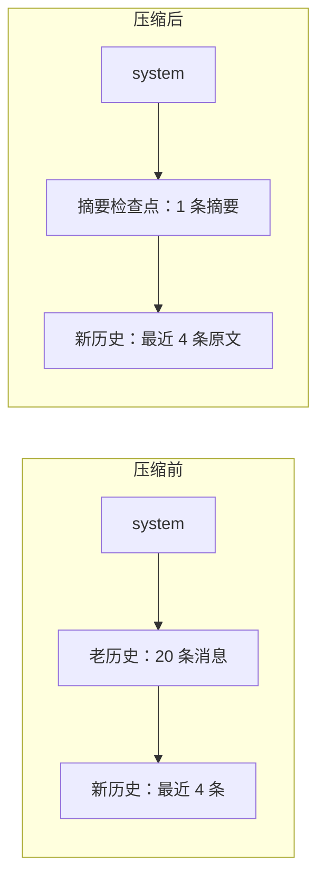

# 09｜上下文工程

> 预计时间：90 分钟 ｜ 前置：完成第 08 章 ｜ 本章调用真实 DeepSeek 模型，压缩摘要由模型生成

智能体执行长任务时会不断积累对话历史，但模型一次能够接收的内容有长度上限。任务运行得越久，每次请求携带的历史越多；接近上限后，请求可能被模型服务拒绝，调用成本也会明显上升。

本章用四种相互配合的方法处理这个问题：

1. 计量：随时知道当前历史占了窗口的百分之几；
2. 裁剪：把历史中的超大工具结果换成首尾片段，完整原文仍留在日志中；
3. 外部存储：工具刚返回超大文本时，把完整正文保存到文件，只把预览和读取位置交给模型；官方把这一步称为 spill；
4. 压缩：压力仍然过高时，把最老的一段历史浓缩成一条摘要，替换掉原文。

本章先估算当前请求大约会使用多少 token，再分别处理“历史里已经存在的大结果”和“工具刚产生的大结果”，最后选择需要压缩的旧历史，并调用模型生成摘要。

## 学习目标

完成本章后，你将能够：

- 解释上下文窗口、token 估算和压力比例之间的关系；
- 使用 `TokenMeter` 估算消息与工具说明占用的输入空间；
- 在不修改原始日志的前提下，用较短内容替换模型看到的工具结果；
- 按 UTF-8 字节数判断大结果，将完整内容保存到文件，并生成首尾预览与读取提示；
- 按阈值和保留比例选择需要压缩的旧历史；
- 生成摘要检查点替换旧历史，并拒绝没有真正变短的结果。

## 9.1 窗口、token 与压力

上下文窗口是模型一次请求能处理的最大输入量，单位是 token。token 可以粗略理解为模型处理文字时使用的小片段，一个英文单词通常占 1 到 2 个 token，一个汉字通常约占 1 个 token。系统提示词、工具清单和消息历史都会占用窗口。本章把“估算用量 ÷ 窗口上限”得到的比例称为上下文压力。

智能体每轮都会追加历史，因此上下文压力会持续增加。本章把 80% 设为处理阈值：每次请求前先估算当前用量，达到阈值后再裁剪或压缩，尽量不要等到模型服务直接拒绝请求。

程序在请求发出前通常拿不到服务商计算的精确 token 数，而且不同模型使用的分词方法也可能不同。本章采用一个简单估算：每 4 个字符算作 1 个 token，再加上消息角色、内容块和工具说明等结构开销。它会低估中文和大型 JSON 数据，但这里的目的只是提前判断用量是否正在接近上限，而不是计算精确账单。

## 9.2 用 TokenMeter 估算输入长度

```python
CHARS_PER_TOKEN = 4
ROLE_OVERHEAD = 4

def estimate_tokens(text: str) -> int:
    return -(-len(text) // CHARS_PER_TOKEN)  # 向上取整

def estimate_message(message: Message) -> int:
    content = message.content or ""
    return estimate_tokens(content) + ROLE_OVERHEAD
```

`CHARS_PER_TOKEN = 4` 表示每 4 个字符估算为 1 个 token。`-(-len // 4)` 是整数向上取整的写法，等价于 `math.ceil(len / 4)`。`ROLE_OVERHEAD = 4` 则为每条消息额外计算角色等结构信息的开销。

工具清单也会占用输入空间，因为每次请求都要把工具名称、用途和参数结构交给模型：

```python
class TokenMeter:
    def __init__(self, context_window: int = DEFAULT_CONTEXT_WINDOW) -> None:
        self.context_window = context_window

    def measure(self, messages, tools=None) -> Measurement:
        # ...逐条估算，汇总 message_tokens + tools_tokens = total_tokens

    def pressure(self, measurement: Measurement) -> Pressure:
        ratio = measurement.total_tokens / self.context_window
        return Pressure(
            total_tokens=measurement.total_tokens,
            context_window=self.context_window,
            ratio=ratio,
            over_threshold=ratio >= PRESSURE_THRESHOLD,  # 0.8
        )
```

`pressure` 只负责计算比例，不决定超过 80% 后应该压缩、警告还是停止。把“测量”和“处理”分开后，同一个计量器可以供多种策略使用，也更容易单独测试。

## 9.3 裁剪工具结果：缩短模型输入，不改原日志

一次 `grep`、测试或构建可能返回上万字符。模型后续通常只需要开头、结尾和“中间被省略”这个事实，没必要让同一份完整输出进入每次请求。

```python
def prune_content(self, text: str) -> str | None:
    if len(text) <= self.threshold_chars:
        return None
    tail = text[-self.tail_chars:] if self.tail_chars else ""
    return text[:self.head_chars] + PRUNE_MARKER + tail
```

教学版默认在结果超过 8192 个字符时才裁剪，保留开头 4096 个字符、一个省略标记和末尾 1024 个字符。这里使用 Python 字符串切片，不直接按原始字节截断，因此不会切坏中文等 Unicode 字符。

裁剪不能覆盖原来的 `tool/result`，否则恢复会话时就再也找不到完整结果。`prune_session()` 会追加一条 `compaction/prune` 事件记录裁剪原因，再追加一条替换事件，并通过 `source_event_seqs` 指向原事件。下一次生成模型消息时只使用较短版本，完整原文仍保留在日志中。再次扫描时看到的是已经替换后的内容，因此不会反复裁剪同一结果。

官方实现还会记录被替换内容原本占用的估算空间，代码中称为 `shadow price`。这个数值用于后续计量，不影响本章理解“模型看到短版本、日志保留完整版本”的主线。

## 9.4 把大结果保存到文件

上一节处理已经进入会话历史的大结果。本节处理工具刚刚返回的大结果：完整文本先保存到外部文件，模型只接收一段预览和文件位置。官方把这个过程称为 spill。`SpillPolicy` 按 UTF-8 字节数计算大小，因为文件存储和网络传输通常按字节限制，而不是按 Python 字符数限制。

```python
result = spill_policy.transform(
    result,
    session_id=session_id,
    tool_name=tool_name,
    call_id=call_id,
)
```

结果超过 `max_inline_bytes` 后，策略先调用 `SpillStore.save_text()` 保存完整文本，再根据剩余空间生成不会切坏字符的首尾预览，并附上文件位置、被省略的字节数和读取提示。`LocalSpillStore` 把正文写入当前会话的专用目录，清理建议文件名中的危险字符，并避免覆盖同名文件。

外部存储失败时，策略会保留原始工具结果，而不是把一次成功调用改成失败。没有存储后端、保存出错、当前工具本身就是 `read`，或者结果来自嵌套工具调用时都会使用原文。如果预览和提示加起来仍然超过上限，也不会返回一个残缺且无法恢复的结果。

两种方法处理不同时间点的问题：外部存储尽量阻止大结果首次进入模型消息；结果裁剪则在后续步骤中检查已有历史，只在上下文压力达到 80% 后处理其中仍然过大的内容。两种方法都不需要额外调用模型。

## 9.5 压缩策略：保留新，浓缩旧

上下文超过阈值后，最直接的办法是删除最老的消息，但这会让模型忘记任务目标和已经完成的工作。更稳妥的做法分为三步：

1. 最近的历史保留原文，默认占窗口的 16%，正在进行的工作细节不能丢；
2. 更老的历史交给模型浓缩，生成一条结构化摘要；
3. 用摘要替换旧历史，而不是把摘要继续追加到末尾。



本章使用的处理阈值是 80%，压缩后保留最近 16% 的原始内容。这两个比例与参考版本的官方默认配置一致。

## 9.6 压缩调用：让模型总结自己

历史摘要仍由模型生成。DeepSeek Harness 将压缩设计成一次特殊的模型调用：

```python
def build_summary_prompt(messages: list[Message], tail_start: int) -> list[Message]:
    return [
        messages[0],              # system：原样重放
        *messages[1:tail_start],  # 被压缩区逐字重放
        Message(role="user", content=COMPACTION_INSTRUCTION),
    ]
```

压缩请求包含原始系统提示词、需要压缩的旧历史，以及一条固定的摘要指令。指令要求模型整理任务意图、技术概念、文件与代码、错误与修复、待办、当前进度、下一步和关键上下文，从长对话中提取继续完成任务所需的信息。

这种排列方式还可能复用模型服务对相同请求开头的计算缓存，也就是 KV cache。压缩请求先按原顺序放入系统提示词和旧历史，最后才追加摘要指令，因此它的开头与正常请求相同。是否真正命中缓存由模型服务决定，但保持相同前缀为复用提供了条件。

## 9.7 用摘要检查点替换旧历史

压缩调用返回纯文本摘要，程序把它包装成一条摘要检查点消息：

```python
def build_checkpoint_message(summary: str) -> Message:
    return Message(
        role="user",
        content=(
            f"{CHECKPOINT_PREAMBLE}\n\n"
            f"{SUMMARY_OPEN_TAG}\n{summary}\n{SUMMARY_CLOSE_TAG}"
        ),
    )

def replace(messages, tail_start, checkpoint):
    return [messages[0], checkpoint, *messages[tail_start:]]
```

三个细节：

1. 摘要检查点的角色是 `user`，它会像其他历史消息一样被模型读取。
2. `<compacted-summary>` 标签把摘要明确框起来。模型的训练语料里见过这个标记，能正确理解这是一段被压缩的历史。
3. 标签前还有一段固定说明，告诉模型这是自动生成的历史摘要，应把它当作已有背景继续任务，而不是重新复述一遍。

这一步必须执行替换。得到 `[system, checkpoint, 新历史原文]` 后，旧历史原文不再进入后续请求。token 数量之所以降低，是因为摘要取代了原文，而不是作为附加内容继续累积。

这里的 checkpoint 表示“帮助模型继续任务的历史摘要”，与第 08 章“在重要操作前保存日志”的持久化检查点用途不同。两者沿用官方名称，但解决的是不同问题。

## 9.8 失败处理：摘要必须真的变短

压缩调用的输出不可控，模型可能写一篇比原文还长的摘要。所以压缩必须带缩小校验：

```python
        checkpoint = build_checkpoint_message(summary_text)
        checkpoint_tokens = estimate_message(checkpoint)

        if checkpoint_tokens >= shadowed_tokens:
            print(f"第 {attempt + 1} 次摘要未缩小（{checkpoint_tokens} >= "
                  f"{shadowed_tokens} token），拒绝")
            continue  # 重试：官方 compactionRetries 默认 1
```

摘要不一定比原文短，因此程序必须重新估算长度。摘要没有缩小时，`continue` 会再次发起压缩调用；重试次数由 `compactionRetries` 控制，默认重试一次。如果仍然没有缩小，程序保留原文并记录警告，不能因为压缩失败而破坏原有会话。

## 9.9 运行完整示例

```bash
uv run python chapters/09-context-engineering/src/demo.py
```

示例先在本地展示工具结果裁剪和外部存储，再把上下文窗口缩小到 4000 token，使演示数据容易超过阈值。长会话由脚本构造，不调用模型；只有生成摘要时会发起真实模型请求。摘要内容与 token 数每次可能不同，其余结构稳定：

```
=== ① 工具结果剪枝：表层变短，原事件仍保留 ===
  replacement: 1 条
  表层字符数: 330 → 99
  原事件仍完整: True

=== ② spill：完整结果落盘，模型只收预算内预览 ===
  inline: 3013 → 510 bytes
  落盘内容完整: True

=== ③ 长会话逐轮计量：压力爬升 ===
  [ 3 条]   9.4%
  [ 6 条]  27.7%
  [ 9 条]  37.4%
  [12 条]  54.7%
  [15 条]  63.9%
  [18 条]  81.5%  ← 越过 80% 阈值！
  [19 条]  81.8%  ← 越过 80% 阈值！
  [20 条]  91.3%  ← 越过 80% 阈值！
  [21 条]  91.5%  ← 越过 80% 阈值！
  [22 条]  99.9%  ← 越过 80% 阈值！
  [23 条] 100.0%  ← 越过 80% 阈值！
  [24 条] 108.3%  ← 越过 80% 阈值！
  阈值 = 3200 token（4000 × 0.8）

=== ④ 触发压缩：真实模型重放前缀 + 官方压缩指令 ===
  压缩前：25 条消息，4334 token

=== ⑤ 压缩结果 ===
  ok: True（压力降到阈值以下，压缩收敛）
  被压缩区：21 条消息，3652 token
  checkpoint：856 token（含 preamble 与标签）
  压缩调用次数：1
  消息数：25 → 5
  token：4334 → 1538
  占用率：108.3% → 38.5%

=== ⑥ checkpoint 的真实内容（模型生成） ===
  [role=user]
  This is an automatically generated checkpoint condensing an earlier span
  of the conversation to free up context. ...

  <compacted-summary>
  ## Primary Request and Intent
  - User is building a GRPO training system ...
```

前两节分别证明结果裁剪不会覆盖原日志，外部存储也不会丢失完整结果。后四节将 25 条消息压缩为 5 条，估算 token 从 4334 降到 1538，占用率从 108.3% 降到 38.5%。输出末尾展示了摘要正文，其中保留了任务意图、技术要点和下一步等结构化信息。

## 本章小结

- `TokenMeter`：估算消息与工具说明的 token 用量，只负责测量，不决定怎样处理
- `ToolResultPruner`：缩短模型看到的旧工具结果，同时保留完整原事件
- `SpillPolicy`：按 UTF-8 字节数判断大结果，保存完整原文并返回首尾预览与文件位置
- `should_compact` / `select_shadowed_start`：80% 阈值、尾部保留 16%
- 压缩调用：保留请求前缀，并让模型生成结构化摘要
- `build_checkpoint_message` 与 `replace`：包装摘要，用它替换旧历史而不是继续追加
- 失败处理：缩小校验、重试、保留原文继续

## 对照官方

| 官方实现 | 我们对应实现 | 说明 |
|----------|--------------|------|
| [`packages/llm/token-meter/README.zh.md`](https://github.com/deepseek-ai/DeepSeek-Harness/blob/141eb6fef83422698aef7a981029e843e8161534/packages/llm/token-meter/README.zh.md) | `TokenMeter` | 教学版使用每 4 个字符约等于 1 个 token 的估算；官方还能使用模型服务返回的真实用量，并跟踪下一次请求的预计长度 |
| 同上 | 职责分离 | 官方计量器不决定使用哪个模型或何时压缩，超过阈值后的处理由调用方选择 |
| [`packages/compaction/compaction-basic/README.zh.md`](https://github.com/deepseek-ai/DeepSeek-Harness/blob/141eb6fef83422698aef7a981029e843e8161534/packages/compaction/compaction-basic/README.zh.md) | `compact` | 与官方一样使用 0.8 和 0.16 两个比例，检查摘要是否真正缩短，失败时保留原文；官方还会处理 KV 缓存重放 |
| [`packages/compaction/compaction-tool-result-pruner/README.zh.md`](https://github.com/deepseek-ai/DeepSeek-Harness/blob/141eb6fef83422698aef7a981029e843e8161534/packages/compaction/compaction-tool-result-pruner/README.zh.md) | `ToolResultPruner` | 与官方一样通过追加替换事件改变模型看到的内容，保留结果首尾并指向完整来源；教学版只处理纯文本 |
| [`packages/spill/spill/README.zh.md`](https://github.com/deepseek-ai/DeepSeek-Harness/blob/141eb6fef83422698aef7a981029e843e8161534/packages/spill/spill/README.zh.md) | `SpillPolicy`、`LocalSpillStore` | 与官方一样按字节限制结果大小，通过可替换的存储服务返回读取位置，保存失败时保留原文；教学版只实现本地文本文件 |

## 练习

1. 结果裁剪、外部存储和摘要压缩都会减少模型看到的内容，但作用时机与信息损失不同。请为“超长网页刚被抓取”“旧日志中已有巨大工具结果”“长对话即将超过窗口”分别选择机制并说明理由。
2. 为一个代码库分析智能体设计上下文预算。哪些内容必须保留原文，哪些可以只留首尾预览，哪些适合摘要？说明窗口压力、可恢复性和调用成本之间的取舍。
3. 摘要可能遗漏用户约束或把不确定信息写成事实。你会如何验证摘要质量，并在摘要没有缩小、内容可疑或模型调用失败时安全回退？
4. 以每 4 个字符估算 token 对英文、中文和大型 JSON schema 的误差并不相同。讨论启发式计量仍然有用的原因，以及服务商返回 context overflow 时还需要怎样的补救路径。
5. 构造一个包含普通对话和大型工具结果的长会话，依次接入计量、结果裁剪、外部存储与摘要压缩。报告处理前后的压力、模型可见内容和完整原文位置，证明节省上下文没有破坏回放与按需读取。
