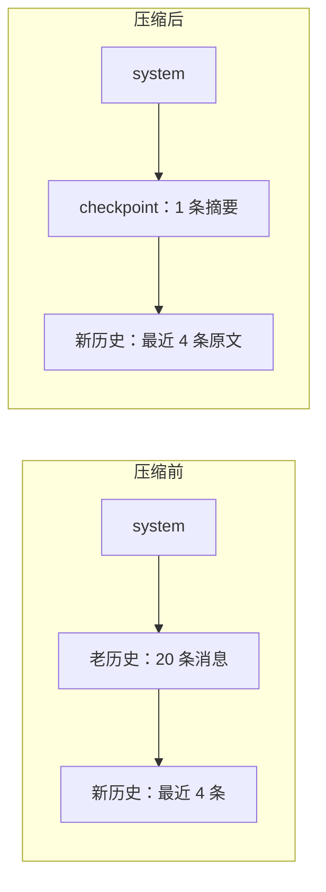

# 09｜上下文工程

> 预计时间：90 分钟 ｜ 前置：完成第 08 章 ｜ 本章调用真实 DeepSeek 模型，压缩摘要由模型生成

长任务 Agent 会持续积累对话历史，但模型一次能够接收的输入总量受上下文窗口限制。任务运行时间越长，每轮请求携带的历史越多；接近窗口上限后，请求可能被服务商拒绝，调用成本也会明显上升。

DeepSeek Harness 通过四个相互配合的机制处理这个问题：

1. 计量：随时知道当前历史占了窗口的百分之几；
2. 剪枝：把历史中的超大工具结果替换成首尾片段，完整原事件仍留在日志；
3. spill：工具刚返回超大文本时，把完整正文放进外部存储，只回灌可读取的预览；
4. 压缩：压力仍然过高时，把最老的一段历史浓缩成一条摘要，替换掉原文。

本章先估算当前请求的 token 压力，再分别处理“历史里已经存在的大结果”和“工具刚产生的大结果”，最后选择需要压缩的历史范围并运行一次真实摘要压缩。

## 学习目标

完成本章后，你将能够：

- 解释上下文窗口、token 估算和压力比例之间的关系；
- 使用 `TokenMeter` 估算消息与工具 schema 的输入成本；
- 用 append-only replacement 剪枝工具结果，同时保留完整原事件；
- 按 UTF-8 byte 预算 spill 过大结果，并生成首尾预览与读取提示；
- 按阈值和保留比例选择需要压缩的旧历史；
- 生成 checkpoint 替换旧历史，并拒绝没有缩小的摘要结果。

## 9.1 窗口、token 与压力

上下文窗口是模型一次请求能处理的最大输入量，单位是 token。token 是模型眼中的字块，一个英文单词约 1 到 2 个 token，一个汉字约 1 个 token。请求的输入等于 system 提示词、工具清单、消息历史三者的总和，这个总和叫上下文压力。

Agent 每轮都会追加历史，因此未压缩时压力会持续增加。达到窗口的 80% 左右后，就需要在触及服务商硬限制之前进行处理。为此，Agent 在每次请求前估算当前压力，并在超过阈值时触发压缩策略。

量压力这件事有一个陷阱：精确的 token 数只有服务商知道，各家分词器是私有的。官方给了一个务实的答案，用启发式估算：每 4 个字符算 1 个 token，外加角色、块与请求 envelope 字段的结构开销。估算不精确，官方文档写明 CJK 文本与 JSON schema 会被严重低估，但目的不是记账，是判断压力趋势，80% 附近差几个百分点无所谓。引入真实 tokenizer 的复杂度换来的精度，对这个用途是浪费。

## 9.2 TokenMeter：4 字符 / token 的启发式

```python
CHARS_PER_TOKEN = 4
ROLE_OVERHEAD = 4

def estimate_tokens(text: str) -> int:
    return -(-len(text) // CHARS_PER_TOKEN)  # 向上取整

def estimate_message(message: Message) -> int:
    content = message.content or ""
    return estimate_tokens(content) + ROLE_OVERHEAD
```

两个常量都直接对应官方实现。`CHARS_PER_TOKEN = 4`，字符数除以 4 向上取整，`-(-len // 4)` 是向上取整的整除写法，等价于 `math.ceil(len / 4)`。`ROLE_OVERHEAD = 4`，每条消息除了内容本身，角色标记也要占 token，启发式把它摊成固定 4。

工具清单同样要计费，它每次请求都随 system 发送，是 envelope 的一部分：

```python
class TokenMeter:
    def __init__(self, context_window: int = DEFAULT_CONTEXT_WINDOW) -> None:
        self.context_window = context_window

    def measure(self, messages, tools=None) -> Measurement:
        # ...逐条估算，汇总 message_tokens + tools_tokens = total_tokens

    def pressure(self, measurement: Measurement) -> Pressure:
        ratio = measurement.total_tokens / self.context_window
        return Pressure(
            total_tokens=measurement.total_tokens,
            context_window=self.context_window,
            ratio=ratio,
            over_threshold=ratio >= PRESSURE_THRESHOLD,  # 0.8
        )
```

`pressure` 的职责边界要单独说清楚：它只读数，不决策。超过 80% 之后怎么办，压缩、警告还是硬停，是消费方的事。这个解耦是官方明确的设计，token-meter 文档写明 meter 保持与压缩无关，压缩按需读取它。

## 9.3 工具结果剪枝：改表层，不改原日志

一次 `grep`、测试或构建可能返回上万字符。模型后续通常只需要开头、结尾和“中间被省略”这个事实，没必要让同一份完整输出进入每次请求。

```python
def prune_content(self, text: str) -> str | None:
    if len(text) <= self.threshold_chars:
        return None
    tail = text[-self.tail_chars:] if self.tail_chars else ""
    return text[:self.head_chars] + PRUNE_MARKER + tail
```

教学版默认超过 8192 个 Unicode code point 才剪枝，保留前 4096、固定 marker 和后 1024。Python `str` 切片按 code point 运行，不会把 Unicode 代理项对拆开。

剪枝不能覆盖原来的 `tool/result`。`prune_session()` 扫描当前稳定表层，先追加 `compaction/prune` 记录被遮蔽节点与启发式 token 价格，再追加一个带 `surface_op=replace` 的新事件，并用 `source_event_seqs` 指回完整原事件。下一次派生消息时只看到 replacement，审计与恢复仍能读取未经修改的 append-only 历史。计量器可以用 shadow price 扣除不再进入模型的原节点；再次剪枝扫描的是替换后的表层，因此不会给同一结果反复追加 replacement。

## 9.4 spill：大结果先保存，再回灌预览

剪枝处理会话里已经存在的结果，spill 则位于工具结果刚产生的边界。SpillPolicy 按 UTF-8 byte 计数，因为存储、传输和 provider 限额通常都是字节预算，而不是 Python 字符数。

```python
result = spill_policy.transform(
    result,
    session_id=session_id,
    tool_name=tool_name,
    call_id=call_id,
)
```

超过 `max_inline_bytes` 时，策略先调用 `SpillStore.save_text()` 保存完整文本，再用剩余预算生成 UTF-8 安全的首尾预览，并附上 locator、遗漏字节数和读取提示。LocalSpillStore 把正文写进 session 私有目录，清理 suggested name，生成碰撞安全文件名，并尽力收紧目录和文件权限。

spill 是 best-effort。没有 backend、保存失败、`read` 工具本身或嵌套工具结果都原样返回，不能因为外围存储失败把一次成功工具调用改成错误。预览加 notice 若仍超过 byte 上限，也保留原文。

两个机制解决不同时间点的问题：spill 尽量阻止大结果首次进入消息表层；pruner 在下一 step 组装出 system、消息表层和工具 schema 后先读取 token 压力，只有达到 80% 才清理仍留在历史中的超大结果。它们都不调用模型。

## 9.5 压缩策略：保留新，浓缩旧

压力超阈值后怎么办？最直接的念头是删掉最老的消息。但直接删会丢掉上下文，模型会忘记任务目标、忘记已经做完的事。官方的策略折中在三点：

1. 最近的历史保留原文，默认占窗口的 16%，正在进行的工作细节不能丢；
2. 更老的历史交给模型浓缩，用一个压缩调用让模型把老历史总结成结构化的 checkpoint（检查点）；
3. checkpoint 替换老历史，不是追加在末尾。替换之后历史真的变短了，追加只会越加越长。



阈值与保留比例都对齐官方 compaction-basic 配置表的默认值：thresholdRatio 为 0.8，retainRatio 为 0.16。

## 9.6 压缩调用：让模型总结自己

历史摘要仍由模型生成。DeepSeek Harness 将压缩设计成一次特殊的模型调用：

```python
def build_summary_prompt(messages: list[Message], tail_start: int) -> list[Message]:
    return [
        messages[0],              # system：原样重放
        *messages[1:tail_start],  # 被压缩区逐字重放
        Message(role="user", content=COMPACTION_INSTRUCTION),
    ]
```

输入等于 system 原文、被压缩区原文、一条固定的压缩指令。本章代码保留官方 compaction-basic 的提示结构，要求模型输出任务意图、技术概念、文件与代码、错误与修复、待办、当前进度、下一步、关键上下文八个小节，把对话骨架提取出来。

这种输入结构还可以复用 KV cache。模型服务通常会缓存请求前缀的计算结果；连续请求具有相同前缀时，后一次请求可以复用已有计算。压缩调用先重放 system 和被压缩区原文，再追加压缩指令，这一前缀与正常请求中的对应部分逐字相同。官方文档明确说明，该结构用于复用服务商的热前缀 cache。教学版保留相同的重放顺序。

## 9.7 替换：checkpoint 进历史，原文退场

压缩调用的输出是纯文本摘要，把它包装成一条 checkpoint 消息：

```python
def build_checkpoint_message(summary: str) -> Message:
    return Message(
        role="user",
        content=(
            f"{CHECKPOINT_PREAMBLE}\n\n"
            f"{SUMMARY_OPEN_TAG}\n{summary}\n{SUMMARY_CLOSE_TAG}"
        ),
    )

def replace(messages, tail_start, checkpoint):
    return [messages[0], checkpoint, *messages[tail_start:]]
```

三个细节：

1. checkpoint 的 role 是 user，它站在用户消息的位置上，对模型来说就是历史的一部分，正常阅读即可。
2. `<compacted-summary>` 标签把摘要明确框起来。模型的训练语料里见过这个标记，能正确理解这是一段被压缩的历史。
3. preamble 开场白在标签前有一段固定说明：这是一个自动生成的检查点，把它当作已确立的背景，直接继续任务，不要复述它。没有这段话，模型可能对着摘要重复一遍历史，浪费整次压缩。

这一步必须执行替换。得到 `[system, checkpoint, 新历史原文]` 后，旧历史原文不再进入后续请求。token 数量之所以降低，是因为 checkpoint 取代了原文，而不是作为附加内容继续累积。

## 9.8 失败处理：摘要必须真的更小

压缩调用的输出不可控，模型可能写一篇比原文还长的摘要。所以压缩必须带缩小校验：

```python
        checkpoint = build_checkpoint_message(summary_text)
        checkpoint_tokens = estimate_message(checkpoint)

        if checkpoint_tokens >= shadowed_tokens:
            print(f"第 {attempt + 1} 次摘要未缩小（{checkpoint_tokens} >= "
                  f"{shadowed_tokens} token），拒绝")
            continue  # 重试：官方 compactionRetries 默认 1
```

`continue` 会再次发起压缩调用，最多重试 compactionRetries 次，默认值为 1。重试后摘要仍未缩小时，系统保留原文并继续运行。官方文档说明，自动压缩路径此时只记录警告，并携带完整的超预算历史继续；压缩失败不能破坏原有会话。

## 9.9 运行完整示例

```bash
uv run python chapters/09-context-engineering/src/demo.py
```

demo 先在本地展示工具结果剪枝和 spill，再用一个缩小的上下文窗口（4000 token，教学用）让压力容易触顶。长会话由脚本构造，不调用模型，只有压缩摘要由真实模型生成。checkpoint 的内容与 token 数每次不同，其余结构稳定：

```
=== ① 工具结果剪枝：表层变短，原事件仍保留 ===
  replacement: 1 条
  表层字符数: 330 → 99
  原事件仍完整: True

=== ② spill：完整结果落盘，模型只收预算内预览 ===
  inline: 3013 → 510 bytes
  落盘内容完整: True

=== ③ 长会话逐轮计量：压力爬升 ===
  [ 3 条]   9.4%
  [ 6 条]  27.7%
  [ 9 条]  37.4%
  [12 条]  54.7%
  [15 条]  63.9%
  [18 条]  81.5%  ← 越过 80% 阈值！
  [19 条]  81.8%  ← 越过 80% 阈值！
  [20 条]  91.3%  ← 越过 80% 阈值！
  [21 条]  91.5%  ← 越过 80% 阈值！
  [22 条]  99.9%  ← 越过 80% 阈值！
  [23 条] 100.0%  ← 越过 80% 阈值！
  [24 条] 108.3%  ← 越过 80% 阈值！
  阈值 = 3200 token（4000 × 0.8）

=== ④ 触发压缩：真实模型重放前缀 + 官方压缩指令 ===
  压缩前：25 条消息，4334 token

=== ⑤ 压缩结果 ===
  ok: True（压力降到阈值以下，压缩收敛）
  被压缩区：21 条消息，3652 token
  checkpoint：856 token（含 preamble 与标签）
  压缩调用次数：1
  消息数：25 → 5
  token：4334 → 1538
  占用率：108.3% → 38.5%

=== ⑥ checkpoint 的真实内容（模型生成） ===
  [role=user]
  This is an automatically generated checkpoint condensing an earlier span
  of the conversation to free up context. ...

  <compacted-summary>
  ## Primary Request and Intent
  - User is building a GRPO training system ...
```

前两节分别证明剪枝不覆盖原日志、spill 不丢失完整结果。后四节将 25 条消息压缩为 5 条，估算 token 从 4334 降到 1538，占用率从 108.3% 降到 38.5%。输出末尾展示了 checkpoint 正文，其中保留了任务意图、技术要点和下一步等结构化信息。

## 本章小结

- `TokenMeter`：4 字符/token 启发式、消息与工具 envelope 计量、压力换算，只读数不决策
- `ToolResultPruner`：Unicode code point 阈值、shadow price、head/middle/tail replacement、完整原事件保留
- `SpillPolicy`：UTF-8 byte 预算、provider seam、首尾预览、locator 与 best-effort 回退
- `should_compact` / `select_shadowed_start`：80% 阈值、尾部保留 16%
- 压缩调用：逐字复刻官方压缩指令、重放前缀复用 KV cache
- `build_checkpoint_message` / `replace`：preamble 加标签包装、替换而非追加
- 失败处理：缩小校验、重试、保留原文继续

## 对照官方

| 官方实现 | 我们对应实现 | 说明 |
|----------|--------------|------|
| [`packages/llm/token-meter/README.zh.md`](https://github.com/deepseek-ai/DeepSeek-Harness/blob/141eb6fef83422698aef7a981029e843e8161534/packages/llm/token-meter/README.zh.md) | `TokenMeter` | 教学版保留 4 字符/token 启发式；官方还能复用提供方真实用量并跟踪 projectedTokens |
| 同上 | 解耦 | 官方 meter 与模型路由、压缩策略无关，压力判定留给消费方 |
| [`packages/compaction/compaction-basic/README.zh.md`](https://github.com/deepseek-ai/DeepSeek-Harness/blob/141eb6fef83422698aef7a981029e843e8161534/packages/compaction/compaction-basic/README.zh.md) | `compact` | 对齐 0.8/0.16 阈值、KV cache 重放、缩小校验、重试与失败保留原文 |
| [`packages/compaction/compaction-tool-result-pruner/README.zh.md`](https://github.com/deepseek-ai/DeepSeek-Harness/blob/141eb6fef83422698aef7a981029e843e8161534/packages/compaction/compaction-tool-result-pruner/README.zh.md) | `ToolResultPruner` | 对齐 append-only surface replacement、head/tail 保留与完整来源事件；教学版只有纯文本块 |
| [`packages/spill/spill/README.zh.md`](https://github.com/deepseek-ai/DeepSeek-Harness/blob/141eb6fef83422698aef7a981029e843e8161534/packages/spill/spill/README.zh.md) | `SpillPolicy`、`LocalSpillStore` | 对齐 byte 预算、provider seam、locator 和 best-effort；教学版只实现 local text provider，没有 dispatch-log 分支 |

## 练习

1. **阈值实验。** 把 CONTEXT_WINDOW 改成 20000，压力只有 20%，观察压缩不再触发；解释阈值判定在 Agent 循环里的位置。
2. **retain 实验。** 把 retain_ratio 改成 0.4，观察被压缩区变小、保留原文变多、token 节省变少，体会省 token 与保细节的权衡。
3. **剪枝可回放。** 构造一个超过阈值的 `tool/result`，运行两次 `prune_session()`。确认第一次追加 replacement、第二次不重复追加，并证明原事件正文仍可从 events 中读取。
4. **spill 字节边界。** 用中英文和 emoji 混合文本测试 100 byte 上限，确认预览不会截断 UTF-8 字符；再让假 store 抛异常，验证工具原文不丢失。
5. **幂等性。** 对已压缩过的历史再压一次，观察第二次压缩的输入里 `<compacted-summary>` 块去哪了。它成了被压缩区的一部分，官方压缩指令的 Rules 一节专门要求合并旧 checkpoint，读一遍那段指令。
