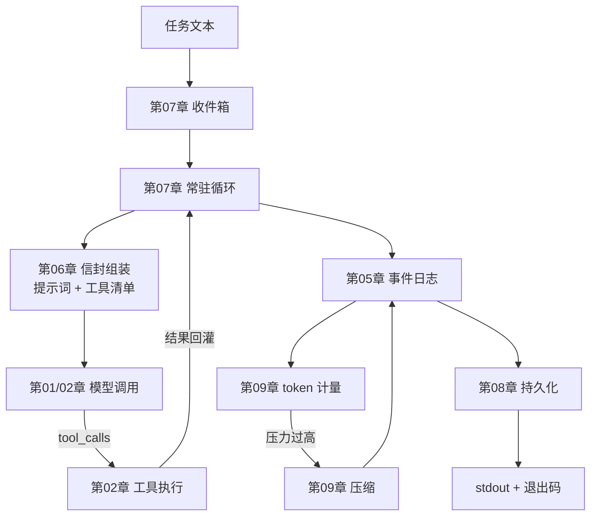

# 17｜收口：把 16 章组装成一个能跑任务的框架

> 预计时间：45 分钟 ｜ 前置：完成前 16 章 ｜ 本章调用真实 DeepSeek 模型

前 16 章，每章都在 `chapters/` 里造了一块机制，各能单独运行。
最后一章做一件前面 16 章一直没做的事：**把它们组装成一个整体**——
一个包、一个入口、一次从「任务文本」到「最终答案 + 落盘 +
退出码」的完整运行。

官方把这一步叫做 **headless**（无界面）组合包。`bundle/headless`
的文档说得很朴素（第 5 行）：「一次性任务组合包……不挂载任何
Host、HTTP server、Web runtime 或浏览器插件」。没有网页、没有
终端 UI，就一条命令：把任务交进去，等它完成，拿结果。这是
Agent 框架最原始的形态，也是我们 17 章的终点。

## 17.1 组装：从「章节代码」到「一个包」

前 16 章的代码是**教学形态**——每章自包含、相对导入、demo 即
教材。组装成包要解决一个具体问题：**导入**。章节代码用扁平
导入（`from client import ...`），因为 demo 与模块同目录运行；
进了包，模块嵌套一层，导入要改成相对的（`from .client import
...`）。除此之外，**一行逻辑都不用改**——这就是前 16 章
「零黑盒、自包含」纪律的红利：组装的成本约等于改导入。

组装清单：

| 包内模块 | 来自 | 贡献 |
|----------|------|------|
| `client.py` | 第 01/02 章 | 流式客户端 + 工具调用消息模型 |
| `session.py` | 第 05 章 | 事件日志与消息投影 |
| `registry.py` / `prompt.py` | 第 06 章 | 工具注册表 + 提示词组装 |
| `agent.py` / `inbox.py` | 第 07 章 | 常驻循环与收件箱 |
| `persistence.py` | 第 08 章 | JSONL 持久化 |
| `meter.py` | 第 09 章 | token 计量 |
| `calculator.py` | 第 02 章 | 计算器工具 |

一个组装时才暴露的真实问题：第 01 章的 `load_api_key` 用
`parents[3]` 定位项目根——那是**章节形态**下的层级。进了包，
层级变了，硬编码的深度失效。组装的修正版改成**向上逐级查找
第一个带 Key 的 `.env`**——对任何嵌套深度都成立。这个小插曲
正是「包」与「教学目录」的本质差异：包的代码要被放在任何
地方运行，不能假设自己住在哪。

## 17.2 入口：headless runner

包的入口 `__main__.py` 实现官方 headless runner 的语义
（官方第 7 行）：创建 Agent → 把任务作为普通用户消息提交 →
等完全停稳 → 最后一条 assistant 文本写 stdout → 完成与否
决定退出码：

```python
def run_task(task: str, session_file: str = SESSION_FILE) -> tuple[str, bool]:
    agent = build_agent()
    meter = TokenMeter(context_window=100_000)

    agent.followup(task)
    session = agent.run()

    pressure = meter.pressure(meter.measure(_messages_of(session)))
    print(f"[meter] 上下文占用 {pressure.ratio:.1%}", file=sys.stderr)

    store = JsonlStore(session_file)
    store.save(session)
    print(f"[persist] 会话已保存到 {store.path}", file=sys.stderr)

    final_text = ""
    completed = False
    for message in session.derive_messages():
        if message.role == "assistant" and message.content:
            final_text = message.content
    for event in session.events:
        if event.type == "turn/end" and event.data.get("reason") == "completed":
            completed = True
    return final_text, completed
```

四个设计点，全部来自前面的章节：

1. **任务 = 一条普通用户消息**（官方第 7 行原文）。入口不做
   任何特殊处理——任务与对话里任何一句话地位相同，这让第 07 章
   的循环、第 05 章的日志都无需为「headless」开特例。
2. **stdout 只放最终答案**。计量、持久化这类过程信息走 stderr
   ——stdout 的契约是「给调用脚本的结果」，混入日志会让脚本
   无法解析（官方同款：成功运行时 stderr 保持为空，我们放宽为
   过程信息）。
3. **退出码 = 完成与否**（官方：「最终 turn/end 完成 → 0，
   否则 1」）。调用脚本据此判断成功失败，而不是解析输出文本。
4. **落盘在退出前**。会话先持久化再交回结果——即使调用方拿到
   结果后立刻杀掉进程，这次运行也有据可查（第 08 章的原子
   发布保证落盘完整）。

## 17.3 跑一遍完整 demo

```bash
uv run python chapters/17-headless-capstone/src/demo.py
```

真实输出（模型回答每次不同）：

```
=== ① 组装清单：前 16 章各贡献了哪一块 ===
  client.py                    来自 第 01/02 章    流式客户端 + 工具调用消息模型
  session.py                   来自 第 05 章       事件日志与消息投影
  ...（共 7 行清单）

=== ② 用组装的包跑真实任务 ===
  [stdout] 等于 7。根据运算优先级，先算乘法 2×3=6，再算加法 1+6=7。
  [exit] 0（正常完成）

=== ③ 会话落盘并读回 ===
  读回 7 条事件（第 08 章的持久化在工作）
```

也可以直接用包的入口跑（在 src 目录下）：

```bash
cd chapters/17-headless-capstone/src
uv run python -m mini_harness "1+2*3 等于几？"
```

## 17.4 全书回顾：你亲手搭起的那台机器

把 17 章的机制按「一次任务的生命周期」串起来，就是这张图：



除主路径外，还有两条独立的线：第 03/04 章的插件系统、第 10/11 章的
沙箱与审批；第 12 到 16 章是各自独立的能力。每一块都能在官方
DeepSeek Harness 源码里找到对应物——每章末尾的「对照官方」小节
就是地图。

## 17.5 本章小结：亲手写了什么

- 包组装：扁平导入 → 相对导入，`load_api_key` 的层级修正
- `run_task`：headless runner 四设计点（任务即消息、stdout
  契约、退出码语义、退出前落盘）
- 全书 17 章机制的完整全景图

## 17.6 对照官方 DSH

| 官方实现 | 我们对应实现 | 说明 |
|----------|--------------|------|
| [`packages/bundle/headless/README.zh.md`](https://github.com/deepseek-ai/DeepSeek-Harness/blob/47f943859bef60e4160492346772ded9b24f765a/packages/bundle/headless/README.zh.md) | `mini_harness` 包 | 官方一次性任务组合包、不挂载 Host/HTTP（第 5 行）；runner 语义（第 7 行：任务即用户消息、stdout 出答案、退出码 0/1）与本章一一对应 |
| 官方 `dsh --profile headless "task"` | `python -m mini_harness "task"` | 官方的任务文本就是命令行参数——教学版同款 |

官方 headless 组合包是 `dsh-base` 上叠加一个 `headless-runner`
插件的**插件组合**（cordis 装配）；教学版是「前 16 章模块的
直接组装」。两者形态不同、语义一致——17 章里每一章的机制都
在官方对应包的文档里找得到出处。

## 17.7 练习

1. **加一个工具**：把第 15 章的 `WebSearchClient` 组装进包，
   给「DeepSeek Harness 最新版本是多少」这类任务跑一遍，
   观察模型何时选择搜索工具。
2. **压缩接通**：把第 09 章的 `compact` 接进 `run_task` 的
   循环前（压力超阈值时压缩历史再请求），用小 context_window
   验证长任务能跑完。
3. **退出码契约**：给 run_task 传一个必然失败的任务（如让
   模型请求不存在的工具），观察退出码与 stderr 的差异；
   写一个 shell 脚本用退出码做分支。
4. **发布形态**：阅读 pyproject.toml 的 `[project.scripts]`，
   把包改成 `pip install -e .` 可安装形态，实现 `mini-harness`
   命令行；对比「章节目录直接跑」与「安装后跑」的差异。
