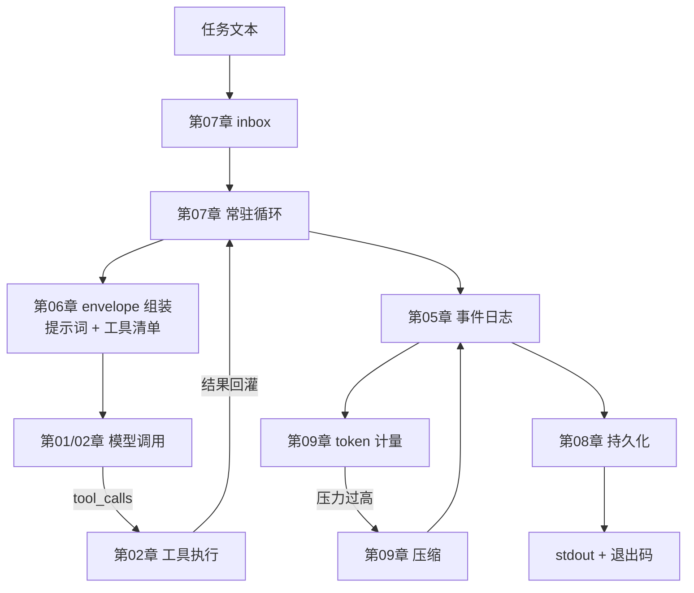

# 17｜headless 组装

> 预计时间：45 分钟 ｜ 前置：完成前 16 章 ｜ 本章调用真实 DeepSeek 模型

前 16 章分别实现了可以独立运行的机制。本章把其中的核心模块组装成一个 Python 包，并提供统一入口：接收任务文本、运行 Agent、保存会话、输出最终答案，再用退出码表示是否完成。

官方将这种形态称为 headless 组合包。bundle/headless 文档将它定义为一次性任务组合包，不挂载 Host、HTTP server、Web runtime 或浏览器插件。调用方通过一条命令提交任务，等待运行结束并读取结果。

## 学习目标

完成本章后，你将能够：

- 把前面章节的自包含模块整理为可导入的 Python 包；
- 实现接收单个任务的 headless runner；
- 区分 stdout 结果、stderr 过程信息和进程退出码；
- 说明一次任务如何经过 inbox、循环、工具、日志和持久化。

## 17.1 组装：从章节代码到一个包

前 16 章采用自包含的教学目录，每个 demo 与模块位于同一目录，因此代码使用 `from client import ...` 这类扁平导入。整理为包后，模块需要改用 `from .client import ...` 这样的包内相对导入。核心逻辑不需要改变，说明各章的模块边界能够直接用于最终组装。

组装清单：

| 包内模块 | 来自 | 贡献 |
|----------|------|------|
| `client.py` | 第 01/02 章 | 流式客户端 + 工具调用消息模型 |
| `session.py` | 第 05 章 | 事件日志与消息投影 |
| `registry.py` / `prompt.py` | 第 06 章 | 工具注册表 + 提示词组装 |
| `agent.py` / `inbox.py` | 第 07 章 | 常驻循环与 inbox |
| `persistence.py` | 第 08 章 | JSONL 持久化 |
| `meter.py` | 第 09 章 | token 计量 |
| `calculator.py` | 第 02 章 | 计算器工具 |

一个组装时才暴露的真实问题：第 01 章的 load_api_key 用 parents[3] 定位项目根，那是章节形态下的层级。进了包，层级变了，硬编码的深度失效。组装的修正版改成向上逐级查找第一个带 Key 的 .env，对任何嵌套深度都成立。这个差异正是包与教学目录的本质区别：包的代码要被放在任何地方运行，不能假设自己住在哪。

## 17.2 入口：headless runner

包的入口 `__main__.py` 实现官方 headless runner 的语义：创建 Agent，把任务作为普通用户消息提交，等待完全停稳，最后一条 assistant 文本写 stdout，完成与否决定退出码：

```python
def run_task(task: str, session_file: str = SESSION_FILE) -> tuple[str, bool]:
    agent = build_agent()
    meter = TokenMeter(context_window=100_000)

    agent.followup(task)
    session = agent.run()

    pressure = meter.pressure(meter.measure(_messages_of(session)))
    print(f"[meter] 上下文占用 {pressure.ratio:.1%}", file=sys.stderr)

    store = JsonlStore(session_file)
    store.save(session)
    print(f"[persist] 会话已保存到 {store.path}", file=sys.stderr)

    final_text = ""
    completed = False
    for message in session.derive_messages():
        if message.role == "assistant" and message.content:
            final_text = message.content
    for event in session.events:
        if event.type == "turn/end" and event.data.get("reason") == "completed":
            completed = True
    return final_text, completed
```

四个设计点，全部来自前面的章节：

1. 任务就是一条普通用户消息，官方第 7 行同款。入口不做任何特殊处理，任务与对话里任何一句话地位相同，这让第 07 章的循环、第 05 章的日志都无需为 headless 开特例。
2. stdout 只放最终答案。计量、持久化这类过程信息走 stderr。stdout 的契约是给调用脚本的结果，混入日志会让脚本无法解析。官方在成功运行时保持 stderr 为空，教学版放宽为过程信息走 stderr。
3. 退出码等于完成与否：最终 turn/end 完成则 0，否则 1。调用脚本据此判断成功失败，而不是解析输出文本。
4. 落盘在退出前。会话先持久化再交回结果，即使调用方拿到结果后立刻杀掉进程，这次运行也有据可查，第 08 章的原子发布保证落盘完整。

## 17.3 运行完整示例

```bash
uv run python chapters/17-headless-capstone/src/demo.py
```

真实输出，模型回答每次不同：

```
[meter] 上下文占用 0.0%
[persist] 会话已保存到 …/session.jsonl
=== ① 组装清单：前 16 章各贡献了哪一块 ===
  client.py                    来自 第 01/02 章    流式客户端 + 工具调用消息模型
  session.py                   来自 第 05 章       事件日志与消息投影
  registry.py / prompt.py      来自 第 06 章       工具注册表 + 提示词组装
  agent.py / inbox.py          来自 第 07 章       常驻循环与 inbox
  persistence.py               来自 第 08 章       JSONL 持久化
  meter.py                     来自 第 09 章       token 计量
  calculator.py                来自 第 02 章       计算器工具

=== ② 用组装的包跑真实任务 ===
  [stdout] 1+2*3 = **7**

根据运算优先级，先算乘法 2×3=6，再算加法 1+6=7。
  [exit] 0（正常完成）

=== ③ 会话落盘并读回 ===
  读回 7 条事件（第 08 章的持久化在工作）
```

开头两行 [meter] 与 [persist] 是 stderr 上的过程信息，先于 stdout 出现是因为 stderr 不缓冲，这也正是两路输出分开的原因。也可以直接用包的入口跑，在 src 目录下：

```bash
cd chapters/17-headless-capstone/src
uv run python -m mini_harness "1+2*3 等于几？"
```

## 17.4 全书回顾：完整运行流程

下图按一次任务的执行顺序连接前面章节的核心机制：



除主路径外，还有两条独立的线：第 03/04 章的插件系统、第 10/11 章的沙箱与审批；第 12 到 16 章是各自独立的能力。每一块都能在官方 DeepSeek Harness 源码里找到对应物，每章末尾的对照官方小节就是地图。

## 本章小结

- 包组装：扁平导入改相对导入，load_api_key 的层级修正
- `run_task`：headless runner 四设计点，任务即消息、stdout 契约、退出码语义、退出前落盘
- 全书 17 章核心机制的完整关系图

## 对照官方

| 官方实现 | 我们对应实现 | 说明 |
|----------|--------------|------|
| [`packages/bundle/headless/README.zh.md`](https://github.com/deepseek-ai/DeepSeek-Harness/blob/47f943859bef60e4160492346772ded9b24f765a/packages/bundle/headless/README.zh.md) | `mini_harness` 包 | 一次性任务组合包、不挂载 Host 与 HTTP 在第 5 行；runner 语义在第 7 行：任务即用户消息、stdout 出答案、完成则退出码 0 否则 1，与本章一一对应 |
| 官方 `dsh --profile headless "task"` | `python -m mini_harness "task"` | 官方的任务文本就是命令行参数，教学版同款 |

官方 headless 组合包在 dsh-base 上叠加 headless-runner 插件，并由 cordis 完成装配；教学版直接组合前 16 章的模块。两者实现形态不同，但都遵循一次性接收任务、等待完成并返回结果的语义。各章末尾的“对照官方”列出了对应源码位置。

## 练习

1. **加一个工具。** 把第 15 章的 WebSearchClient 组装进包，给 DeepSeek Harness 最新版本是多少这类任务跑一遍，观察模型何时选择搜索工具。
2. **压缩接通。** 把第 09 章的 compact 接进 run_task 的循环前，压力超阈值时压缩历史再请求，用小 context_window 验证长任务能跑完。
3. **退出码契约。** 给 run_task 传一个必然失败的任务，比如让模型请求不存在的工具，观察退出码与 stderr 的差异；写一个 shell 脚本用退出码做分支。
4. **发布形态。** 阅读 pyproject.toml 的 [project.scripts]，把包改成 pip install -e . 可安装形态，实现 mini-harness 命令行；对比章节目录直接跑与安装后跑的差异。
